---
## Author
author:
  name: Гайдук Софья Сергеевна
  degrees: DSc
  orcid: 0000-0002-0877-7063
  email: 1032253645@rudn.ru
  affiliation:
    - name: Российский университет дружбы народов
      country: Российская Федерация
      postal-code: 117198
      city: Москва
      address: ул. Миклухо-Маклая, д. 6
---
## Title
---
title: "Прохождение внешнего курса. Часть 1"
subtitle: "Презентация"
author: "Гайдук Софья Сергеевна"
date: "2026-05-10"
format: 
  revealjs: 
    theme: solarized
    slide-number: true
---

# Информация

## Докладчик

:::::::::::::: {.columns align=center}
::: {.column width="70%"}

  * Гайдук Софья Сергеевна
  * студент
  * Российский университет дружбы народов им. П. Лумумбы
  * [1032253645@rudn.ru](mailto:1032253645@rudn.ru)
  * <https://github.com/SofiaGayduk/study_2025-2026_os-intro>

:::
::: {.column width="30%"}

:::
::::::::::::::

# Цель работы

Изучить операционную систему Linux. Прохождение 1 этапа внешнего курса. 

# Выполнение лабораторной работы 

## Курс называется "Введение в Linux", это написано в левом верхнем углу ([рис. @fig-001]).

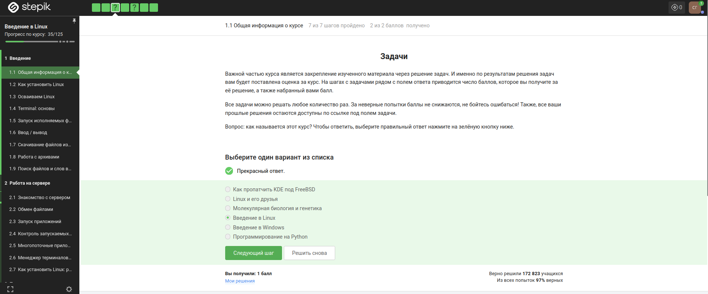{#fig-001 width=70%}

## Из "Критерии прохождения курса" я выбрала все подходящие ответы ([рис. @fig-002]).

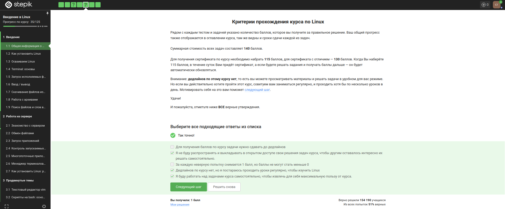{#fig-002 width=70%}

## Изначально пользовалась операционной системой Windows ([рис. @fig-003]).

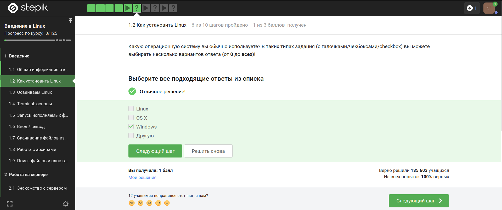{#fig-003 width=70%}

## Это программа для работы одной операционной системы на другой. Мы установили VirtualBox ([рис. @fig-004]).

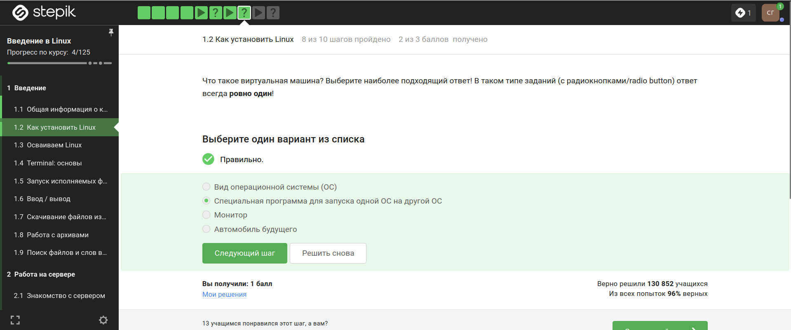{#fig-004 width=70%}

## Да, получилось ([рис. @fig-005]).

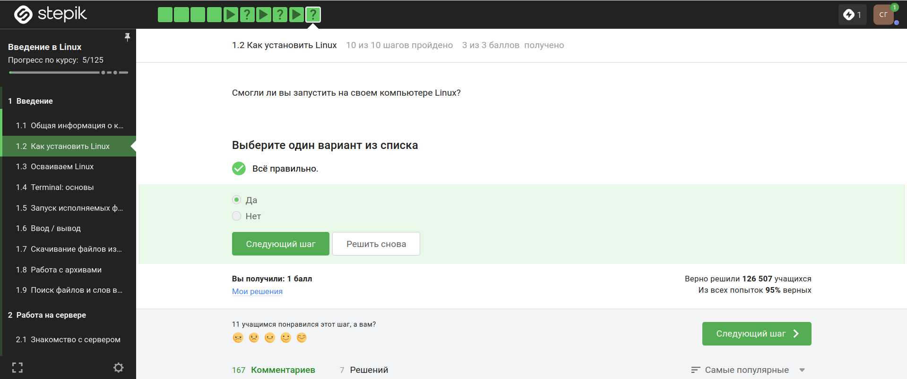{#fig-005 width=70%}

## 

Создаем документ в LibreOffice Writer, записываем строку "Hello, Linux!" шрифтом FreeMono и сохраняем файл в формате XML. Прикрепляем файл к заданию ([рис. @fig-006]).

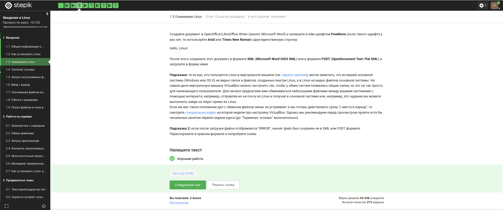{#fig-006 width=70%}

## Пакеты Linux(Ubuntu) имеют расширение deb ([рис. @fig-007]).

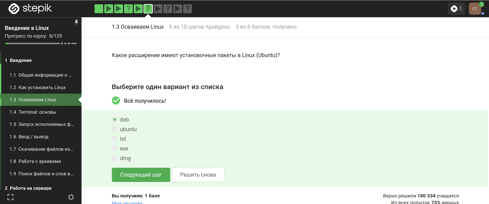{#fig-007 width=70%}

## Мы установили плеер VLC и, открыв его, увидели и записали первую фамилию ([рис. @fig-008]).

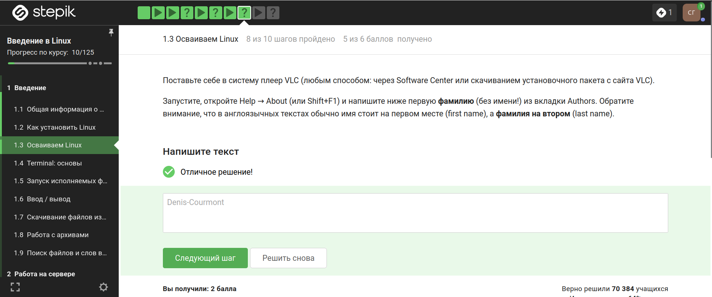{#fig-008 width=70%}

## 

Update Manager используется для обновления установленного программного обеспечивания в Linux. Он устанавливает обновления безопасности и улучшает функциональность программы ([рис. @fig-009]).

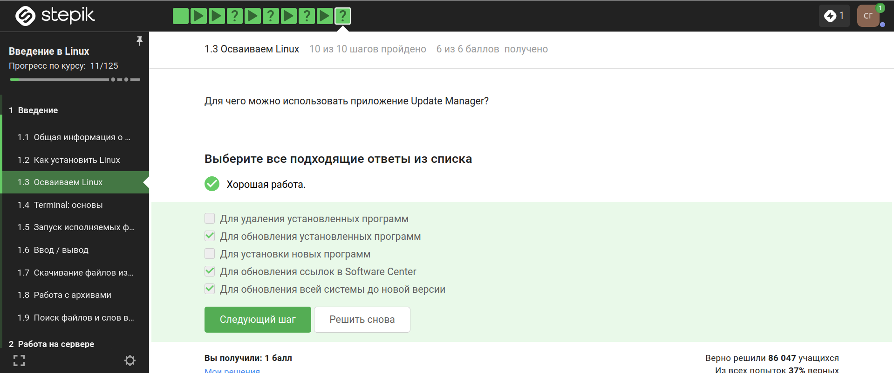{#fig-009 width=70%}

## Терминал и консоль. Остальное не относится к "командной строке" ([рис. @fig-010]).

{#fig-010 width=70%}

## Команда pwd ([рис. @fig-011]).

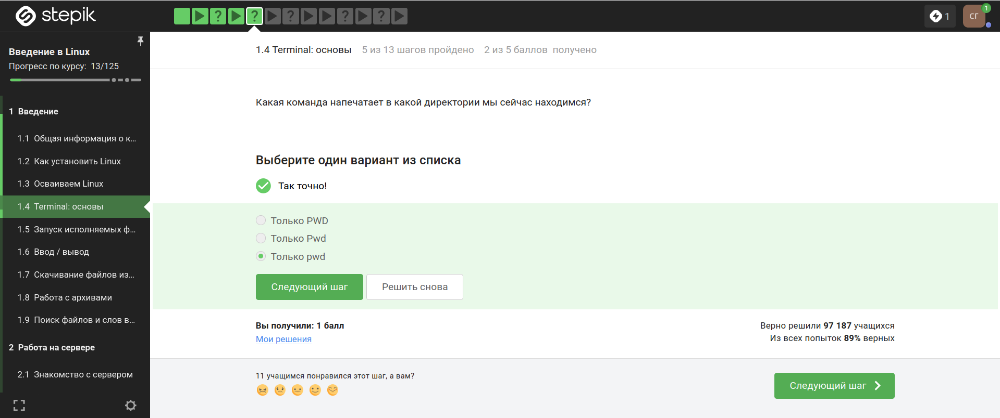{#fig-011 width=70%}

## 

ls -A --human-readable -l здесь нет пути /some/directory, поэтому команда применится к текущей директории. Без указания пути это другая команда. ls AhI /some/directory здесь A – есть, -h – есть, -I – игнорировать файлы/паттерны. отсутствует -l и без него вывода в длинном формате не будет ([рис. @fig-012]).

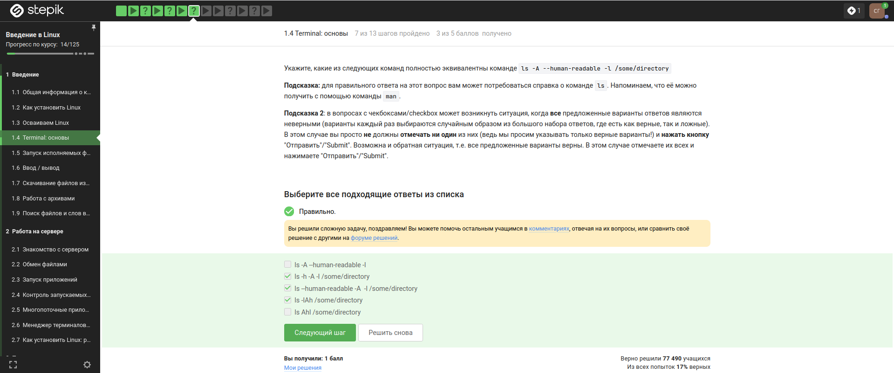{#fig-012 width=70%}

## 

Абсолютный путь — всегда корректно покажет нужную директорию, независимо от текущего расположения - подходит. Тильда ~ в bash заменяется на домашнюю директорию пользователя — /home/bi. Получается /home/bi/Downloads - подходит. ls Downloads покажет /home/bi/Documents/Downloads - не подходит. ./Downloads — то же самое, что Downloads (относительно текущей папки) - не подходит ([рис.  @fig-013]).

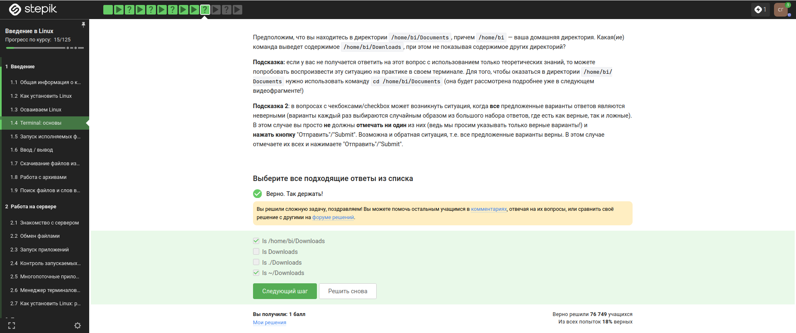{#fig-013 width=70%}

## rm -r это команда удаления директорий и рекуррентное удаление файлов в ней ([рис. @fig-014]).

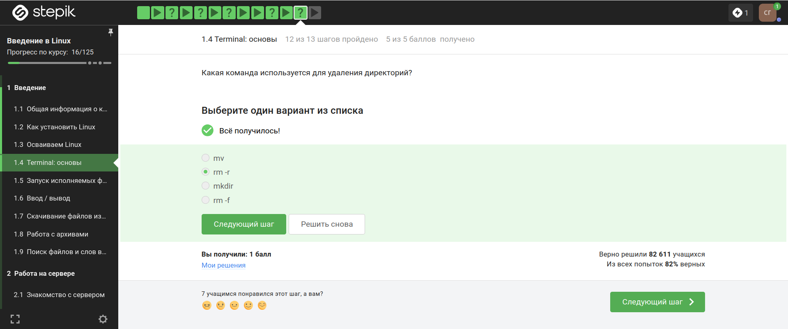{#fig-014 width=70%}

## Проверкой выясниллось, никто не закроется ([рис.  @fig-015]).

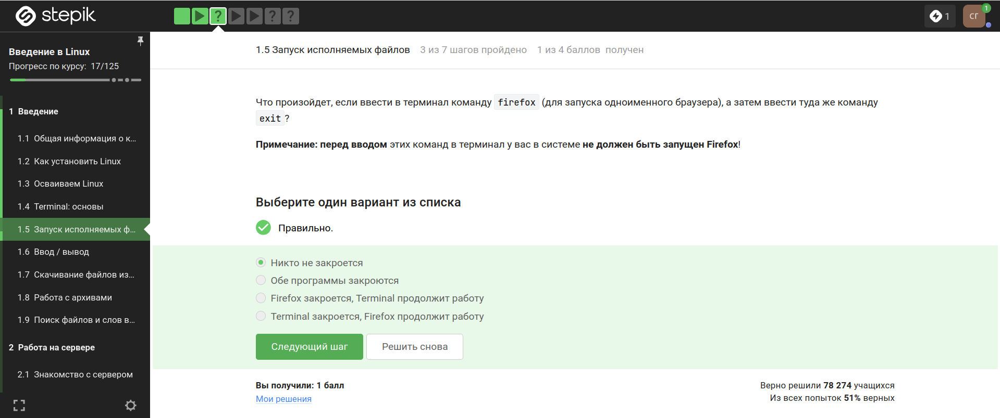{#fig-015 width=70%}

## Ctrl+Z, bg это запуск в фоновом режиме программы ([рис. @fig-016]).

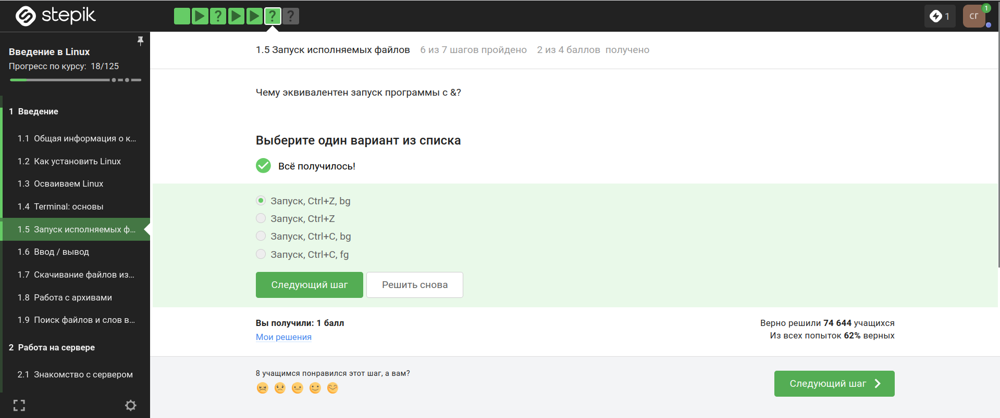{#fig-016 width=70%}

## После запуска файла мы видим вывод, показанный на скриншоте 18 ([рис.  @fig-017], [рис. @fig-018]).

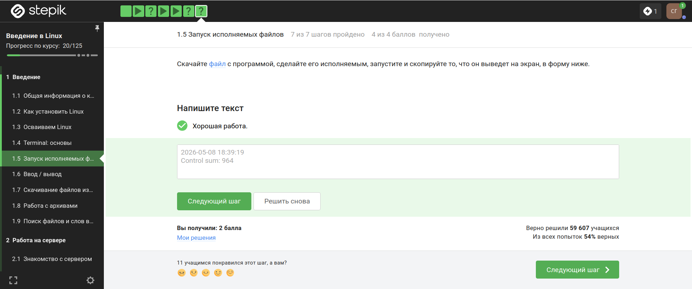{#fig-017 width=70%}

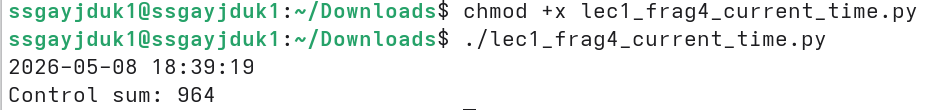{#fig-018 width=70%}

## По умолчанию поток ошибок из программы в терминале выводится на экран ([рис. @fig-019]).

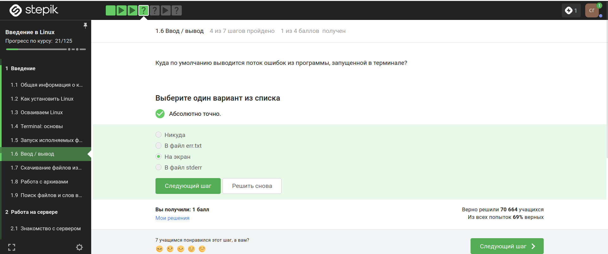{#fig-019 width=70%}

## 

program 2> file.txt - направить стандартный поток ошибок в файл, если его нет, файл будет создан, есди есть - будет перезаписан сверху. program 2>> file.txt - направить стандартный поток ошибок в файл, если его нет, файл будет создан, есди есть - информация будет записана в конец ([рис. @fig-020]).

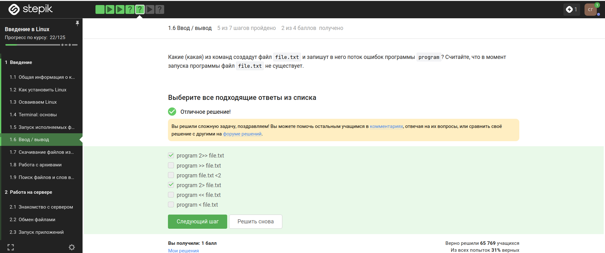{#fig-020 width=70%}

## Сообщения об ошибках выводятся на экран ([рис. @fig-021]). 

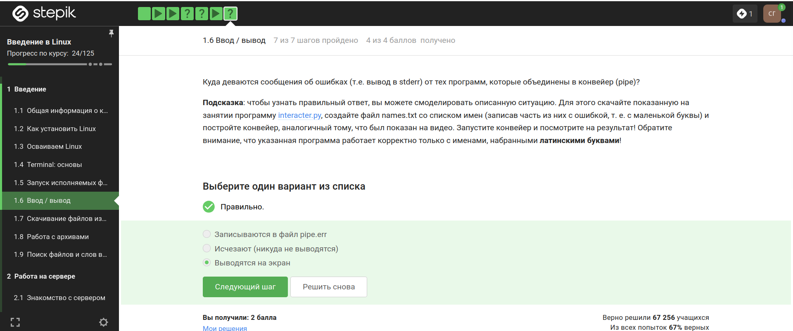{#fig-021 width=70%}

## 

В данной ситуации, файл скачивается и размещается с названием example.jpg в папке /home/alex/Pictures. После этот файл конвертируется в 1.jpg и добавляется в текущей директории, где мы находимся, так как указано только название файла и путь не прописан ([рис.  @fig-022]). 

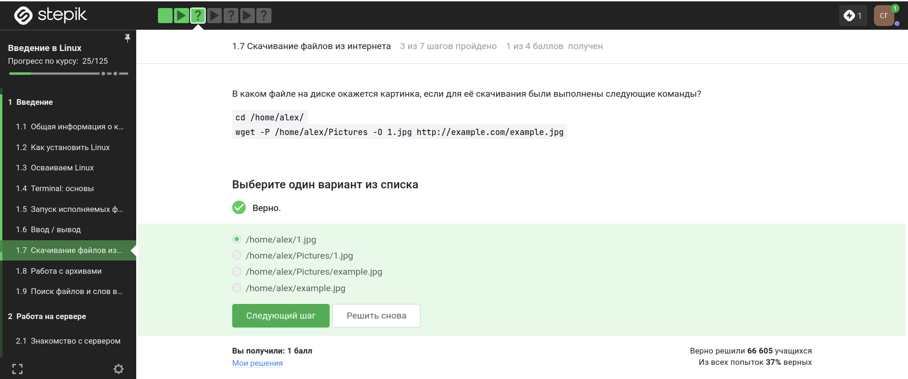{#fig-022 width=70%}

## -q или -quiet ([рис. @fig-023]). 

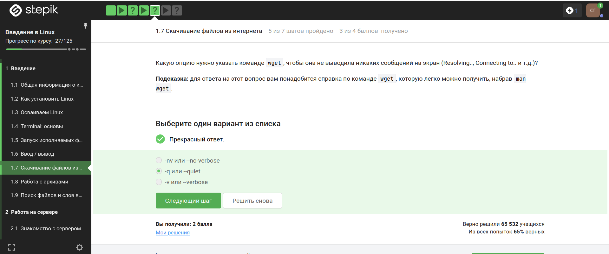{#fig-023 width=70%}

## 

-r — рекурсивная загрузка. -l 1 — глубина рекурсии = 1 (скачать исходную страницу и всё, на что есть прямые ссылки с неё). -A jpg — принимать (accept) только файлы с расширением .jpg. В итоге, исходная HTML-страница загружается обязательно (она нужна для анализа ссылок), но не подпадает под фильтр -A, так как -A применяется к не-HTML ресурсам. Все найденные на исходной странице ссылки на .jpg будут скачаны. Ссылки на .png будут проигнорированы. Ссылки на другие HTML-страницы будут перейдены (из-за -r, но глубина -l 1 уже исчерпана), но никакие файлы с них не скачиваются. Сами эти HTML-страницы тоже не сохраняются, потому что -A jpg запрещает сохранять HTML. Будут скачаны именно .jpg файлы, и только они. HTML-страницы (кроме первой) удаляются ([рис.  @fig-024]).

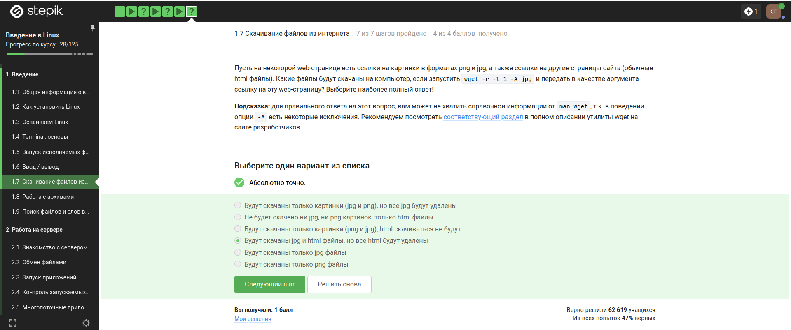{#fig-024 width=70%}

## gzip удаляет архив после распаковки. zip при распаковке архив не удаляет ([рис. @fig-025]). 

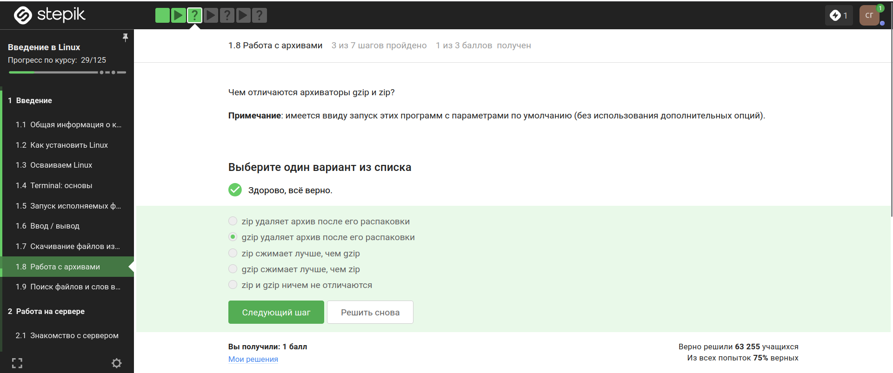{#fig-025 width=70%}

## Создать архив из директории с файлами могут zip и tar ([рис.  @fig-026]). 

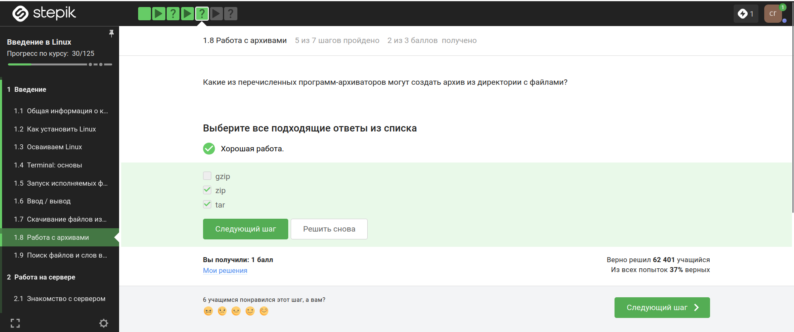{#fig-026 width=70%}

## c - архиватор, j - указатель на тип архиватора bzip, f - создание архива в файловой системе ([рис. @fig-027]). 

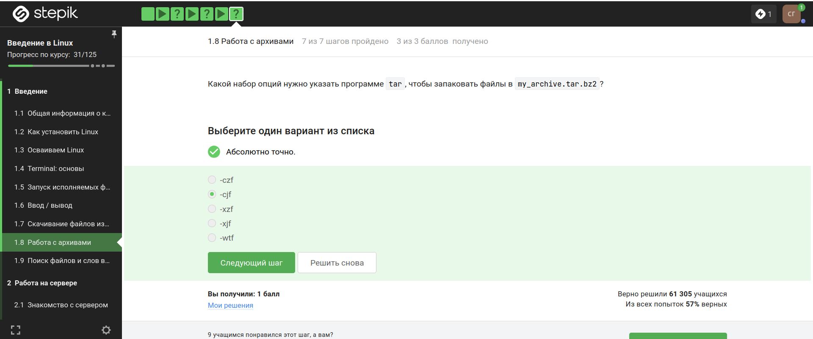{#fig-027 width=70%}

## Формат файла jpeg, а не jpg. Название файла Alexey, а не alexey. ? - один символ ([рис.  @fig-028]).

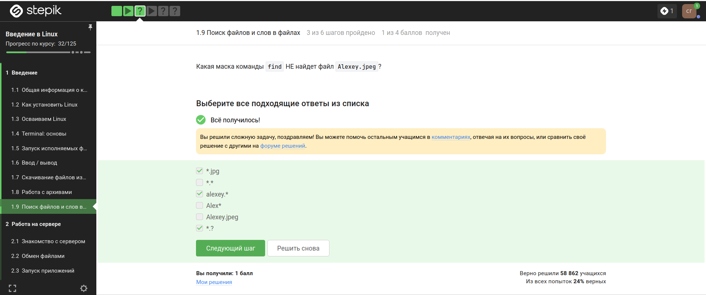{#fig-028 width=70%}

## Все строки, в которых указано world. В остальных строках не найдет слова word и World (другое слово и регистр) ([рис.  @fig-029]). 

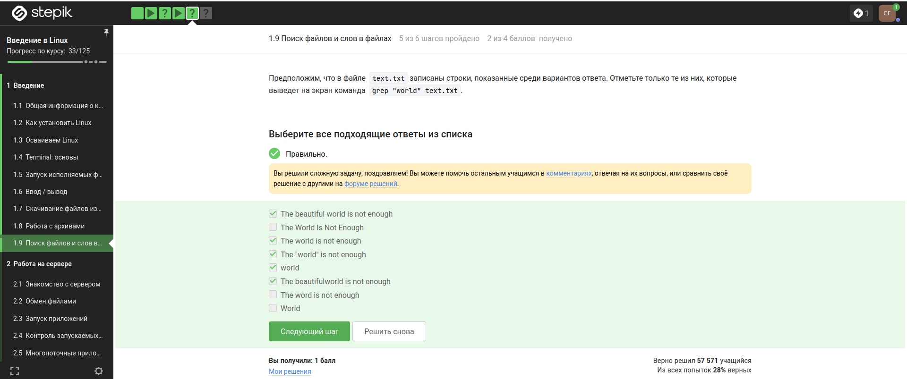{#fig-029 width=70%}

## 

Скачаем архив, с помощью команды grep -r "love" Shakespeare/ > love.txt сгенерируем файл, в котором будут все строчки из этих произведений, содержащие "love", и загрузим к заданию ([рис. @fig-030], [рис. @fig-031]).

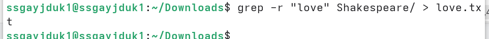{#fig-030 width=70%}

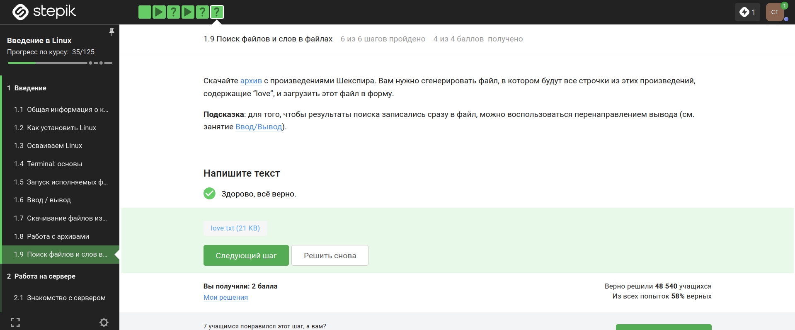{#fig-031 width=70%}

# Выводы

Изучили операционную систему Linux. Прошли 1 этап внешнего курса. 

# Список литературы{.unnumbered}

1.Kulyabov. Прохождение внешнего курса. Часть 1. RUDN

::: {#refs}
:::
