---
## Author
author:
  name: Гайдук Софья Сергеевна
  degrees: DSc
  orcid: 0000-0002-0877-7063
  email: 1032253645@rudn.ru
  affiliation:
    - name: Российский университет дружбы народов
      country: Российская Федерация
      postal-code: 117198
      city: Москва
      address: ул. Миклухо-Маклая, д. 6
---
## Title
---
title: "Прохождение внешнего курса. Часть 2"
subtitle: "Презентация"
author: "Гайдук Софья Сергеевна"
date: "2026-05-11"
format:
  beamer:
    theme: "Madrid"
    colortheme: "dove"
    slide-number: true
---
# Информация

## Докладчик

:::::::::::::: {.columns align=center}
::: {.column width="70%"}

  * Гайдук Софья Сергеевна
  * студент
  * Российский университет дружбы народов им. П. Лумумбы
  * [1032253645@rudn.ru](mailto:1032253645@rudn.ru)
  * <https://github.com/SofiaGayduk/study_2025-2026_os-intro>

:::
::: {.column width="30%"}

:::
::::::::::::::

# Цель работы

Изучить операционную систему Linux. Прохождение 2 этапа внешнего курса. 

# Выполнение лабораторной работы 

## 

Удаленный сервер можно использовать для широкого круга задач, где нужны: непрерывная работа 24/7 — сервер не выключается, в отличие от домашнего/рабочего компьютера. Высокая производительность — мощные CPU, много RAM, GPU для ресурсоёмких расчётов. Общедоступность — сайты, API, базы данных, доступные из интернета. Коллаборация — несколько человек могут работать с одними данными из разных мест ([рис. 1]).

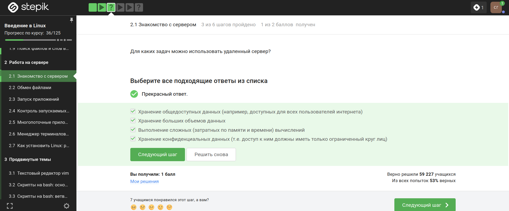{#fig-001 width=70%}

## id_rsa.pub является открытым ([рис. 2]).

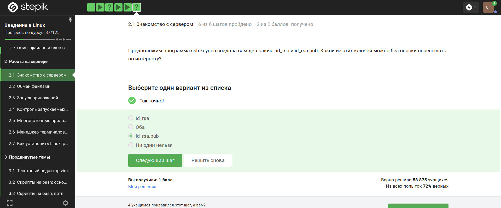{#fig-002 width=70%}

## 

scp -r stepic username@server:~/ ,где -r (рекурсивный режим) — копирует всю директорию вместе со всем её содержимым (поддиректориями, файлами) ([рис. 3]).

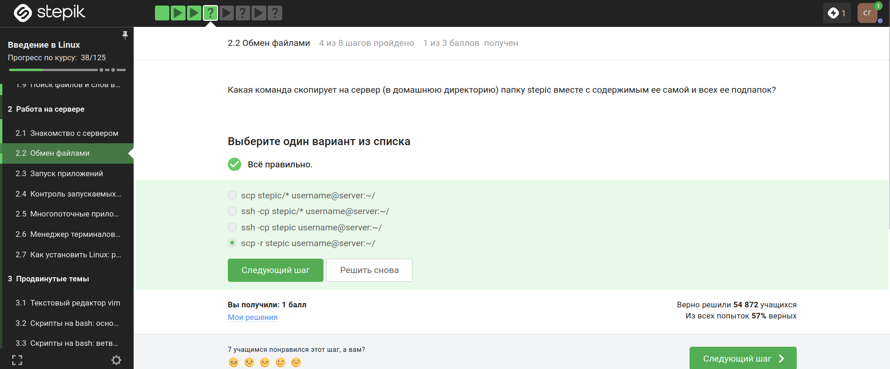{#fig-003 width=70%}

## Проверка на существование программы и интернет соединение ([рис. 4]).

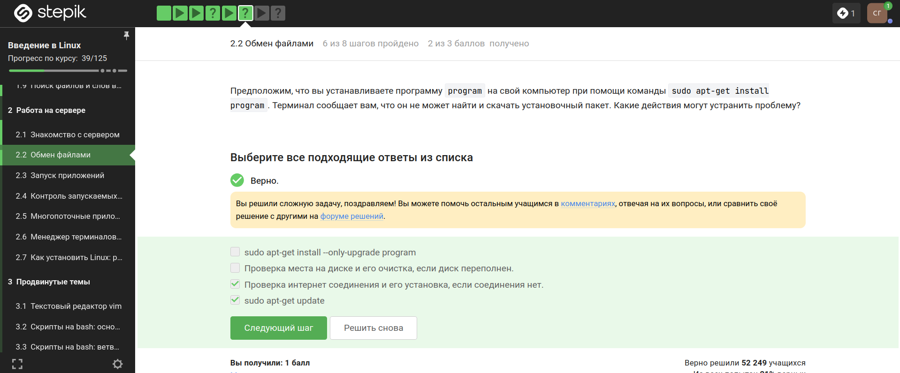{#fig-004 width=70%}

## 

Для просмотра и копирования на своем компьютере и сервере. FileZilla - проект посвященный приложениям для FTP ([рис. 5]).

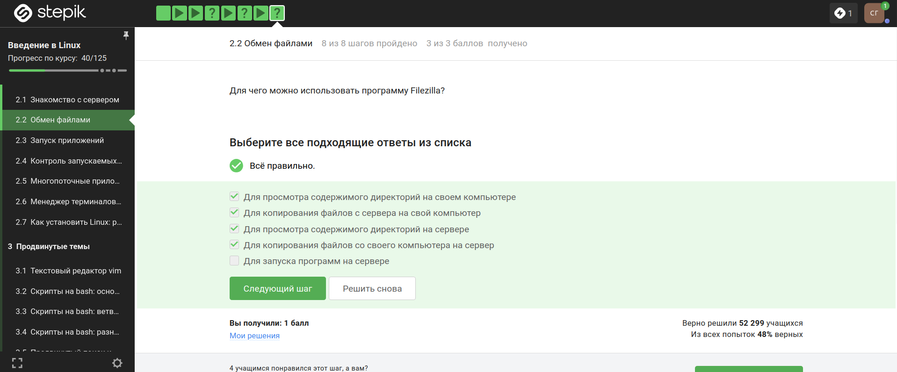{#fig-005 width=70%}

## 

Сначала проверить, есть ли другая версия программы, и если есть, то настроить сервер для поддержки вывода информации на экран ([рис. 6]).

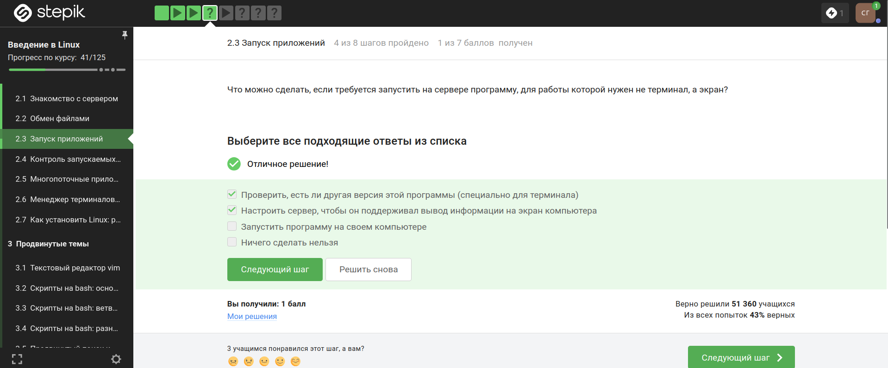{#fig-006 width=70%}

## С помощью команд man program, help program, program --help  ([рис. 7]).

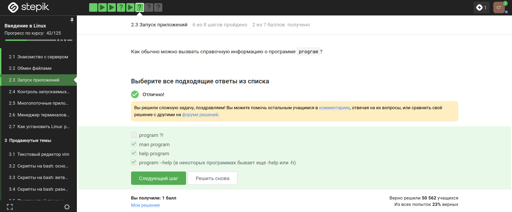{#fig-007 width=70%}

## 

Программа FastQC может принимать 5 форматов данных на вход: bam, sam, bam_mapped, sam_mapped and fastq ([рис. 8]).

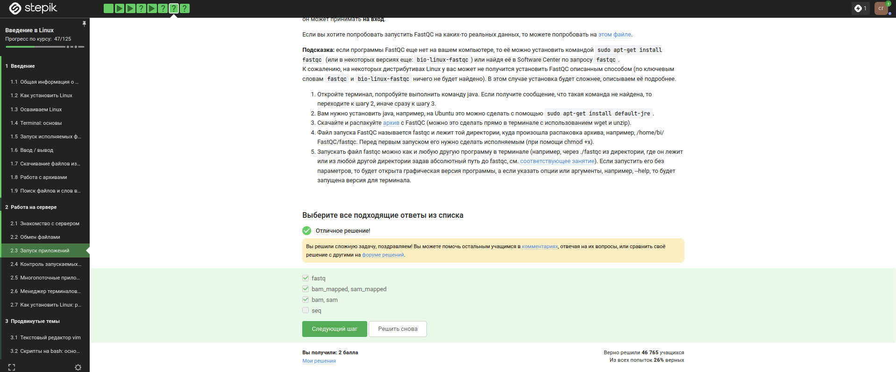{#fig-008 width=70%}

## 

Команда, которая запускает в терминале Clustal на файле test.fasta и выполняет множественное выравнивание clustalw2 -infile=test.fasta -align ([рис. 9]).

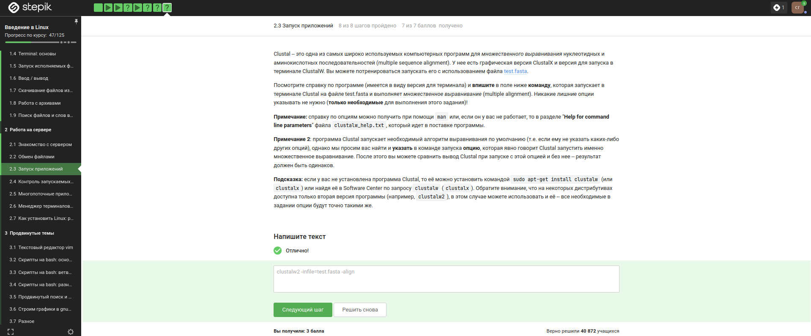{#fig-009 width=70%}

## Ctrl+C - завершение процесса, Ctrl+Z - приостановка процесса ([рис. 10]).

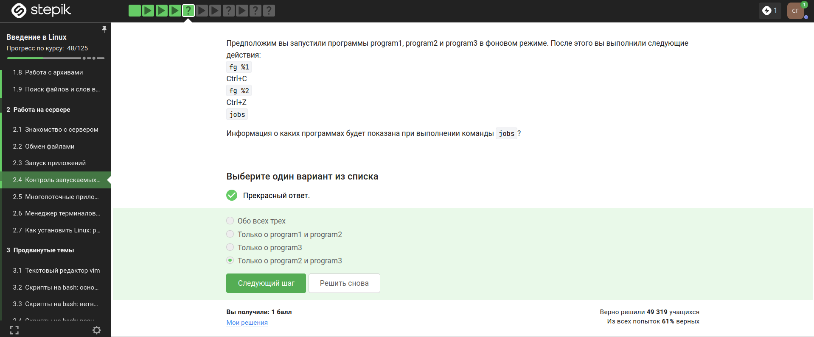{#fig-010 width=70%}

## 

jobs по умолчанию показывает номер задания (job ID), локальный для текущей сессии. top и ps показывают системный PID. То есть одинаковые только у ps и top ([рис. 11]).

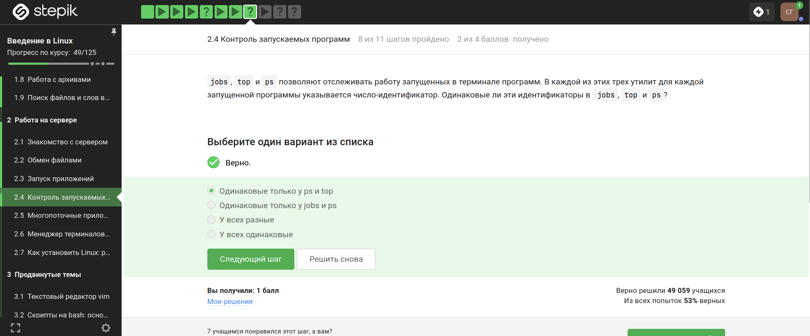{#fig-011 width=70%}

## Для мгновенного завершения остановленного процесса нужна команда kill -9 ([рис. 12]).

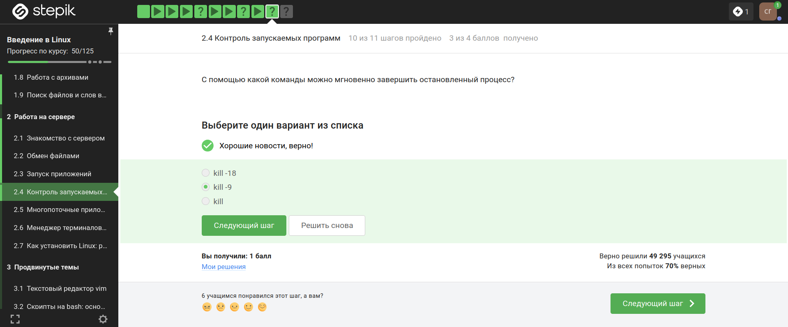{#fig-012 width=70%}

## Процесс приступит к завершению, как только будет продолжен ([рис. 13]).

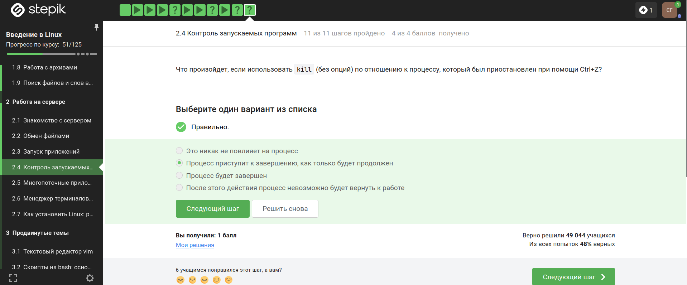{#fig-013 width=70%}

## Остановленная программа не потребляет ресурсы CPU ([рис. 14]).

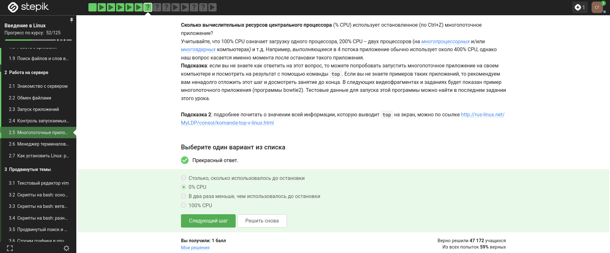{#fig-014 width=70%}

## 

Остановленное приложение занимает памяти столько же, сколько потребляло в момент остановки ([рис. 15]).

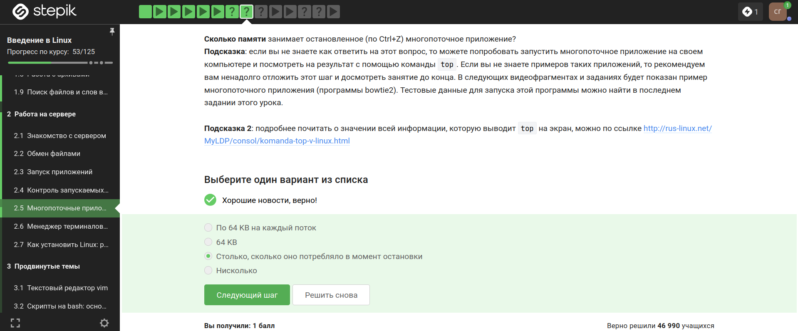{#fig-015 width=70%}

## 

Принудительно завершить один из потоков запущенного многопоточного приложения нельзя ([рис. 16]).

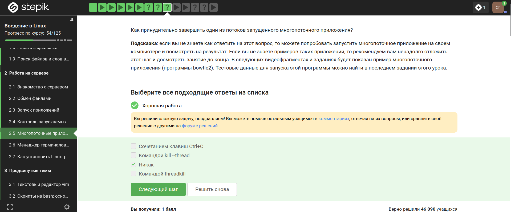{#fig-016 width=70%}

## bowtie2 можно выполнить в несколько потоков ([рис. 17]).

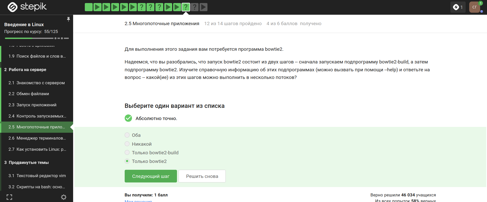{#fig-017 width=70%}

## Вывод stderr второго этапа ([рис. 18]).

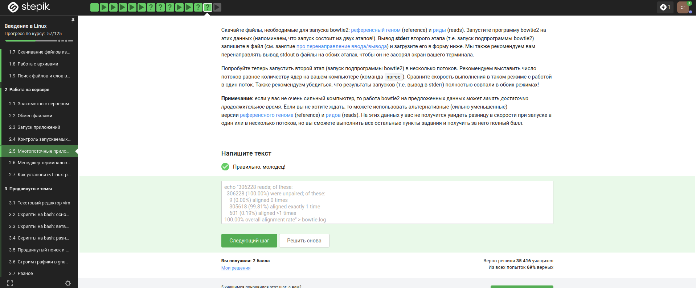{#fig-018 width=70%}

## Терминал сообщит о неизвестных процессах ([рис. 19]).

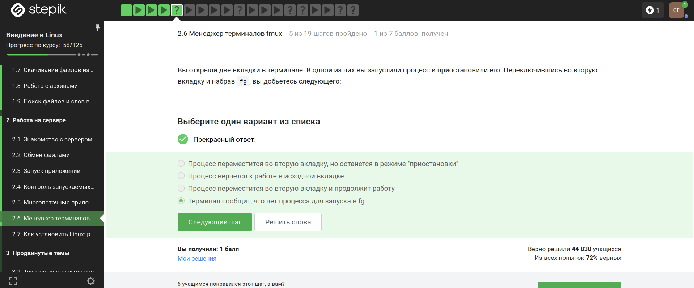{#fig-019 width=70%}

## Командой exit tmux завершает работу ([рис. 20]).

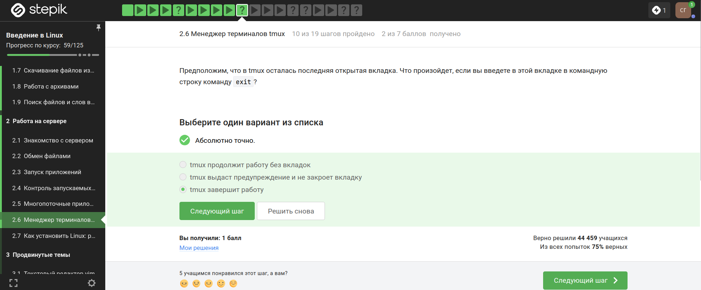{#fig-020 width=70%}

## 

Соединение с сервером будет прервано, но tmux продолжит работу ([рис. 21]). 

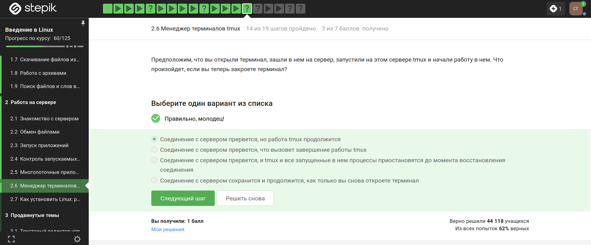{#fig-021 width=70%}

## 

Вкладка закроется, будет предупреждение о завершении работы и пропадет запущенный в ней процесс ([рис. 22]). 

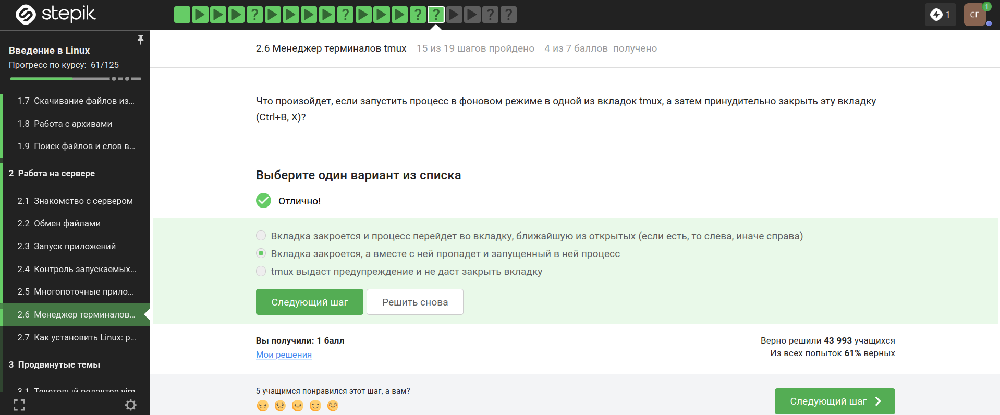{#fig-022 width=70%}

## 

Ctrl+B + . (точка): переименовать текущий tmux-сеанс. Ctrl+B + t: показать часы.  Ctrl+B + , (запятая): переименовать текущее окно (window). Ctrl+B + ~ (тильда): показать сообщения (messages). Ctrl+B + i: показать информацию об активном pane ([рис. 23]). 

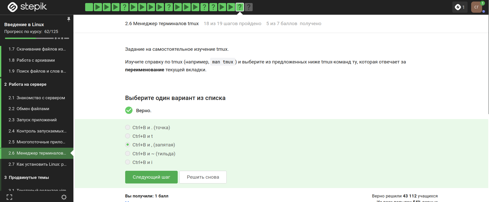{#fig-023 width=70%}

## 

Можно по отдельности (не одновременно) разделять, закрывать вкладки. Можно перемещаться с помощью стрелочек по вкладкам ([рис. 24]).

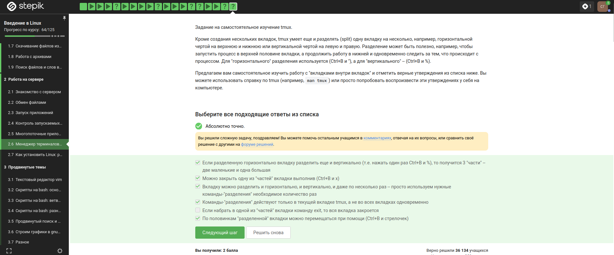{#fig-024 width=70%}

# Выводы

Изучили операционную систему Linux. Прошли 2 этап внешнего курса. 

# Список литературы{.unnumbered}

1.Kulyabov. Прохождение внешнего курса. Часть 2. RUDN

# Список литературы{.unnumbered}

1.Kulyabov. Прохождение внешнего курса. Часть 2. RUDN

::: {#refs}
:::
