---
## Author
author:
  name: Гайдук Софья Сергеевна
  degrees: DSc
  orcid: 0000-0002-0877-7063
  email: 1032253645@rudn.ru
  affiliation:
    - name: Российский университет дружбы народов
      country: Российская Федерация
      postal-code: 117198
      city: Москва
      address: ул. Миклухо-Маклая, д. 6

## Title
title: "Отчёт по лабораторной работе № 1"
subtitle: "Отчет"
license: "CC BY"
---

# Цель работы

Целью данной работы является приобретение практических навыков установки операционной системы на виртуальную машину, настройки минимально необходимых для дальнейшей работы сервисов.

# Задание

-  Установка Linux на Virtualbox.
-  Установка операционной системы.
-  Обновления.
-  Повышение комфорта работы.
-  Автоматическое обновление.
-  Отключение SELinux.
-  Настройка раскладки клавиатуры.
-  Установка имени пользователя и названия хоста.
-  Установка программного обеспечения для создания документации.
-  Работа с языком разметки Markdown.
-  texlive.
-  Домашнее задание.
-  Содержание отчёта.
-  Контрольные вопросы.

# Выполнение лабораторной работы

Настройка хост-клавиши - левый Ctrl и Shift ([рис. @fig-001]).

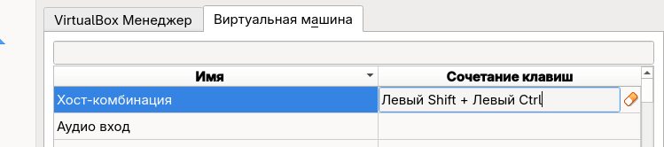{#fig-001 width=70%}

Запустим менеджер виртуальных машин, введя в командной строке VirtualBox ([рис. @fig-002]).

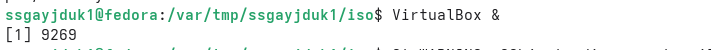{#fig-002 width=70%}

Создание новой виртуальной машины в графическом интерфейсе ([рис. @fig-003]).

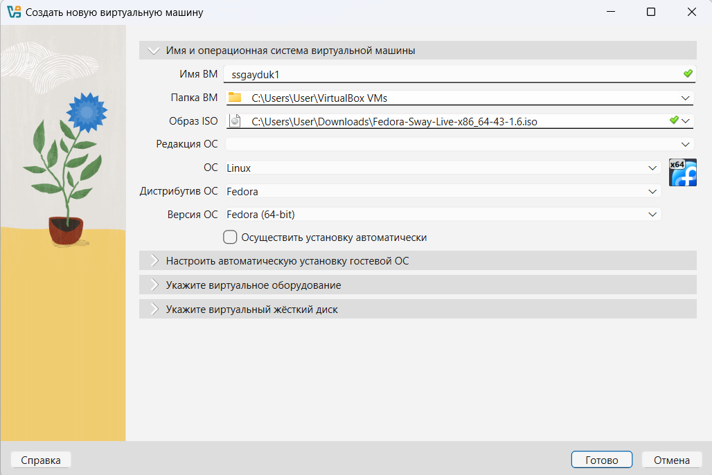{#fig-003 width=70%}

Укажем размер основной памяти виртуальной машины ([рис. @fig-004]).

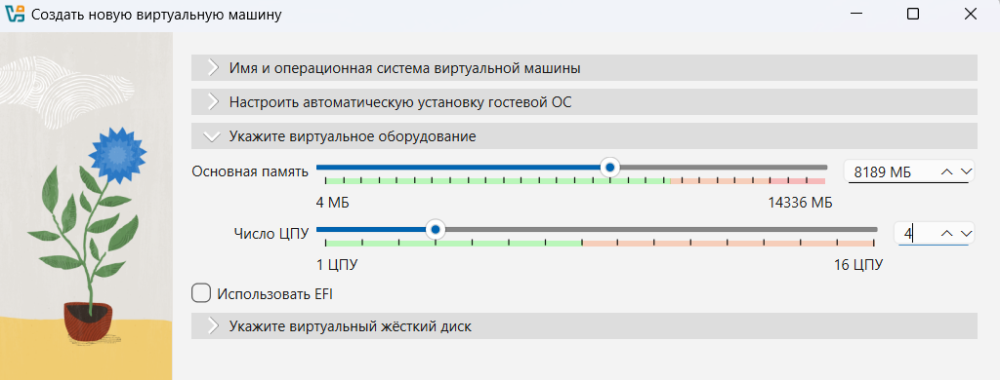{#fig-004 width=70%}

Зададим размер диска — 80 ГБ ([рис. @fig-005]).

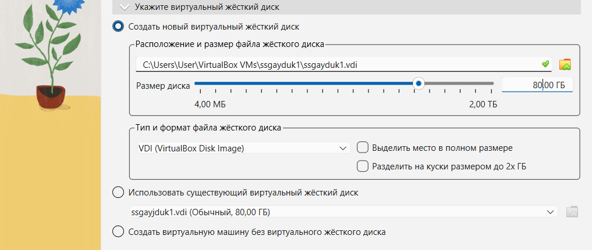{#fig-005 width=70%}

Сделаем Общий буфер обмена двунаправленным ([рис. @fig-006]).

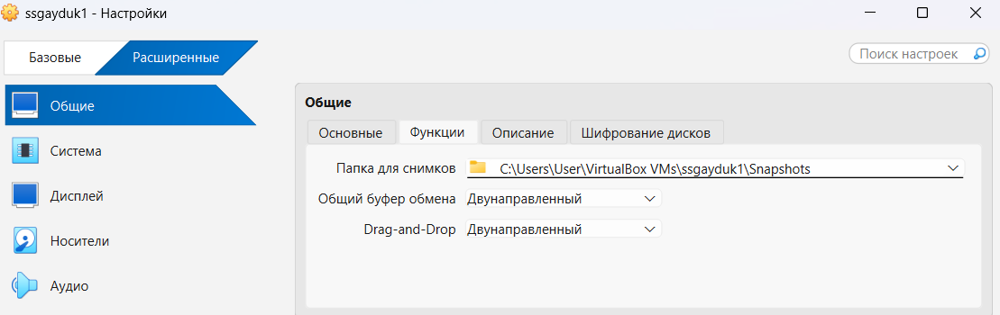{#fig-006 width=70%}

Изнально Носителем стоит диск, уберем его для правильной работы ВМ([рис. @fig-007, @fig-008]).

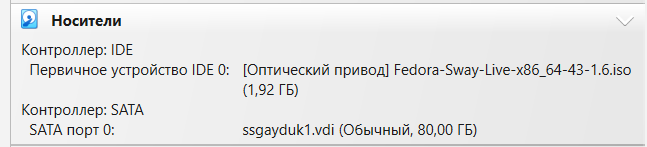{#fig-007 width=70%}

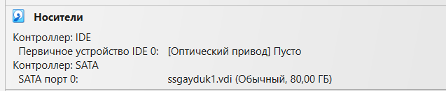{#fig-008 width=70%}

Сделаем режим полного экрана для лучшей работы ([рис. @fig-009]).

{#fig-009 width=70%}

Выбор языка для Fedora ([рис. @fig-010]).

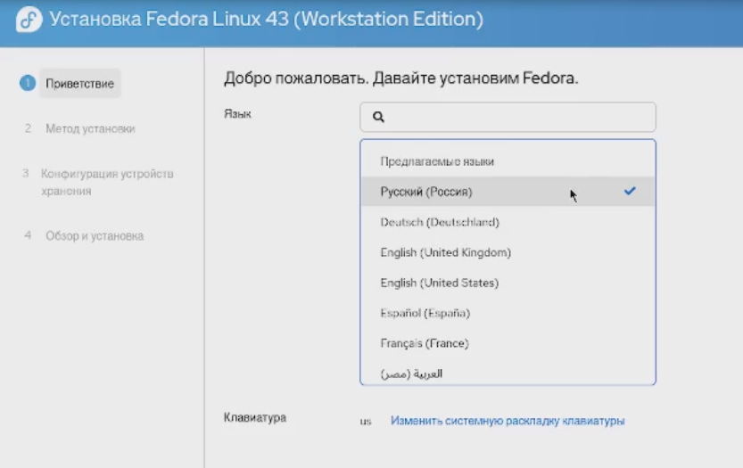{#fig-010 width=70%}

Обзор и установка ([рис. @fig-011]).

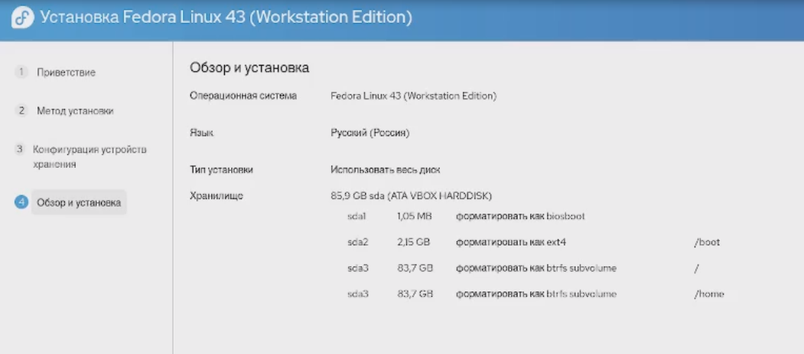{#fig-011 width=70%}

Установка ([рис. @fig-012]).

{#fig-012 width=70%}

Завершение установки ([рис. @fig-013]).

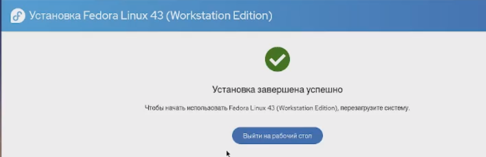{#fig-013 width=70%}

Успешная установка ([рис. @fig-014]).

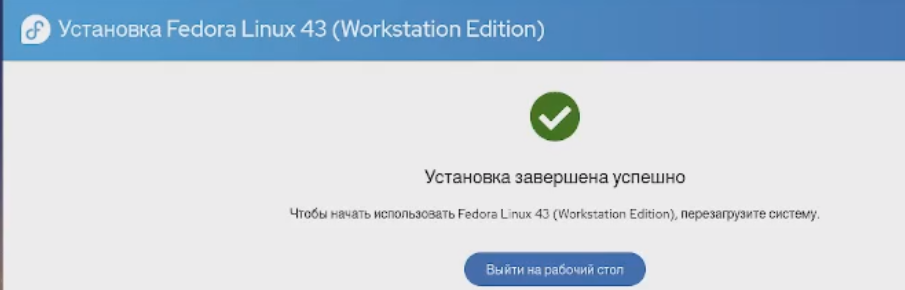{#fig-014 width=70%}

Перезагрузка ([рис. @fig-015]).

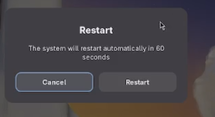{#fig-015 width=70%}

Выбор раскладки клавиатуры ([рис. @fig-016]).

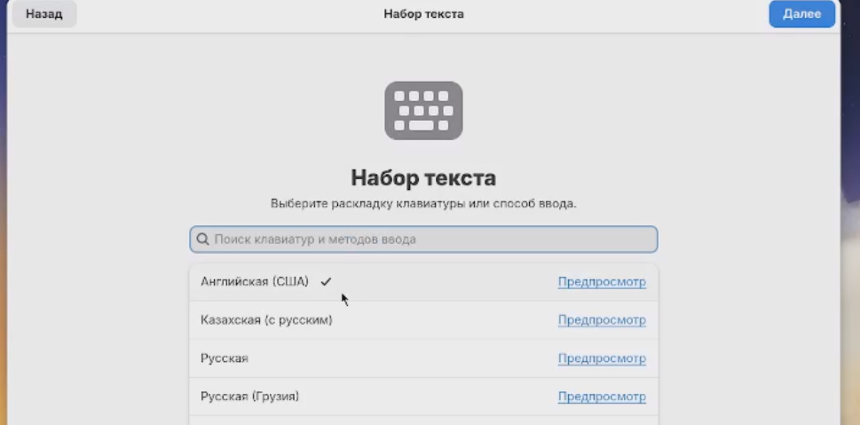{#fig-016 width=70%}

Выбор часового пояса ([рис. @fig-017]).

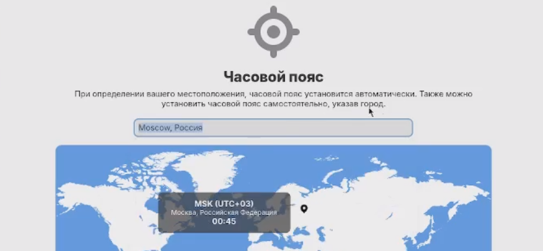{#fig-017 width=70%}

Заполнение личных данных ([рис. @fig-018]).

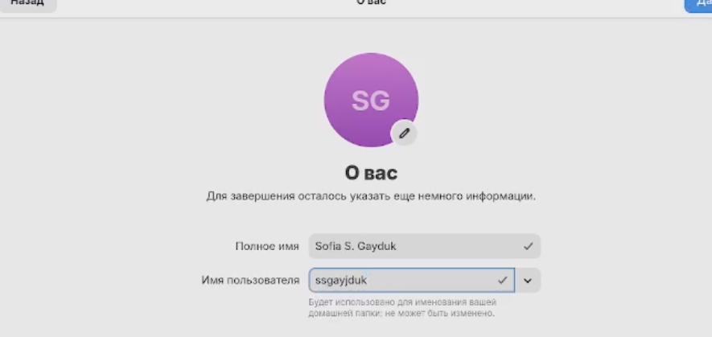{#fig-018 width=70%}

Запускаем в терминале tmux, Переключаемся на роль супер-пользователя ([рис. @fig-019]).

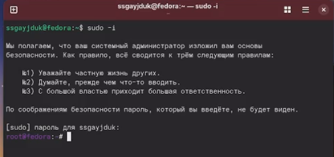{#fig-019 width=70%}

Установиваем средства разработки ([рис. @fig-020]).

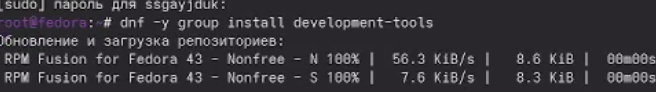{#fig-020 width=70%}

Также устанавливаем update ([рис. @fig-021]).

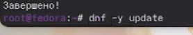{#fig-021 width=70%}

Устанавливаем пакет DKMS ([рис. @fig-022]).

{#fig-022 width=70%}

Устанавливаем автообновление ([рис. @fig-023]).

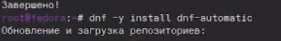{#fig-023 width=70%}

Устанавливаем таймер автообновления([рис. @fig-024]).

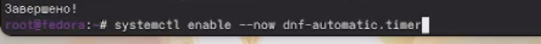{#fig-024 width=70%}

Отключаем SELinux, меняя занчение ([рис. @fig-025, @fig-026]).

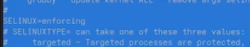{#fig-025 width=70%}

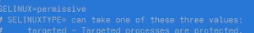{#fig-026 width=70%}

Перегрузим виртуальную машину([рис. @fig-027]).

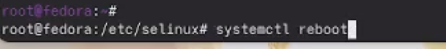{#fig-027 width=70%}

Создаем конфигурационный файл ([рис. @fig-028]).

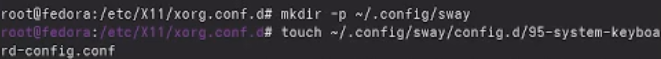{#fig-028 width=70%}

Отредактируем конфигурационный файл ([рис. @fig-029]).

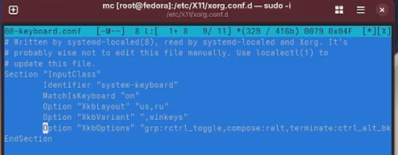{#fig-029 width=70%}

Перегрузим виртуальную машину([рис. @fig-030]).

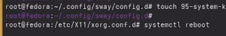{#fig-030 width=70%}

Переключимся на роль супер-пользователя, Установим средство pandoc для работы с языком разметки Markdown([рис. @fig-031]).

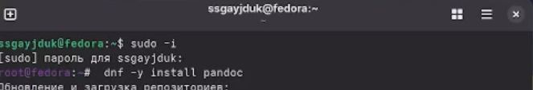{#fig-031 width=70%}

Установим дистрибутив TeXlive ([рис. @fig-032]).

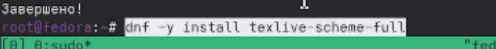{#fig-032 width=70%}

# Домашнее задание

Получим Версию ядра Linux (Linux version) ([рис. @fig-033]).

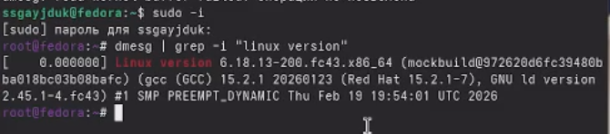{#fig-033 width=70%}

Частота процессора (Detected Mhz processor) ([рис. @fig-034]).

{#fig-034 width=70%}

Модель процессора (CPU0) ([рис. @fig-035]).

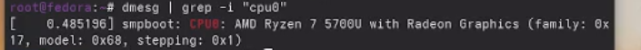{#fig-035 width=70%}

Тип обнаруженного гипервизора (Hypervisor detected) ([рис. @fig-036]).

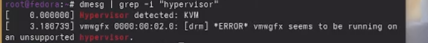{#fig-036 width=70%}

Тип файловой системы корневого раздела ([рис. @fig-037]).

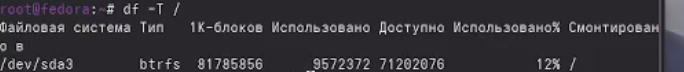{#fig-037 width=70%}

Последовательность монтирования файловых систем ([рис. @fig-038, @fig-039]).

{#fig-038 width=70%}

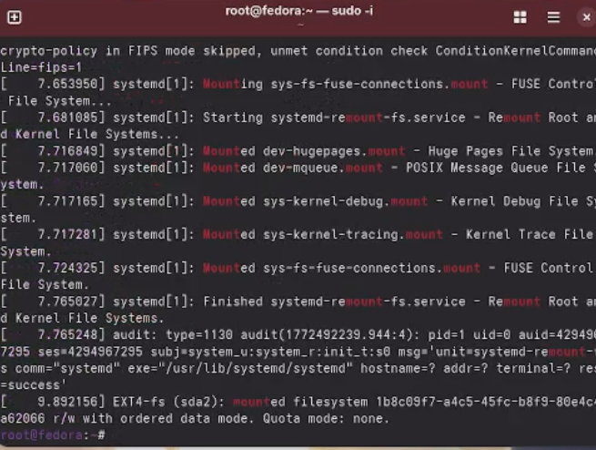{#fig-039 width=70%}

# Ответы на контрольные вопросы

1. Какую информацию содержит учётная запись пользователя? -Логин пользователя, пароль пользователя, его ID, ID его группы, дополнитель- ная информация (настоящее имя, почта), домашний каталог пользователя

2. Укажите команды терминала и приведите примеры:
для получения справки по команде

-Используется команда mаn. Например: man cd — узнать, что делает команда cd
для перемещения по файловой системе

-Используется команда сd. Например: cd ~ - переместиться в домашний каталог
для просмотра содержимого каталога

-Используется команда ls. Например: Is /- посмотреть содержимое корне- вого каталога для определения объёма каталога -Используется команда dи. Например: dи — выводит размер всех подката- логов и файлов в каталоге для создания / удаления каталогов / файлов -Для создания файлов: touch. Например: touch /test.txt - создать файл test.txt В КорН -Для удаления файлов: rm. Например: rm /test.txt - удалить файл test.txt в корне

# Выводы

Мы приобрели практические навыки установки операционной системы на виртуальную машину, настройки минимально необходимых для дальнейшей работы сервисов

# Список литературы{.unnumbered}

1.Kulyabov. Лабораторная работа № 1. Установка ОС Linux. RUDN

::: {#refs}
:::

