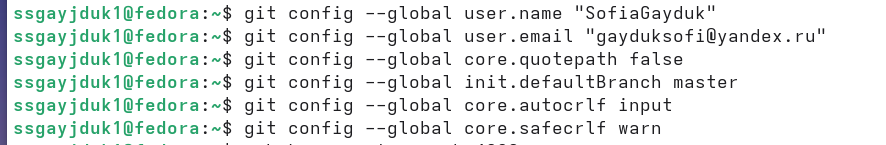

---
## Front matter
lang: ru-RU
title: Лабораторная работа №2
subtitle: Презентация
author:
  - Гайдук Софья Сергеевна
institute:
  - Российский университет дружбы народов, Москва, Россия
date: 25 февраля 2024

## i18n babel
babel-lang: russian
babel-otherlangs: english

## Formatting pdf
toc: false
toc-title: Содержание
slide_level: 2
aspectratio: 169
section-titles: true
theme: metropolis
header-includes:
 - \metroset{progressbar=frametitle,sectionpage=progressbar,numbering=fraction}
 - '\makeatletter'
 - '\beamer@ignorenonframefalse'
 - '\makeatother'
 
## Fonts
mainfont: PT Serif
romanfont: PT Serif
sansfont: PT Sans
monofont: PT Mono
mainfontoptions: Ligatures=TeX
romanfontoptions: Ligatures=TeX
sansfontoptions: Ligatures=TeX,Scale=MatchLowercase
monofontoptions: Scale=MatchLowercase,Scale=0.9
---

# Информация

## Докладчик

:::::::::::::: {.columns align=center}
::: {.column width="70%"}

  * Гайдук Софья Сергеевна
  * Студент
  * Российский университет дружбы народов
  * [1032253645@pfur.ru](mailto:1032253645@pfur.ru)

:::
::: {.column width="30%"}

:::
::::::::::::::

## Цель

Изучить идеологию и применение средств контроля версий.
Освоить умения по работе с git

## Задачи

Создать базовую конфигурацию для работы с git.
Создать ключ SSH.
Создать ключ PGP.
Настроить подписи git.
Зарегистрироваться на Github.
Создать локальный каталог для выполнения заданий по предмету.

## Установка git и Установка gh

Для начала установим git и gh. В моём случае они уже установлены, посмотрим версию

## Базовая настройка git

Зададим имя для владельца репозитория.

## Базовая настройка git

Зададим почту, на которую зарегистрирован аккаунт на github

## Базовая настройка git

Настроим кодировку utf8 в выводе сообщений git

## Базовая настройка git

Зададим имя начальной ветки, настроим параметры autocrlf и safecrlf

## Создание ключа ssh

Создадим ключ RSA размером 4096 бит

{height=60%}

## Создание ключа ssh

Теперь создадим ключ по алгоритму ed22519

{height=60%}

## Создание ключа pgp

Теперь создадим ключ gpg. Выбираем из предложенных вариантов первый тип (RSA and RSA), размер ключа задаём 4096 бит и делаем срок действия ключа неограниченным

{height=60%}

## Создание ключа pgp

Вводим имя и адрес электронной почты. 

{height=60%}

## Добавление PGP ключа в GitHub

Добавляем PGP ключа в GitHub

{height=60%}

## Настройка автоматических подписей коммитов git

Теперь производим настройку автоматических подписей

## Настройка автоматических подписей коммитов git

## Настройка автоматических подписей коммитов git

## Настройка gh

Нам нужно авторизоваться в github с помощью gh. Мы выбираем сайт для авторизации (GitHub.com), после выбираем предпочитаемый протокол (SSH), публичный SSH ключ (id_rsa.pub), и имя для ключа (Sway). В качестве способа авторизации выбираем браузер

{height=45%}

## Сознание репозитория курса на основе шаблона

Теперь создаём рабочую директорию курса и переходим в неё

## Сознание репозитория курса на основе шаблона

Cоздаём репозиторий для лабораторных работ из шаблона

## Сознание репозитория курса на основе шаблона

И клонируем его к себе на компьютер

## Настройка каталога курса

Переходим в него с помощью cd и удаляем ненужные файлы (package.json) и создаём необходимые каталоги, записав в файл COURSE строку os-intro (это наш текущий курс) и прописываем make prepare для того, чтобы нужные нам каталоги создались

{height=45%}

## Настройка каталога курса

Теперь добавляем нашу папку для отправки

## Настройка каталога курса

Делаем коммит, в котором указываем, что мы сделали структуру курса

{height=60%}

## Настройка каталога курса

И отправляем файлы на сервер GitHub с помощью команды push

## Выводы

Устаноли git, провели его первоначальную настройку, были созданы ключи для авторизации и подписи, а также создан репозиторий курса из предложенного шаблона
