---
## Author
author:
  name: Гайдук Софья Сергеевна
  degrees: DSc
  orcid: 0000-0002-0877-7063
  email: 1032253645@rudn.ru
  affiliation:
    - name: Российский университет дружбы народов
      country: Российская Федерация
      postal-code: 117198
      city: Москва
      address: ул. Миклухо-Маклая, д. 6

## Title
title: "Лабораторная работа № 2"
subtitle: "Отчет"
license: "CC BY"
---

# Цель работы

- Изучить идеологию и применение средств контроля версий.
- Освоить умения по работе с git.

# Задание

- Создать базовую конфигурацию для работы с git.
- Создать ключ SSH.
- Создать ключ PGP.
- Настроить подписи git.
- Зарегистрироваться на Github.
- Создать локальный каталог для выполнения заданий по предмету.

# Выполнение лабораторной работы

Так как у нас установлены git и gh, посмотрим его версию ([рис. @fig-001]).

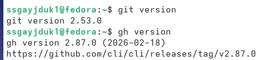{#fig-001 width=70%}

Зададим наше имя и email репозитория, настроим utf-8 в выводе сообщений git, зададим имя начальной ветки (называем её master), зададим параметры autocrlf и safecrlf ([рис. @fig-002]).

{#fig-002 width=70%}

По алгоритму rsa, размером 4096 бит создим ключ ([рис. @fig-003]).

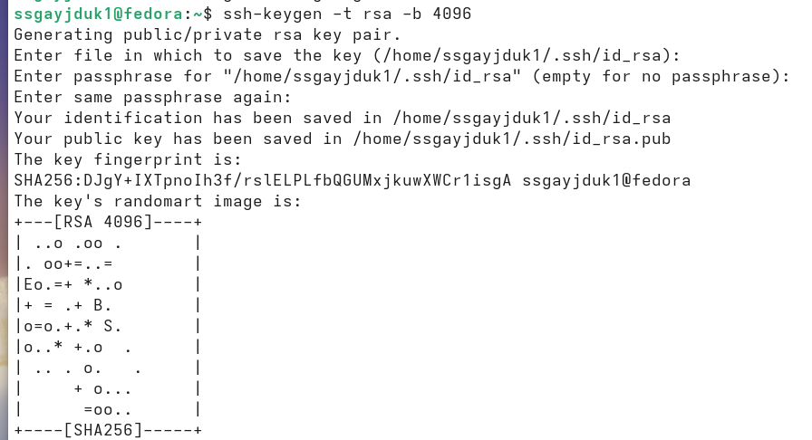{#fig-003 width=70%}

По алгоритму ed25519, создим ключ ([рис. @fig-004]).

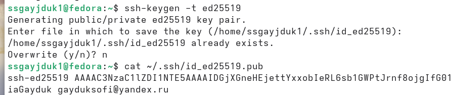{#fig-004 width=70%}

Создание ключа pgp: Генерируем ключ. Из предложенных опций выбираем: тип RSA and RSA (1), размер 4096, выберите срок действия: не ограничен (0) ([рис. @fig-005]).

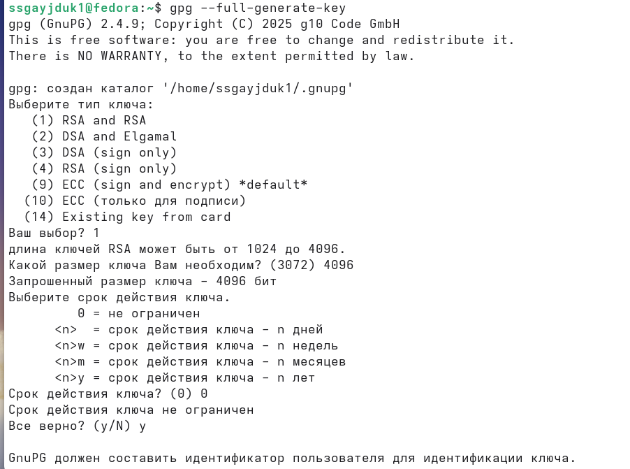{#fig-005 width=70%}

GPG запросит личную информацию, которая сохранится в ключе: Имя, Адрес электронной почты (email должен соответствовать адресу, используемому на GitHub, Комментарий (оставим это поле пустым) ([рис. @fig-006]).

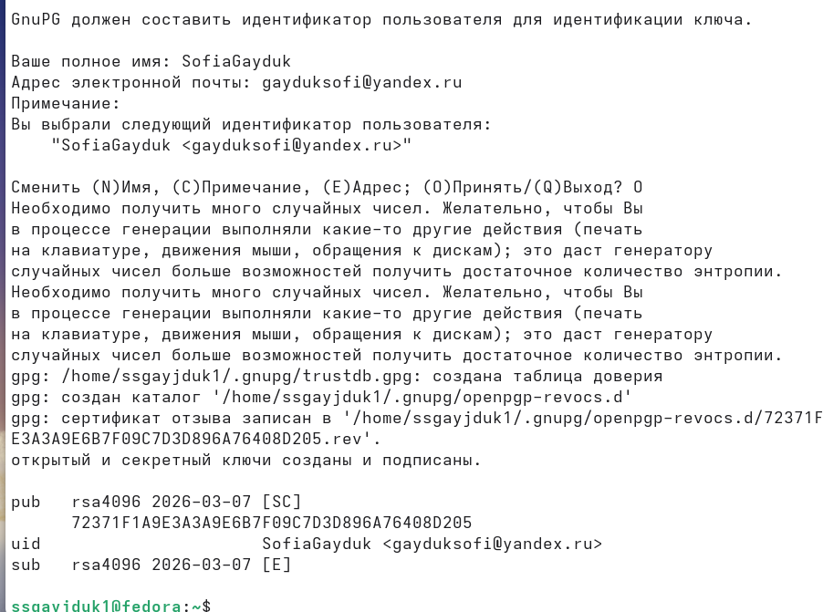{#fig-006 width=70%}

Так как уже создана учётная запись и заполнены основные данные на github, то посмотрим их ([рис. @fig-007]).

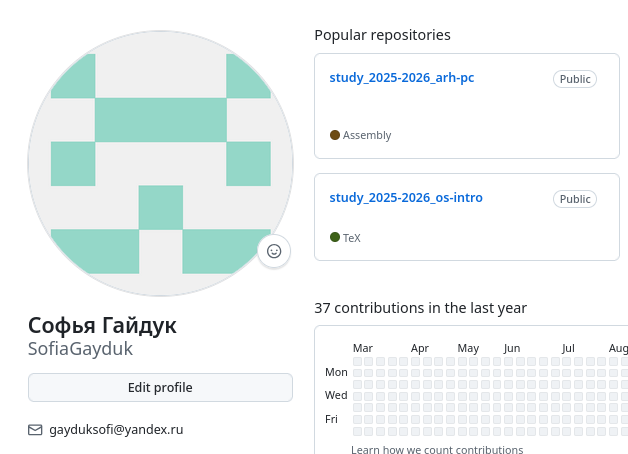{#fig-007 width=70%}

Добавим PGP ключ в GitHub - выводим список ключей и копируем отпечаток приватного ключа ([рис. @fig-008]).

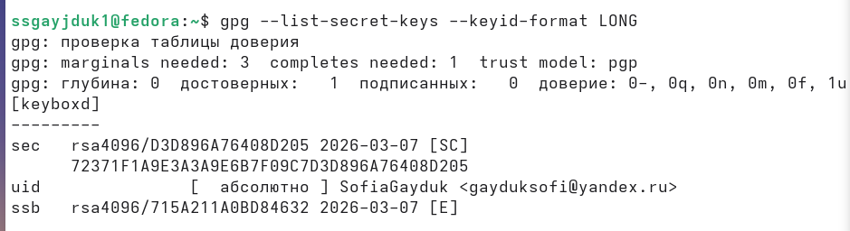{#fig-008 width=70%}

Cкопируем наш сгенерированный PGP ключ в буфер обмена ([рис. @fig-009]).

{#fig-009 width=70%}

Перейдем в настройки GitHub, нажмем на кнопку New GPG key и вставим полученный ключ в поле ввода  ([рис. @fig-010]).

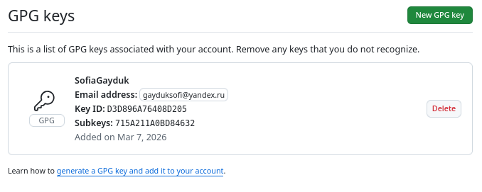{#fig-010 width=70%}

Используя введёный email, укажем Git применять его при подписи коммитов ([рис. @fig-011],[рис. @fig-012],[рис.  @fig-013]).

{#fig-011 width=70%}

{#fig-012 width=70%}

{#fig-013 width=70%}

Настройка gh: Для начала авторизируемся, ответим на несколько вопросов Утилиты и Авторизируемся через броузер ([рис. @fig-014]).

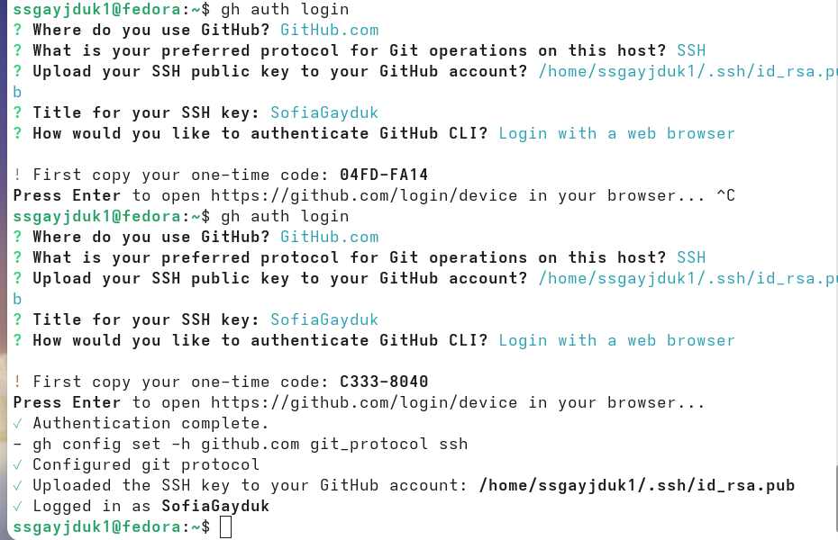{#fig-014 width=70%}

Авторизация прошла успешно ([рис. @fig-015]).

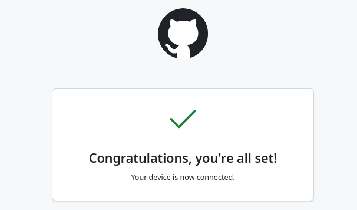{#fig-015 width=70%}

Создадим шаблон рабочего пространства и перейдем в него ([рис. @fig-016]).

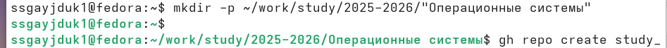{#fig-016 width=70%}

Создаем репозиторий и клонируем его ([рис. @fig-017], [рис. @fig-018]).

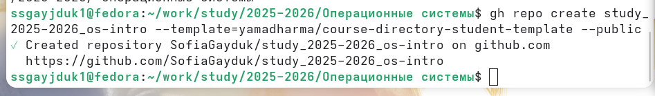{#fig-017 width=70%}

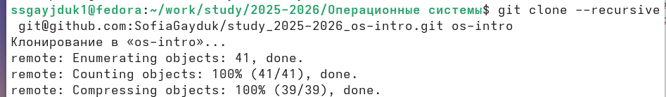{#fig-018 width=70%}

Удалим лишние файлы и создим необходимые каталоги ([рис. @fig-019]).

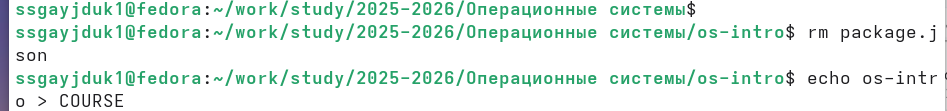{#fig-019 width=70%}

Скомпилируем файлы ([рис. @fig-020]).

{#fig-020 width=70%}

Отправьте файлы на сервер ([рис. @fig-021], [рис. @fig-022], [рис.  @fig-023]).

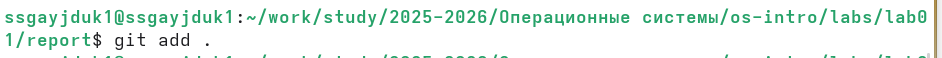{#fig-021 width=70%}

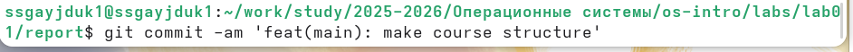{#fig-022 width=70%}

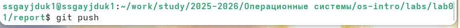{#fig-023 width=70%}

# Ответы на контрольные вопросы

1. Что такое системы контроля версий (VCS) и для решения каких задач они предназначаются?

VCS — программы для отслеживания изменений в файлах, совместной работы, возврата к старым версиям и резервного копирования.

2. Объясните следующие понятия VCS и их отношения: хранилище, commit, история, рабочая копия.

- Хранилище (репозиторий) — база данных всех изменений. 
- Commit — сохранённая версия файлов.
- История — цепочка коммитов. 
- Рабочая копия — текущие файлы, с которыми работает пользователь.

Изменяем файлы в рабочей копии, тогда фиксируем их через commit, после commit попадает в историю внутри хранилища.

3. Что представляют собой и чем отличаются централизованные и децентрализованные VCS? Приведите примеры VCS каждого вида.

- Централизованные (SVN, CVS) — одно главное хранилище, все работают с ним. Примеры: SVN (Subversion), CVS. 

- Децентрализованные (Git, Mercurial) — у каждого полная копия репозитория. Примеры: Git, Mercurial.

В CVCS история только на сервере, в DVCS — у каждого есть полная история локально.

4. Опишите действия с VCS при единоличной работе с хранилищем.

При единоличной работе: инициализация репозитория, добавление файлов, создание коммитов, просмотр истории.

5. Опишите порядок работы с общим хранилищем VCS.

С общим хранилищем: клонирование, синхронизация (pull/push), решение конфликтов.

6. Каковы основные задачи, решаемые инструментальным средством git?

Git решает задачи: отслеживание версий, ветвление, слияние, удалённая работа, отмена изменений.

7. Назовите и дайте краткую характеристику командам git.

- init - создать
- add - добавить
- commit - сохранить
- push  - отправить
- pull - получить
- branch - ветки
- merge - слияние.

8. Приведите примеры использования при работе с локальным и удалённым репозиториями.

- Локально: git init, add, commit, log. 
- Удалённо: clone, push, pull, fetch

9. Что такое и зачем могут быть нужны ветви (branches)?

Ветки — независимые линии разработки. Нужны для параллельной работы, экспериментов, функций без влияния на основную версию.

10. Как и зачем можно игнорировать некоторые файлы при commit?

Игнорирование через файл .gitignore — для временных, служебных и конфиденциальных файлов, которые не должны попадать в репозиторий.

Нужны для освобождения репозиторий временных и служебных файлов, чтобы не хранить секреты (пароли, ключи) и не тащить тяжёлые зависимости и сборки.

# Выводы

Мы изучили идеологию и применение средств контроля версий, а также освоили умения по работе с git.

# Список литературы{.unnumbered}

1.Kulyabov. Лабораторная работа № 2. Первоначальна настройка git. RUDN

::: {#refs}
:::

