---
## Author
author:
  name: Гайдук Софья Сергеевна
  degrees: DSc
  orcid: 0000-0002-0877-7063
  email: 1032253645@rudn.ru
  affiliation:
    - name: Российский университет дружбы народов
      country: Российская Федерация
      postal-code: 117198
      city: Москва
      address: ул. Миклухо-Маклая, д. 6
---
## Title
---
title: "Лабораторная работа № 5"
subtitle: "Презентация"
author: "Гайдук Софья Сергеевна"
date: "2026-03-14"
format: 
  revealjs: 
    theme: solarized
    slide-number: true
---

# Информация

## Докладчик

:::::::::::::: {.columns align=center}
::: {.column width="70%"}

  * Гайдук Софья Сергеевна
  * студент
  * Российский университет дружбы народов им. П. Лумумбы
  * [1032253645@rudn.ru](mailto:1032253645@rudn.ru)
  * <https://github.com/SofiaGayduk/study_2025-2026_os-intro>

:::
::: {.column width="30%"}

:::
::::::::::::::

## Цели и задачи

- Установка и настройка менеджеров паролей pass. 
- Управление файлами конфигурации.

## Выполнение лабораторной работы

## Установка 

Установка pass ([рис. @fig-001]).

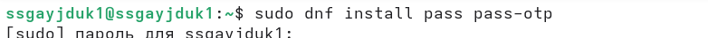{#fig-001 width=70%}

Установка gopass ([рис. @fig-002]).

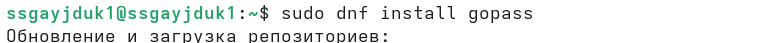{#fig-002 width=70%}

## Ключи

Просмотр списка ключей ([рис. @fig-003]).

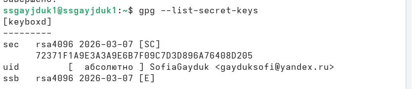{#fig-003 width=70%}

Инициализация хранилища ([рис. @fig-004]).

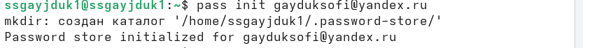{#fig-004 width=70%}

## Git

Создадим структуру git ([рис. @fig-005]).

{#fig-005 width=70%}

Создадим репозиторий ([рис. @fig-006]).

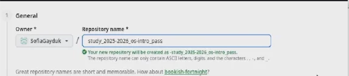{#fig-006 width=70%}

## Git продолжение

Зададим адрес репозитория на хостинге ([рис. @fig-007]).

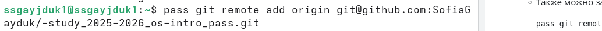{#fig-007 width=70%}

Для синхронизации выполним следующие команды ([рис. @fig-008]).

{#fig-008 width=70%}

## Git продолжение

Вручную закоммитим и выложим изменения ([рис. @fig-009]).

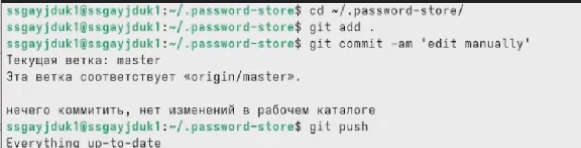{#fig-009 width=70%}

Проверим статус синхронизации модной командой ([рис. @fig-010]).

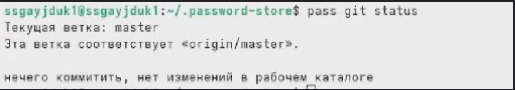{#fig-010 width=70%}

## Установка 

Установим программу, обеспечивающую интерфейс native messaging ([рис. @fig-011]).

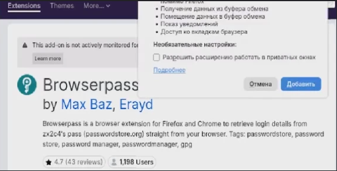{#fig-011 width=70%}

## Установка 

Установим интерфейс для взаимодействия с броузером (native messaging)([рис. @fig-012], [рис.  @fig-013]).

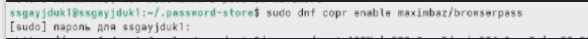{#fig-012 width=70%}

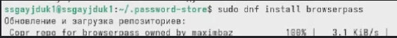{#fig-013 width=70%}

## Пароли 

Добавим новый пароль ([рис. @fig-014]).

{#fig-014 width=70%}

Отобразим пароль для указанного имени файла ([рис. @fig-015]).

{#fig-015 width=70%}

## Пароли 

Заменим существующий пароль ([рис. @fig-016]).

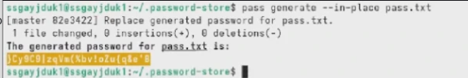{#fig-016 width=70%}

## Установка 

Установим дополнительное программное обеспечение ([рис. @fig-017]).

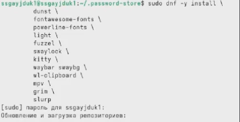{#fig-017 width=70%}

## Установка 

Установим шрифты ([рис. @fig-018], [рис. @fig-019], [рис. @fig-020]).
 
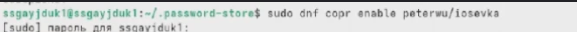{#fig-018 width=70%}

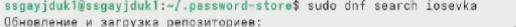{#fig-019 width=70%}

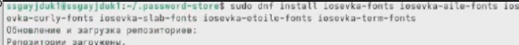{#fig-020 width=70%}

## Установка 

Установим бинарный файл ([рис. @fig-021]).

{#fig-021 width=70%}

## Создание репозитория 

Создадим свой репозиторий для конфигурационных файлов на основе шаблона ([рис. @fig-022]).

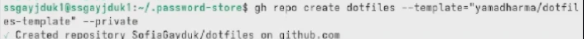{#fig-022 width=70%}

## Инициализируем chezmoi

Инициализируем chezmoi с нашим репозиторием dotfiles ([рис.  @fig-023]).

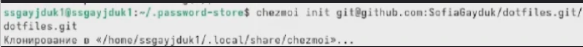{#fig-023 width=70%}

## Проверка 

Проверим, какие изменения внесёт chezmoi в домашний каталог ([рис. @fig-024]).

{#fig-024 width=70%}

Если устраивают изменения, внесённые chezmoi, запустим ([рис. @fig-025]).

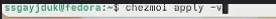{#fig-025 width=70%}

## Вторая ВМ 

На второй машине инициализируем chezmoi с нашим репозиторием dotfiles ([рис.  @fig-026]).

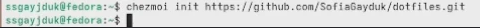{#fig-026 width=70%}

## Проверка 

Проверим, какие изменения внесёт chezmoi в домашний каталог ([рис. @fig-027]).

{#fig-027 width=70%}

Если устраивают изменения, внесённые chezmoi, запустим ([рис. @fig-028]).

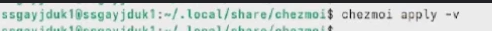{#fig-028 width=70%}

При существующем каталоге chezmoi получим и применим последние изменения из нашего репозитория ([рис.  @fig-029]).

{#fig-029 width=70%}

## Установка 

Установим свои dotfiles на новый компьютер с помощью одной команды ([рис. @fig-030]).

{#fig-030 width=70%}

## Изменения в репозитории 

Извлекем последние изменения из репозитория и применим их ([рис. @fig-031]).

{#fig-031 width=70%}

Извлекем последние изменения из своего репозитория и посмотрим, что изменится, фактически не применяя изменения ([рис.  @fig-032]).

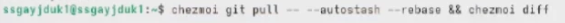{#fig-032 width=70%}

Мы довольны изменениями и можем применить их ([рис. @fig-033]).

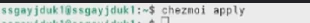{#fig-033 width=70%}

## Фиксация 

Автоматически фиксируем и отправляем изменения в репозиторий ([рис. @fig-034]).

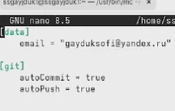{#fig-034 width=70%}

# Выводы

Мы научились установке и настройке менеджеров паролей pass, а также  управлению файлами конфигурации.

# Список литературы{.unnumbered}

1.Kulyabov. Лабораторная работа № 5. Настройка рабочей среды. RUDN

