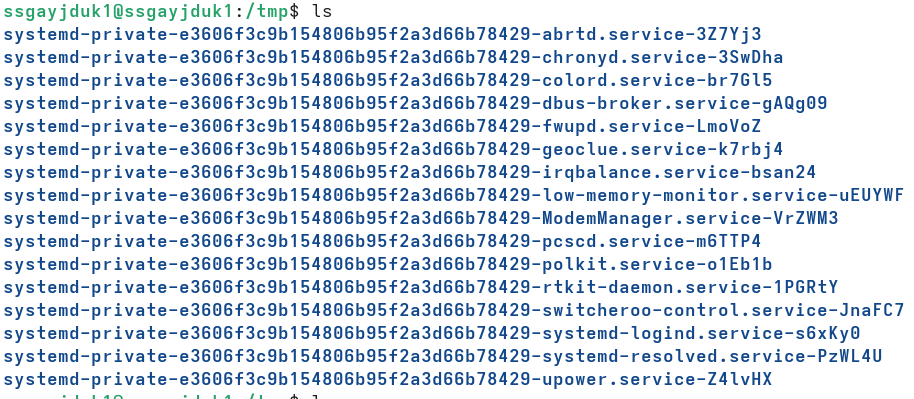
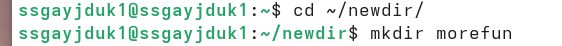
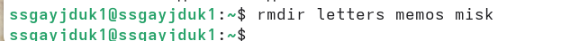
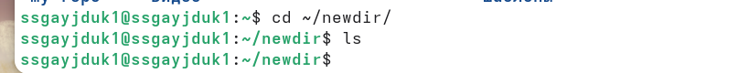
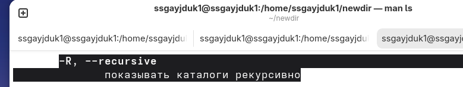
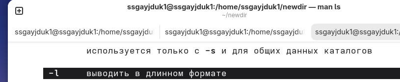

---
## Author
author:
  name: Гайдук Софья Сергеевна
  degrees: DSc
  orcid: 0000-0002-0877-7063
  email: 1032253645@rudn.ru
  affiliation:
    - name: Российский университет дружбы народов
      country: Российская Федерация
      postal-code: 117198
      city: Москва
      address: ул. Миклухо-Маклая, д. 6
---
## Title
---
title: "Лабораторная работа № 6"
subtitle: "Презентация"
author: "Гайдук Софья Сергеевна"
date: "2026-03-20"
format:
  beamer:
    theme: "Madrid"
    colortheme: "dove"
    slide-number: true
---
# Информация

## Докладчик

:::::::::::::: {.columns align=center}
::: {.column width="70%"}

  * Гайдук Софья Сергеевна
  * студент
  * Российский университет дружбы народов им. П. Лумумбы
  * [1032253645@rudn.ru](mailto:1032253645@rudn.ru)
  * <https://github.com/SofiaGayduk/study_2025-2026_os-intro>

:::
::: {.column width="30%"}

:::
::::::::::::::

## Цель работы

Приобретение практических навыков взаимодействия пользователя с системой посредством командной строки.

## Выполнение лабораторной работы

## Определение  имени 

Определим полное имя нашего домашнего каталога ([рис. 1]).

{#fig-001 width=70%}

## Команда ls

Перейдем в каталог /tmp ([рис. 2]).

{#fig-002 width=70%}

## Команда ls

Выведем на экран содержимое каталога /tmp командой ls ([рис. 3]).

{#fig-003 width=70%}

## Команда ls

Выведем на экран содержимое каталога /tmp командой ls с различными опциями. ([рис. 4]).

{#fig-004 width=70%}

## Команда ls

Выведем на экран содержимое каталога /tmp командой ls с различными опциями. ([рис. 5]).

{#fig-005 width=70%}

## Просмотр катологов 

Определим, есть ли в каталоге /var/spool подкаталог с именем cron ([рис. 6]).

{#fig-006 width=70%}

## Просмотр катологов 

Перейдем в домашний каталог и выведем на экран содержимое. Определим владельца файлов и подкаталогов ([рис. 7]).

{#fig-007 width=70%}

## Создание каталогов 

Создадим новый каталог newdir ([рис. 8]).

{#fig-008 width=70%}

В каталоге ~/newdir создадим новый каталог с именем morefun ([рис. 9]).

{#fig-009 width=70%}

## Создание и удаление каталогов

Создадим одной командой три новых каталога: letters, memos, misk. Затем удалим эти каталоги одной командой ([рис. 10], [рис. 11]).

{#fig-010 width=70%}

{#fig-011 width=70%}

## Удаление каталогов

Попробуем удалить ранее созданный каталог ~/newdir командой rm ([рис. 12]).

{#fig-012 width=70%}

Удалим каталог ~/newdir/morefun из домашнего каталога ([рис. 13], [рис. 14]).

{#fig-013 width=70%}

{#fig-014 width=70%}

## Команда man 

С помощью команды man определим, какую опцию команды ls нужно использовать для просмотра содержимое не только указанного каталога, но и подкаталогов, входящих в него ([рис. 15], [рис. 16]).

{#fig-015 width=70%}

{#fig-016 width=70%}

## Команда man 

С помощью команды man определим набор опций команды ls, позволяющий отсортировать по времени последнего изменения выводимый список содержимого каталога с развёрнутым описанием файлов ([рис. 17], [рис. 18]).

{#fig-017 width=70%}

{#fig-018 width=70%}

## Команда man 

Проверим эти команды ([рис. 19], [рис. 20]).

{#fig-019 width=70%}

{#fig-020 width=70%}

## Команда man 

Используем команду man для просмотра описания следующих команд: cd, pwd, mkdir, rmdir, rm. Основные опции этих команд ([рис.  21]).

{#fig-021 width=70%}

## Команда history 

Используя информацию, полученную при помощи команды history, выполним модификацию и исполнение нескольких команд из буфера команд ([рис. 22], [рис. 23]).

{#fig-022 width=70%}

{#fig-023 width=70%}

## Выводы

Мы приобрели практические навыки взаимодействия пользователя с системой посредством командной строки.

## Список литературы

1.Kulyabov. Лабораторная работа № 6. Основы интерфейса взаимодействия пользователя с системой Unix на уровне командной строки. RUDN

## Список литературы

1.Kulyabov. Лабораторная работа № 6. Основы интерфейса взаимодействия пользователя с системой Unix на уровне командной строки. RUDN

::: {#refs}
:::
