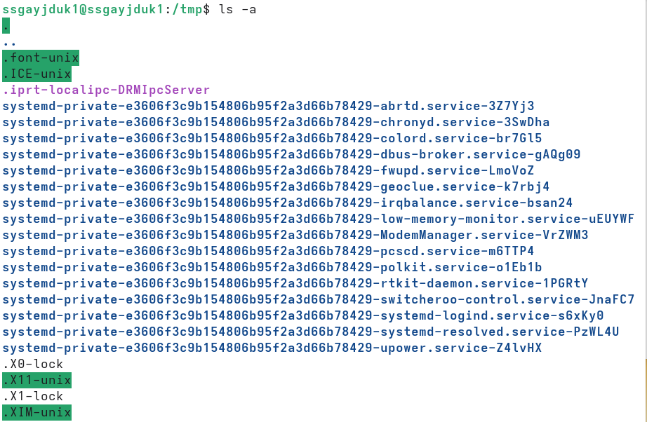
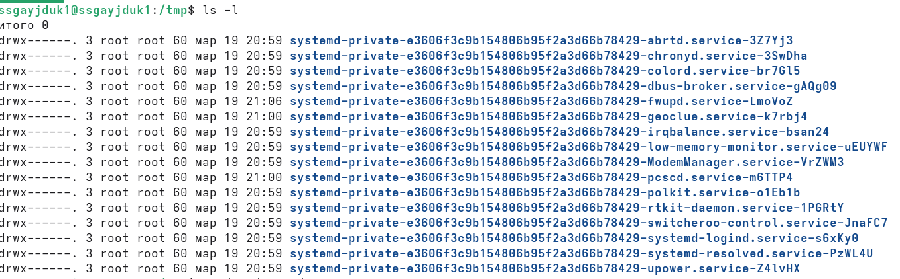
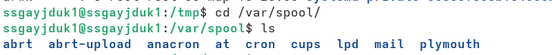
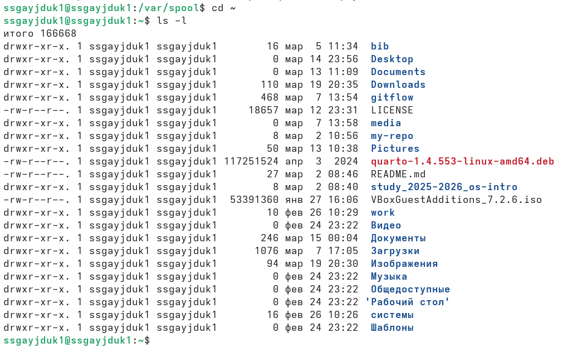
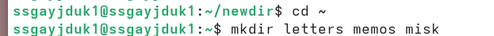
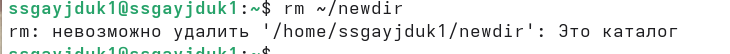
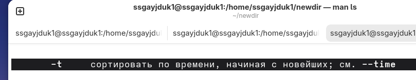
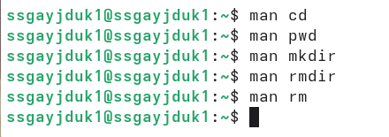
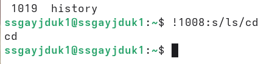

---
## Author
author:
  name: Гайдук Софья Сергеевна
  degrees: DSc
  orcid: 0000-0002-0877-7063
  email: 1032253645@rudn.ru
  affiliation:
    - name: Российский университет дружбы народов
      country: Российская Федерация
      postal-code: 117198
      city: Москва
      address: ул. Миклухо-Маклая, д. 6

## Title
title: "Лабораторная работа № 6"
subtitle: "Отчет"
license: "CC BY"
---

# Цель работы

Приобретение практических навыков взаимодействия пользователя с системой посредством командной строки.

# Выполнение лабораторной работы

Определим полное имя нашего домашнего каталога. Далее относительно этого каталога будут выполняться последующие упражнения ([рис. @fig-001]).

{#fig-001 width=70%}

Перейдем в каталог /tmp ([рис. @fig-002]).

{#fig-002 width=70%}

Выведем на экран содержимое каталога /tmp. Для этого используем команду ls с различными опциями. Разница в выводимой на экран информации команд -a (скрытые файлы) и -l (подробная информация) ([рис. @fig-003], ([рис. @fig-004], [рис. @fig-005]).

{#fig-003 width=70%}

{#fig-004 width=70%}

{#fig-005 width=70%}

Определим, есть ли в каталоге /var/spool подкаталог с именем cron ([рис. @fig-006]).

{#fig-006 width=70%}

Перейдем в наш домашний каталог и выведем на экран его содержимое. Определим, что владельцем файлов и подкаталогов является ssgayjduk1 ([рис. @fig-007]).

{#fig-007 width=70%}

В домашнем каталоге создадим новый каталог с именем newdir ([рис. @fig-008]).

{#fig-008 width=70%}

В каталоге ~/newdir создадим новый каталог с именем morefun ([рис. @fig-009]).

{#fig-009 width=70%}

В домашнем каталоге создадим одной командой три новых каталога с именами letters, memos, misk. Затем удалим эти каталоги одной командой ([рис. @fig-010], [рис. @fig-011]).

{#fig-010 width=70%}

{#fig-011 width=70%}

Попробуем удалить ранее созданный каталог ~/newdir командой rm. Проверим, был ли каталог удалён ([рис. @fig-012]).

{#fig-012 width=70%}

Удалим каталог ~/newdir/morefun из домашнего каталога. Проверим, был ли каталог удалён ([рис.  @fig-013], [рис. @fig-014]).

{#fig-013 width=70%}

{#fig-014 width=70%}

С помощью команды man определим, какую опцию команды ls нужно использовать для просмотра содержимое не только указанного каталога, но и подкаталогов, входящих в него ([рис.  @fig-015], [рис. @fig-016]).

{#fig-015 width=70%}

{#fig-016 width=70%}

С помощью команды man определим набор опций команды ls, позволяющий отсортировать по времени последнего изменения выводимый список содержимого каталога с развёрнутым описанием файлов ([рис.  @fig-017], [рис. @fig-018]).

{#fig-017 width=70%}

{#fig-018 width=70%}

Проверим эти команды ([рис. @fig-019], [рис. @fig-020]).

{#fig-019 width=70%}

{#fig-020 width=70%}

Используем команду man для просмотра описания следующих команд: cd, pwd, mkdir, rmdir, rm. Основные опции этих команд ([рис. @fig-021]).

{#fig-021 width=70%}

Используя информацию, полученную при помощи команды history, выполним модификацию и исполнение нескольких команд из буфера команд ([рис.  @fig-022], [рис. @fig-023]).

{#fig-022 width=70%}

{#fig-023 width=70%}

# Контрольные вопросы 

1. Что такое командная строка?

Командой в операционной системе называется записанный по специальным правилам текст (возможно с аргументами), представляющий собой указание на выполнение какой-либо функций (или действий) в операционной системе.

2. При помощи какой команды можно определить абсолютный путь текущего каталога? Приведите пример.

Для определения абсолютного пути к текущему каталогу используется
команда pwd (print working directory). Пример: /home/ssgayjduk1/work/study/2025-2026/Операционные системы/os-intro/labs

3. При помощи какой команды и каких опций можно определить только тип файлов и их имена в текущем каталоге? Приведите примеры.

ls с опцией -F. Пример: os-intro-lab05-os-intro-lab05-report.docx os-intro-lab05-os-intro-lab05-report.pdf os-intro-lab05-os-intro-lab05-report.qmd 

4. Каким образом отобразить информацию о скрытых файлах? Приведите примеры.

ls -a. Пример: .gitignore 

5. При помощи каких команд можно удалить файл и каталог? Можно ли это сделать одной и той же командой? Приведите примеры.

rm (Удалим файл), rmdir (Удалим пустую папку), rm -r (Удалит папку и всё, что внутри нее). Можно удалить одной командой - это rm -r. Пример: rm l.txt, rmdir k, rm -r m    

6. Каким образом можно вывести информацию о последних выполненных пользователем командах работы?

history - для вывода на экран списка ранее выполненных команд

7. Как воспользоваться историей команд для их модифицированного выполнения? Приведите примеры.

Стрелки вверх и вниз: Пролистывают историю. Можно найти команду, отредактировать её (стереть часть текста, дописать) и нажать Enter.

!!: Повторяет последнюю выполненную команду.

Пример: Если вы забыли написать sudo перед apt update, наберите sudo !!.

!число: Выполняет команду под конкретным номером из истории.

Пример: !15 выполнит команду, которая шла в истории под номером 15.

!строка: Выполняет последнюю команду, начинающуюся с определенной строки.

Пример: !pwd запустит последнюю использованную команду, начинающуюся с pwd.

8. Приведите примеры запуска нескольких команд в одной строке.

cd labs/lab06; touch file.txt

9. Дайте определение и приведите примера символов экранирования.

Экранирование — это механизм, позволяющий интерпретировать специальные символы как обычные. Пример: touch Новый\ файл.txt или touch "Новый файл".txt

10. Охарактеризуйте вывод информации на экран после выполнения команды ls с опцией l.

Команда ls -l (long listing format) выводит подробный список файлов в виде таблицы. -rw-r--r-- — Тип и права доступа: Первый символы: - (файл), d (каталог), l (ссылка).Следующие 9 символов: права для владельца (rw-), группы (r--), остальных (r--). 1 — Количество жестких ссылок. user — Владелец файла. group — Группа-владелец. 1024 — Размер в байтах. May 18 10:30 — Дата и время последнего изменения. example.txt — Имя файла/каталога.

11. Что такое относительный путь к файлу? Приведите примеры использования относительного и абсолютного пути при выполнении какой-либо команды.

Абсолютный путь — это полный путь от корня /. Он всегда начинается с /. Относительный путь — это путь от текущего каталога. Он не начинается с / и часто использует обозначения . (текущий каталог) и .. (родительский каталог). Пример: скопируем файл из каталога lab06: Абсолютный путь: cp /home/ssgayjduk1/work/study/2025-2026/Операционные системы/os-intro/labs/lab06/report.pdf . Относительный путь: cp lab06/report.pdf .

12. Как получить информацию об интересующей вас команде?

man ls или ls --help

13. Какая клавиша или комбинация клавиш служит для автоматического дополнения
вводимых команд? 

Tab 

# Выводы

Мы приобрели практические навыки взаимодействия пользователя с системой посредством командной строки.

# Список литературы{.unnumbered}

1.Kulyabov. Лабораторная работа № 6. Основы интерфейса взаимодействия пользователя с системой Unix на уровне командной строки. RUDN

::: {#refs}
:::
