---
## Author
author:
  name: Гайдук Софья Сергеевна
  degrees: DSc
  orcid: 0000-0002-0877-7063
  email: 1032253645@rudn.ru
  affiliation:
    - name: Российский университет дружбы народов
      country: Российская Федерация
      postal-code: 117198
      city: Москва
      address: ул. Миклухо-Маклая, д. 6
---
## Title
---
title: "Лабораторная работа № 7"
subtitle: "Презентация"
author: "Гайдук Софья Сергеевна"
date: "2026-03-20"
format:
  beamer:
    theme: "Madrid"
    colortheme: "dove"
    slide-number: true
---
# Информация

## Докладчик

:::::::::::::: {.columns align=center}
::: {.column width="70%"}

  * Гайдук Софья Сергеевна
  * студент
  * Российский университет дружбы народов им. П. Лумумбы
  * [1032253645@rudn.ru](mailto:1032253645@rudn.ru)
  * <https://github.com/SofiaGayduk/study_2025-2026_os-intro>

:::
::: {.column width="30%"}

:::
::::::::::::::

## Цель работы

Ознакомление с файловой системой Linux, её структурой, именами и содержанием каталогов. Приобретение практических навыков по применению команд для работы с файлами и каталогами, по управлению процессами (и работами), по проверке использования диска и обслуживанию файловой системы.

## Выполнение лабораторной работы

## Копирование файлов

Скопируем файл ~/abc1 в файл april и в файл may ([рис. 1]).

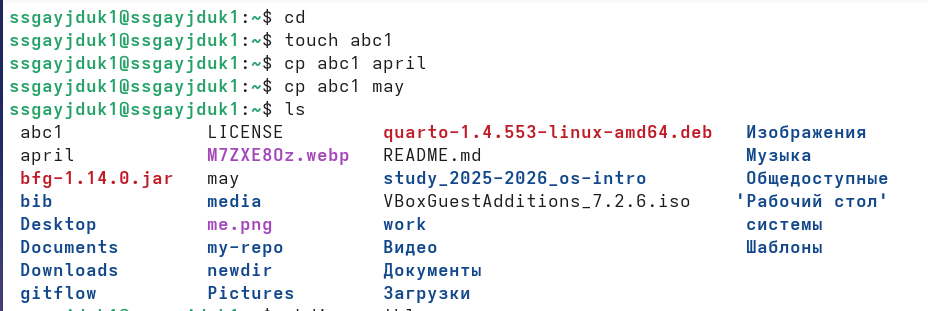{#fig-001 width=70%}

## Копирование файлов

Скопируем файлы april и may в каталог monthly ([рис. 2]).

{#fig-002 width=70%}

Скопируем файл monthly/may в файл с именем june  ([рис. 3]).

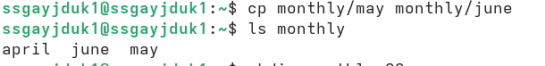{#fig-003 width=70%}

## Копирование каталогов

Скопируем каталог monthly в каталог monthly.00 ([рис. 4]).

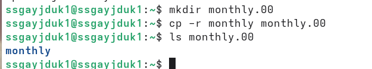{#fig-004 width=70%}

Скопируем каталог monthly.00 в каталог /tmp ([рис. 5]).

{#fig-005 width=70%}

## Изменение названия 

Изменим название файла april на july в домашнем каталоге ([рис. 6]).

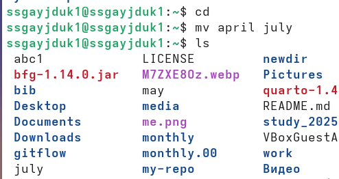{#fig-006 width=70%}

## Перемещение файла

Переместим файл july в каталог monthly.00 ([рис. 7]).

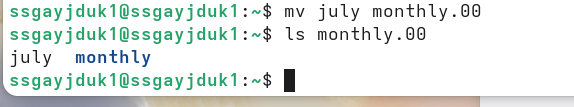{#fig-007 width=70%}

## Изменение названия 

Переименуем каталог monthly.00 в monthly.01 ([рис. 8]).

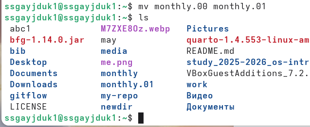{#fig-008 width=70%}

## Перемещение каталогов

Переместим каталог monthly.01в каталог reports ([рис. 9]).

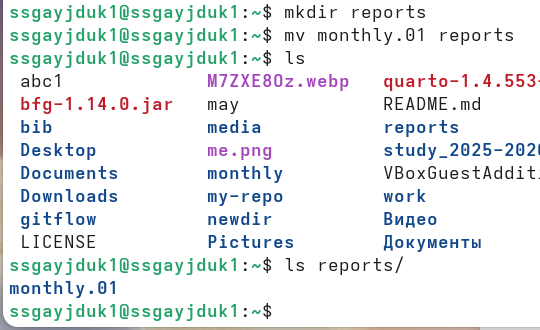{#fig-009 width=70%}

## Изменение названия 

Переименуем каталог reports/monthly.01 в reports/monthly ([рис. 10]).

{#fig-010 width=70%}

## Создание файла

Создадим файл ~/may с правом выполнения для владельца ([рис. 11]).

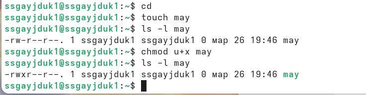{#fig-011 width=70%}

## Права на выполнение

Лишим владельца файла ~/may права на выполнение ([рис. 12]).

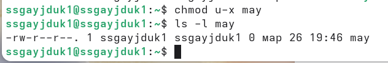{#fig-012 width=70%}

## Создание каталогов

Создадим каталог monthly с запретом на чтение для членов группы и всех
остальных пользователей ([рис. 13]).

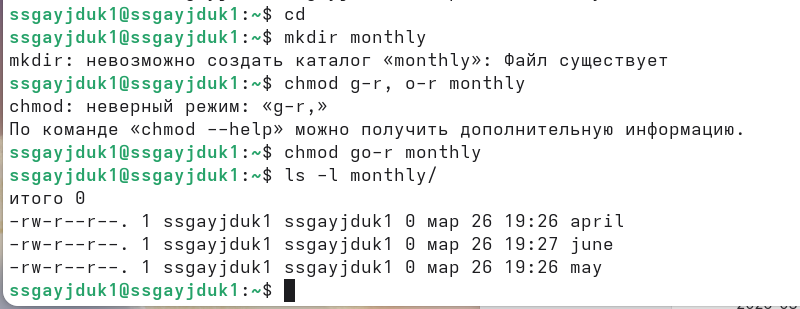{#fig-013 width=70%}

## Создание файла

Создадим файл ~/abc1 с правом записи для членов группы ([рис. 14]).

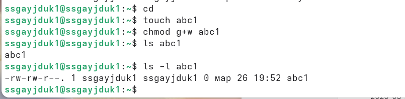{#fig-014 width=70%}

## Копирование файлов

Скопируем файл /usr/include/sys/io.h в домашний каталог и назовите его
equipment ([рис. 15]).

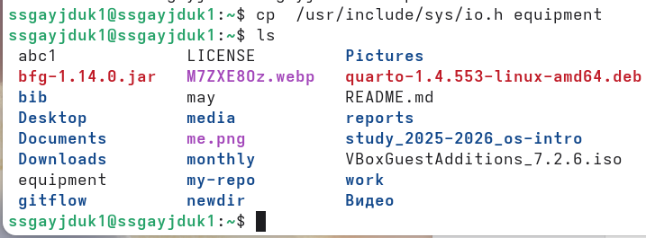{#fig-015 width=70%}

## Создание директории 

В домашнем каталоге создадим директорию ~/ski.plases ([рис. 16]).

{#fig-016 width=70%}

## Перемещение файла

Переместим файл equipment в каталог ~/ski.plases ([рис. 17]).

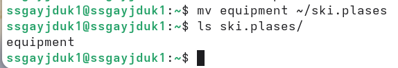{#fig-017 width=70%}

## Изменение названия 

Переименуем файл ~/ski.plases/equipment в ~/ski.plases/equiplist ([рис. 18]).

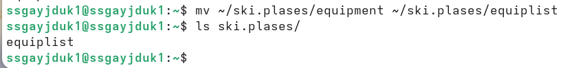{#fig-018 width=70%}

## Создание и копирование 

Создадим в домашнем каталоге файл abc1 и скопируйте его в каталог ~/ski.plases, назовите его equiplist2 ([рис. 19]).

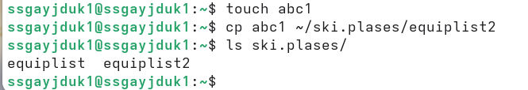{#fig-019 width=70%}

Создадим каталог с именем equipment в каталоге ~/ski.plases ([рис. 20]).

{#fig-020 width=70%}

## Перемещение файла

Переместим файлы ~/ski.plases/equiplist и equiplist2 в каталог ~/ski.plases/equipment ([рис. 21], [рис. 22]).

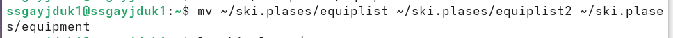{#fig-021 width=70%}

{#fig-022 width=70%}

## Перемещение и создание каталога 

Создадим и переместим каталог ~/newdir в каталог ~/ski.plases и назовите
его plans ([рис. 23], [рис. 24]).

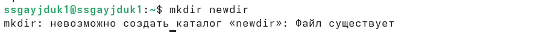{#fig-023 width=70%}

{#fig-024 width=70%}

## Права на выполнение

Определим опции команды chmod, необходимые для того, чтобы присвоить файлам (australia, play, my_os, feathers) выделенные права доступа, также создадим нужные файлы ([рис. 25], [рис. 26], [рис. 27])

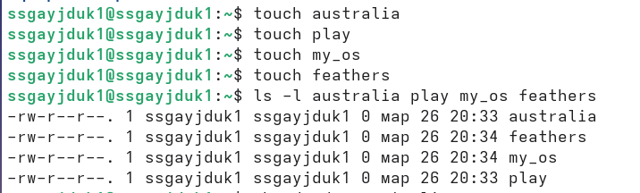{#fig-025 width=20%}

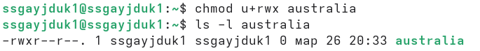{#fig-026 width=40%}

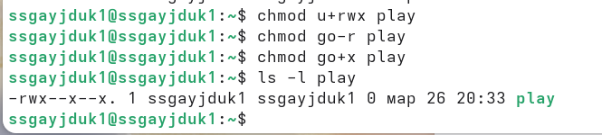{#fig-027 width=40%}

## Права на выполнение

Определим опции команды chmod, необходимые для того, чтобы присвоить файлам (australia, play, my_os, feathers) выделенные права доступа, также создадим нужные файлы ([рис. 28], [рис. 29]).

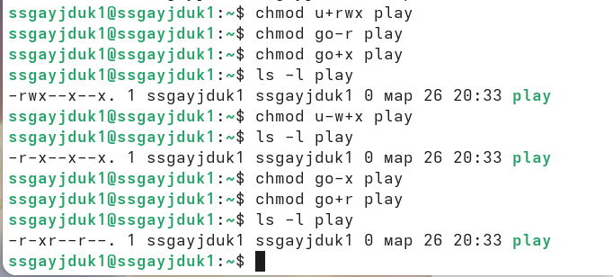{#fig-028 width=40%}

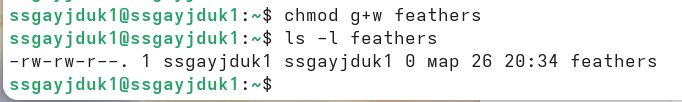{#fig-029 width=40%}

## Просмотр файлов 

Просмотрим содержимое файла /etc/password ([рис. 30]).

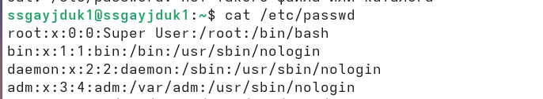{#fig-030 width=70%}

## Копирование файлов

Скопируем файл ~/feathers в файл ~/file.old ([рис. 31]).

{#fig-031 width=70%}

## Перемещение файла

Переместим файл ~/file.old в каталог ~/play ([рис. 32]).

{#fig-032 width=70%}

## Копирование каталогов

Скопируем каталог ~/play в каталог ~/fun ([рис. 33]).

{#fig-033 width=70%}

## Перемещение каталогов

Переместим каталог ~/fun в каталог ~/play и назовите его games ([рис. 34]).

{#fig-034 width=70%}

## Права на выполнение

Лишим владельца файла ~/feathers права на чтение ([рис. 35]).

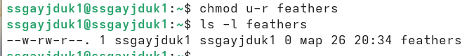{#fig-035 width=70%}

Попытаемся просмотреть файл ~/feathers командой cat. Будет отказано в доступе ([рис. 36]).

{#fig-036 width=70%}

## Права на выполнение

Попытаемся скопировать файл ~/feathers. Также будет отказано в доступе ([рис. 37]).

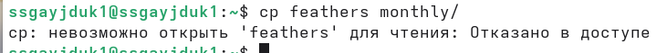{#fig-037 width=70%}

Дадим владельцу файла ~/feathers право на чтение ([рис. 38]).

{#fig-038 width=70%}

## Права на выполнение

Лишим владельца каталога ~/play права на выполнение ([рис. 39]).

{#fig-039 width=70%}

Перейдем каталог ~/play. Будет отказано в доступе ([рис. 40]).

{#fig-040 width=70%}

## Права на выполнение

Дадим владельцу каталога ~/play право на выполнение ([рис. 41]).

{#fig-041 width=70%}

## man

Прочитаем man по командам mount, fsck, mkfs, kill ([рис. 42]).

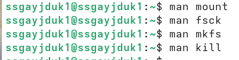{#fig-042 width=70%}

## Выводы

Ознакомились с файловой системой Linux, её структурой, именами и содержанием каталогов. Приобрели практические навыки по применению команд для работы с файлами и каталогами, по управлению процессами (и работами), по проверке использования диска и обслуживанию файловой системы.

## Список литературы{.unnumbered}

1.Kulyabov. Лабораторная работа № 7. Анализ файловой структуры UNIX. Команды для работы с файлами и каталогами. RUDN

## Список литературы{.unnumbered}

1.Kulyabov. Лабораторная работа № 7. Анализ файловой структуры UNIX. Команды для работы с файлами и каталогами. RUDN

::: {#refs}
:::
