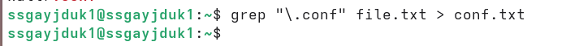
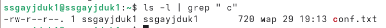
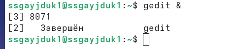
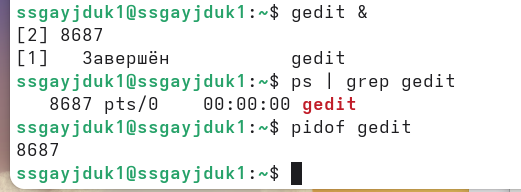
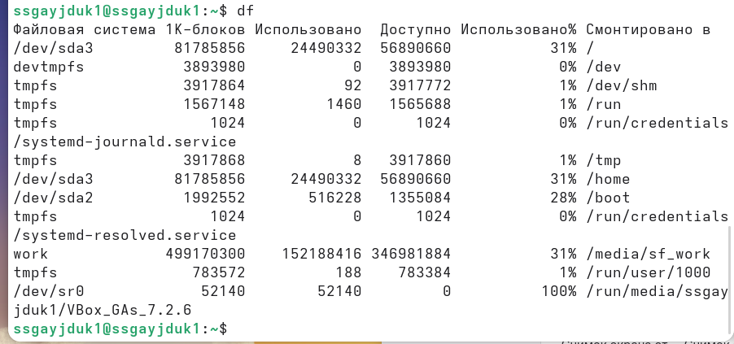

---
## Author
author:
  name: Гайдук Софья Сергеевна
  degrees: DSc
  orcid: 0000-0002-0877-7063
  email: 1032253645@rudn.ru
  affiliation:
    - name: Российский университет дружбы народов
      country: Российская Федерация
      postal-code: 117198
      city: Москва
      address: ул. Миклухо-Маклая, д. 6
---
## Title
---
title: "Лабораторная работа № 8"
subtitle: "Презентация"
author: "Гайдук Софья Сергеевна"
date: "2026-03-30"
format: 
  revealjs: 
    theme: solarized
    slide-number: true
---

# Информация

## Докладчик

:::::::::::::: {.columns align=center}
::: {.column width="70%"}

  * Гайдук Софья Сергеевна
  * студент
  * Российский университет дружбы народов им. П. Лумумбы
  * [1032253645@rudn.ru](mailto:1032253645@rudn.ru)
  * <https://github.com/SofiaGayduk/study_2025-2026_os-intro>

:::
::: {.column width="30%"}

:::
::::::::::::::

## Цель работы

Ознакомление с инструментами поиска файлов и фильтрации текстовых данных. Приобретение практических навыков: по управлению процессами (и заданиями), по проверке использования диска и обслуживанию файловых систем.

## Выполнение лабораторной работы

## Запись в файл 

Осуществим вход в систему, используя соответствующее имя пользователя. Запишем в файл file.txt названия файлов, содержащихся в каталоге /etc. Допишем в этот же файл названия файлов, содержащихся в нашем домашнем каталоге ([рис. @fig-001], [рис. @fig-002], [рис. @fig-003]).

{#fig-001 width=40%}

{#fig-002 width=40%}

## Запись в файл 

{#fig-003 width=70%}

## Вывод имен  

Выведим имена всех файлов из file.txt, имеющих расширение .conf, после чего запишем их в новый текстовой файл conf.txt ([рис. @fig-004], [рис. @fig-005]).

{#fig-004 width=70%}

{#fig-005 width=70%}

## Определение файлов  

Определим какие файлы в нашем домашнем каталоге имеют имена, начинавшиеся с символа c. Сделаем это  несколькими вариантами ([рис. @fig-006], [рис. @fig-007]).

{#fig-006 width=70%}

{#fig-007 width=70%}

## Вывед на экран 

Выведим на экран (по странично) имена файлов из каталога /etc, начинающиеся с символа h ([рис. @fig-008]).

{#fig-008 width=70%}

## Запуск в фоновом режиме

Запустим в фоновом режиме процесс, который будет записывать в файл ~/logfile файлы, имена которых начинаются с log ([рис. @fig-009], [рис. @fig-010]).

{#fig-009 width=70%}

{#fig-010 width=70%}

## Удаление файла 

Удалим файл ~/logfile ([рис. @fig-011]).

{#fig-011 width=70%}

## gedit 

Запустим из консоли в фоновом режиме редактор gedit ([рис. @fig-012]).

{#fig-012 width=70%}

## gedit 

Определим идентификатор процесса gedit, используя команду ps, конвейер и фильтр grep. Сделаем это  несколькими вариантами ([рис.  @fig-013]).

{#fig-013 width=70%}

## kill 

Прочтем справку (man) команды kill, после чего используем её для завершения процесса gedit ([рис. @fig-014]).

{#fig-014 width=70%}

## df и du 

Выполним команды df и du, предварительно получив более подробную информацию об этих командах, с помощью команды man ([рис.  @fig-015], [рис. @fig-016]).

{#fig-015 width=70%}

{#fig-016 width=70%}

## find

Воспользовавшись справкой команды find, выведим имена всех директорий, имеющихся в нашем домашнем каталоге ([рис.  @fig-017]).

{#fig-017 width=70%}

## Выводы

Мы ознакомлились с инструментами поиска файлов и фильтрации текстовых данных. Приобрели практических навыков: по управлению процессами (и заданиями), по проверке использования диска и обслуживанию файловых систем.

## Список литературы{.unnumbered}

1.Kulyabov. Лабораторная работа № 8. Поиск файлов. Перенаправление ввода-вывода. Просмотр запущенных процессов. RUDN

::: {#refs}
:::
