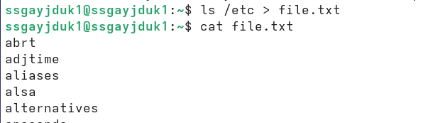
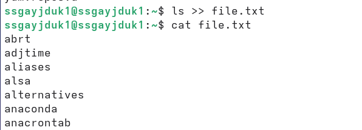
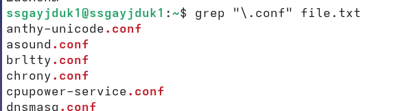
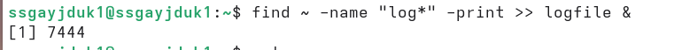
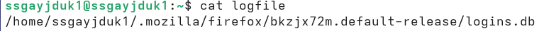
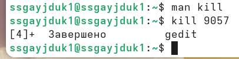

---
## Author
author:
  name: Гайдук Софья Сергеевна
  degrees: DSc
  orcid: 0000-0002-0877-7063
  email: 1032253645@rudn.ru
  affiliation:
    - name: Российский университет дружбы народов
      country: Российская Федерация
      postal-code: 117198
      city: Москва
      address: ул. Миклухо-Маклая, д. 6

## Title
title: "Лабораторная работа № 8"
subtitle: "Отчет"
license: "CC BY"
---

# Цель работы

Ознакомление с инструментами поиска файлов и фильтрации текстовых данных. Приобретение практических навыков: по управлению процессами (и заданиями), по проверке использования диска и обслуживанию файловых систем.

# Выполнение лабораторной работы

Осуществим вход в систему, используя соответствующее имя пользователя. Запишем в файл file.txt названия файлов, содержащихся в каталоге /etc. Допишем в этот же файл названия файлов, содержащихся в нашем домашнем каталоге ([рис. @fig-001], [рис. @fig-002], [рис. @fig-003]).

{#fig-001 width=70%}

{#fig-002 width=70%}

{#fig-003 width=70%}

Выведим имена всех файлов из file.txt, имеющих расширение .conf, после чего запишем их в новый текстовой файл conf.txt ([рис. @fig-004], [рис. @fig-005]).

{#fig-004 width=70%}

{#fig-005 width=70%}

Определим какие файлы в нашем домашнем каталоге имеют имена, начинавшиеся с символа c. Сделаем это  несколькими вариантами ([рис. @fig-006], [рис. @fig-007]).

{#fig-006 width=70%}

{#fig-007 width=70%}

Выведим на экран (по странично) имена файлов из каталога /etc, начинающиеся с символа h ([рис. @fig-008]).

{#fig-008 width=70%}

Запустим в фоновом режиме процесс, который будет записывать в файл ~/logfile файлы, имена которых начинаются с log ([рис. @fig-009], [рис. @fig-010]).

{#fig-009 width=70%}

{#fig-010 width=70%}

Удалим файл ~/logfile ([рис. @fig-011]).

{#fig-011 width=70%}

Запустим из консоли в фоновом режиме редактор gedit ([рис. @fig-012]).

{#fig-012 width=70%}

Определим идентификатор процесса gedit, используя команду ps, конвейер и фильтр grep. Сделаем это  несколькими вариантами ([рис.  @fig-013]).

{#fig-013 width=70%}

Прочтем справку (man) команды kill, после чего используем её для завершения процесса gedit ([рис. @fig-014]).

{#fig-014 width=70%}

Выполним команды df и du, предварительно получив более подробную информацию об этих командах, с помощью команды man ([рис.  @fig-015], [рис. @fig-016]).

{#fig-015 width=70%}

{#fig-016 width=70%}

Воспользовавшись справкой команды find, выведим имена всех директорий, имеющихся в нашем домашнем каталоге ([рис.  @fig-017]).

{#fig-017 width=70%}

# Контрольные вопросы 

1. Какие потоки ввода вывода вы знаете?
- В Linux существует три стандартных потока:
	- stdin (0) — стандартный ввод (обычно клавиатура);
	- stdout (1) — стандартный вывод (обычно экран);
	- stderr (2) — стандартный вывод ошибок (обычно экран).
2. Объясните разницу между операцией > и >>.
- > — перенаправляет вывод в файл, перезаписывая его содержимое (если файл существовал, он будет заменен новым).
- >> — перенаправляет вывод в файл, добавляя данные в конец файла (старое содержимое сохраняется).
3. Что такое конвейер?
- Конвейер (|) - это механизм, позволяющий передавать вывод одной команды напрямую на ввод другой команде. Пример: cat file.txt | grep "lab".
4. Что такое процесс? Чем это понятие отличается от программы?
- Программа — это статичный набор инструкций, хранящийся на диске (файл).
- Процесс — это экземпляр запущенной программы, находящийся в оперативной памяти, с выделенными ему ресурсами (память, время CPU).
- Отличие: Программа — это статичный код, а процесс — это динамичное выполнение этого кода. 
5. Что такое PID и GID?
- PID (Process ID) — уникальный числовой идентификатор процесса.
- GID (Group ID) — идентификатор группы пользователя, определяющий права доступа к файлам и процессам для группы.
6. Что такое задачи и какая команда позволяет ими управлять?
- Задача (job) — это процесс или группа процессов, запущенные из командной оболочки (shell). Управление ей осуществляется командой jobs. Основная команда управления — jobs (показывает список задач текущей сессии), а также: fg %номер — переводит задачу на передний план (foreground), bg %номер — переводит приостановленную задачу в фоновый режим (background), Ctrl+Z — приостанавливает выполняющуюся на переднем плане задачу.
7. Найдите информацию об утилитах top и htop. Каковы их функции?
- Обе утилиты служат для интерактивного мониторинга системы и управления процессами в реальном времени.
	- top — стандартная утилита для отображения в реальном времени списка процессов, загрузки CPU, памяти. Работает в интерактивном режиме. Управление осуществляется клавишами (например, k — убить процесс, q — выход).
	- htop — улучшенная версия top (обычно требует установки). Обладает более удобным цветным интерфейсом, поддержкой мыши, позволяет прокручивать список процессов и управлять ими (убивать, менять приоритет) без ввода команд вручную.
8. Назовите и дайте характеристику команде поиска файлов. Приведите примеры использования этой команды.
- Команда — find. Она выполняет поиск файлов и каталогов в заданной иерархии по различным критериям.
- Примеры:
	- find /home -name "report.txt" — найти файл с точным именем в каталоге /home.
	- find . -name "*.log" — найти все файлы с расширением .log в текущем каталоге и подкаталогах.
	- find /var/log -type f -mtime +7 — найти обычные файлы (-type f) в /var/log, измененные более 7 дней назад.
	- find /tmp -size +100M -delete — найти файлы больше 100 МБ в /tmp и удалить их.
9. Можно ли по контексту (содержанию) найти файл? Если да, то как?
- Да, можно. Для этого используется команда grep (Global Regular Expression Print), которая ищет текст по шаблону. Чтобы найти файл по содержимому, комбинируют find с grep или используют grep рекурсивно.
- Пример: grep -r "ошибка" /var/log/ — рекурсивно найти строку "ошибка" во всех файлах внутри /var/log.
- Пример с find: find . -name "*.txt" -exec grep -l "пароль" {} \; — найти все .txt файлы, содержащие слово "пароль".
10. Как определить объем свободной памяти на жёстком диске?
- Используется команда df (disk free).
	- df -h — показывает использование дискового пространства для всех смонтированных файловых систем в "читаемом" формате (в гигабайтах, мегабайтах). Ключ -h расшифровывается как "human-readable".
11. Как определить объем вашего домашнего каталога?
- Используется команда du (disk usage).
	- du -sh ~ — показывает общий размер (-s — summary) домашнего каталога (~) в читаемом формате (-h).
	- du -h ~ — покажет размер каждого подкаталога внутри домашней папки.
12. Как удалить зависший процесс?
- Сначала нужно определить идентификатор процесса (PID) с помощью команд ps aux | grep <имя_процесса> или pgrep <имя_процесса>. Затем отправить процессу сигнал завершения с помощью команды kill:
- kill <PID> — отправляет сиглнал SIGTERM (мягкое завершение).
- Если процесс не реагирует, используется принудительное завершение: kill -9 <PID> (сигнал SIGKILL, немедленно уничтожает процесс, но может привести к потере данных).

# Выводы

Мы ознакомлились с инструментами поиска файлов и фильтрации текстовых данных. Приобрели практических навыков: по управлению процессами (и заданиями), по проверке использования диска и обслуживанию файловых систем.

# Список литературы{.unnumbered}

1.Kulyabov. Лабораторная работа № 8. Поиск файлов. Перенаправление ввода-вывода. Просмотр запущенных процессов. RUDN

::: {#refs}
:::
