---
## Author
author:
  name: Гайдук Софья Сергеевна
  degrees: DSc
  orcid: 0000-0002-0877-7063
  email: 1032253645@rudn.ru
  affiliation:
    - name: Российский университет дружбы народов
      country: Российская Федерация
      postal-code: 117198
      city: Москва
      address: ул. Миклухо-Маклая, д. 6
---
## Title
---
title: "Лабораторная работа № 9"
subtitle: "Презентация"
author: "Гайдук Софья Сергеевна"
date: "2026-04-11"
format: 
  revealjs: 
    theme: solarized
    slide-number: true
---

# Информация

## Докладчик

:::::::::::::: {.columns align=center}
::: {.column width="70%"}

  * Гайдук Софья Сергеевна
  * студент
  * Российский университет дружбы народов им. П. Лумумбы
  * [1032253645@rudn.ru](mailto:1032253645@rudn.ru)
  * <https://github.com/SofiaGayduk/study_2025-2026_os-intro>

:::
::: {.column width="30%"}

:::
::::::::::::::

## Цель работы

Освоение основных возможностей командной оболочки Midnight Commander. Приобретение навыков практической работы по просмотру каталогов и файлов; манипуляций с ними 

## Выполнение лабораторной работы

## Задание по mc

Изучим информацию о mc, вызвав в командной строке man mc. Запустим из командной строки mc, изучим его структуру и меню ([рис. @fig-001], [рис. @fig-002]).

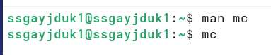{#fig-001 width=70%}

{#fig-002 width=40%}

## mc 

Выполним несколько операций в mc, используя управляющие клавиши (операции с панелями; выделение/отмена выделения файлов, копирование/перемещение файлов и т.п.) ([рис. @fig-003], [рис. @fig-004], [рис. @fig-005], [рис. @fig-006]).

{#fig-003 width=40%}

## mc 

{#fig-004 width=70%}

## mc 

{#fig-005 width=70%}

## mc 

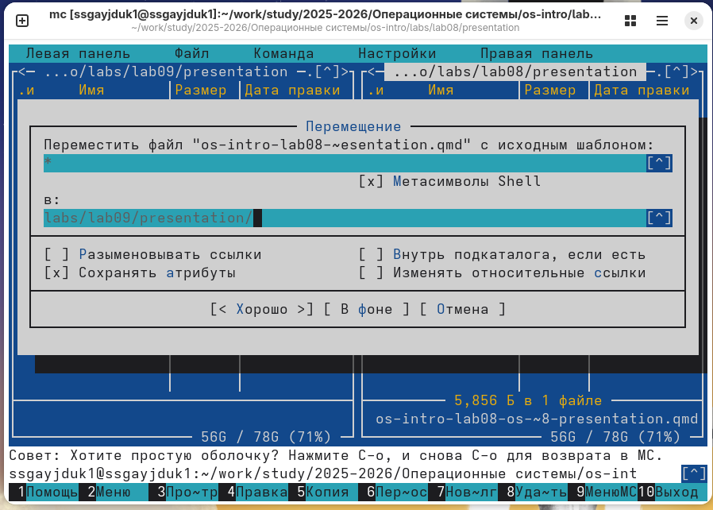{#fig-006 width=70%}

## mc 

Выполним основные команды меню левой (или правой) панели. Оценим степень подробности вывода информации о файлах ([рис. @fig-007], [рис. @fig-008], [рис. @fig-009], [рис. @fig-010], [рис. @fig-011], [рис. @fig-012], [рис.  @fig-013]).

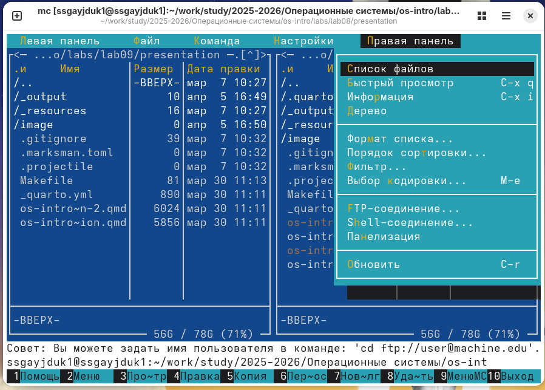{#fig-007 width=50%}

## mc 

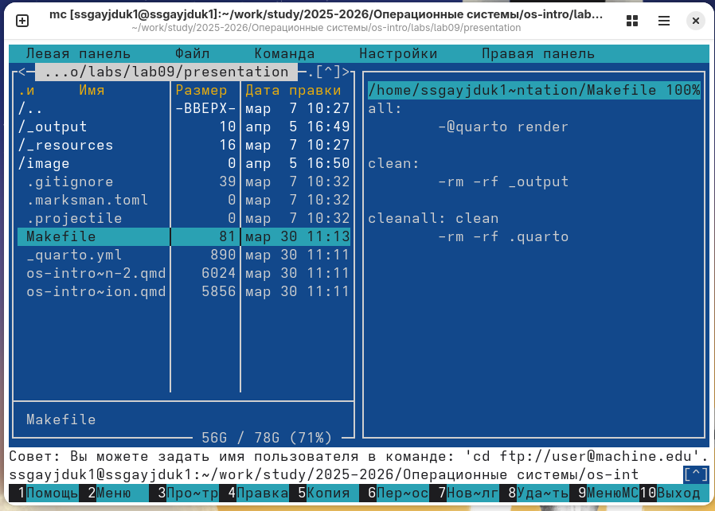{#fig-008 width=70%}

## mc 

{#fig-009 width=70%}

## mc 

{#fig-010 width=70%}

## mc 

{#fig-011 width=50%}

## mc 

{#fig-012 width=50%}

## mc 

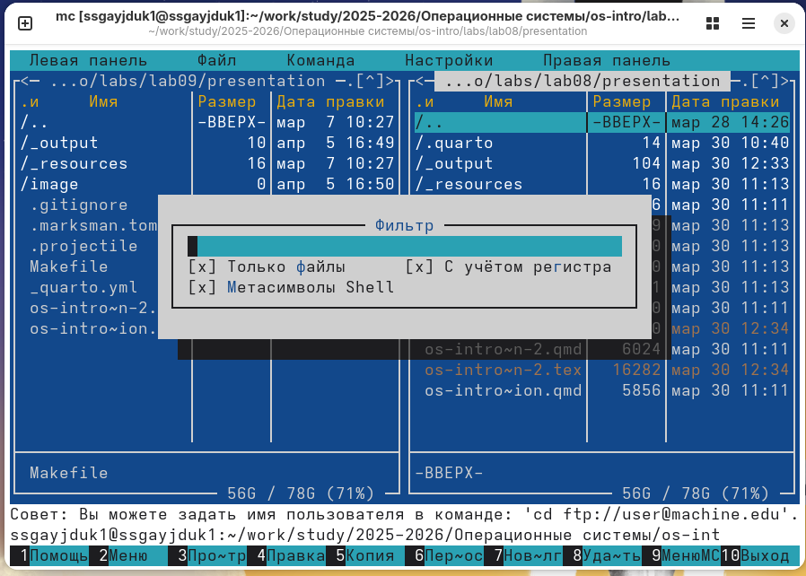{#fig-013 width=50%}

## подменю Файл

Используя возможности подменю Файл , выполним: просмотр содержимого текстового файла, редактирование содержимого текстового файла (без сохранения результатов редактирования), создание каталога, копирование в файлов в созданный каталог ([рис. @fig-014], [рис.  @fig-015], [рис. @fig-016], [рис.  @fig-017], [рис.  @fig-018], [рис.  @fig-019]).

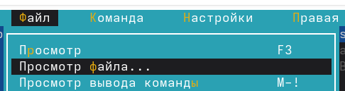{#fig-014 width=70%}

{#fig-015 width=50%}

## подменю Файл

{#fig-016 width=70%}

{#fig-017 width=70%}

## подменю Файл

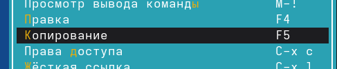{#fig-018 width=70%}

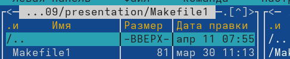{#fig-019 width=70%}

## подменю Команда

С помощью соответствующих средств подменю Команда осуществим: поиск в файловой системе файла с заданными условиями (например, файла с расширением .c или .cpp, содержащего строку main), выбор и повторение одной из предыдущих команд, переход в домашний каталог, анализ файла меню и файла расширений ([рис.  @fig-020], [рис.  @fig-021], [рис. @fig-022], [рис.  @fig-023], [рис.  @fig-024]).

{#fig-020 width=70%}

## подменю Команда

{#fig-021 width=70%}

## подменю Команда 

{#fig-022 width=50%}

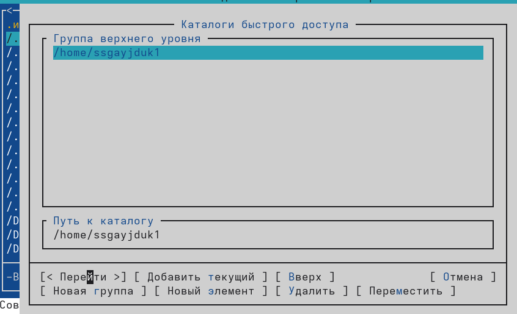{#fig-023 width=40%}

{#fig-024 width=40%}

## подменю Настройки 

Вызовим подменю Настройки. Освоим операции, определяющие структуру экрана mc ([рис.  @fig-025], [рис.  @fig-026], [рис. @fig-027], [рис.  @fig-028], [рис.  @fig-029]).

{#fig-025 width=70%}

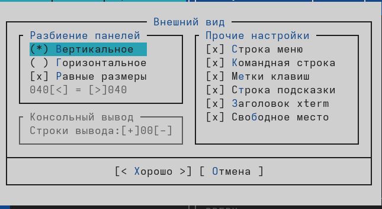{#fig-026 width=50%}

## подменю Настройки 

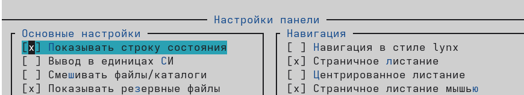{#fig-027 width=50%}

{#fig-028 width=50%}

{#fig-029 width=50%}

## Задание по встроенному редактору mc 

Создадим текстовой файл text.txt ([рис. @fig-030]).

{#fig-030 width=70%}

## Задание по встроенному редактору mc 

Откроем этот файл с помощью встроенного в mc редактора ([рис. @fig-031]).

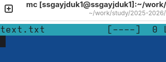{#fig-031 width=70%}

## Задание по встроенному редактору mc 

Вставим в открытый файл небольшой фрагмент текста, скопированный из Интернета ([рис. @fig-032]).

{#fig-032 width=70%}

## Задание по встроенному редактору mc 

Проделаем с текстом следующие манипуляции, используя горячие клавиши: Удалим строку текста. Выделим фрагмент текста и скопируем его на новую строк. Выделим фрагмент текста и перенесем его на новую строку. Сохраним файл.
Отменим последнее действие. Перейдем в конец файла (нажав комбинацию клавиш) и напишем некоторый текст. Перейдем в начало файла (нажав комбинацию клавиш) и напишем некоторый текст. Сохраним и закроем файл. И получим итоговый результат ([рис. @fig-033]).

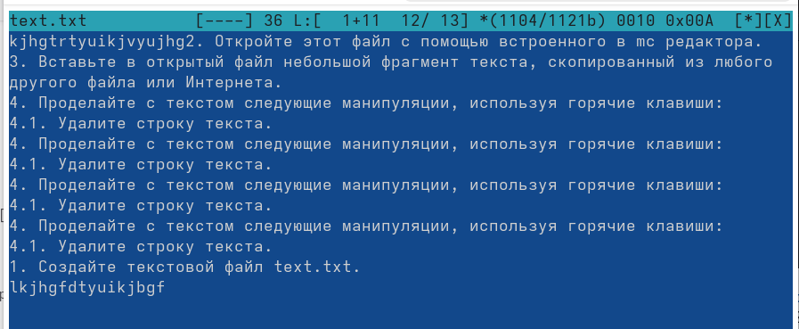{#fig-033 width=70%}

## Работа с файлом

Откроем файл с исходным текстом на некотором языке программирования (например C или Java) ([рис. @fig-034]).

{#fig-034 width=70%}

## Работа с файлом

Используя меню редактора, включим подсветку синтаксиса, если она не включена, или выключим, если она включена ([рис. @fig-035]).

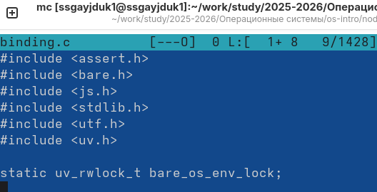{#fig-035 width=70%}

## Выводы

Мы ознакомлились с инструментами поиска файлов и фильтрации текстовых данных. Приобрели практических навыков: по управлению процессами (и заданиями), по проверке использования диска и обслуживанию файловых систем.

## Список литературы{.unnumbered}

1.Kulyabov. Лабораторная работа № 9. Командная оболочка Midnight Commander. RUDN

::: {#refs}
:::
