---
## Author
author:
  name: Гайдук Софья Сергеевна
  degrees: DSc
  orcid: 0000-0002-0877-7063
  email: 1032253645@rudn.ru
  affiliation:
    - name: Российский университет дружбы народов
      country: Российская Федерация
      postal-code: 117198
      city: Москва
      address: ул. Миклухо-Маклая, д. 6

## Title
title: "Лабораторная работа № 9"
subtitle: "Отчет"
license: "CC BY"
---

# Цель работы

Освоение основных возможностей командной оболочки Midnight Commander. Приобретение навыков практической работы по просмотру каталогов и файлов; манипуляций с ними

# Выполнение лабораторной работы

## Задание по mc

Изучим информацию о mc, вызвав в командной строке man mc. Запустим из командной строки mc, изучим его структуру и меню ([рис. @fig-001], [рис. @fig-002]).

{#fig-001 width=70%}

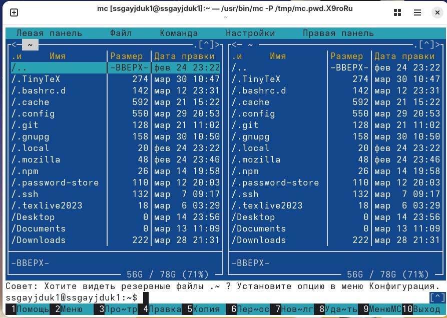{#fig-002 width=70%}

Выполним несколько операций в mc, используя управляющие клавиши (операции с панелями; выделение/отмена выделения файлов, копирование/перемещение файлов и т.п.) ([рис. @fig-003], [рис. @fig-004], [рис. @fig-005], [рис. @fig-006]).

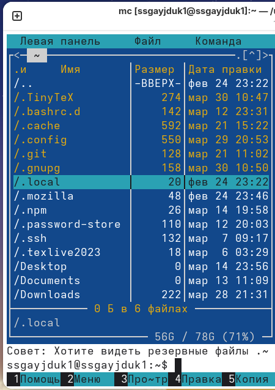{#fig-003 width=70%}

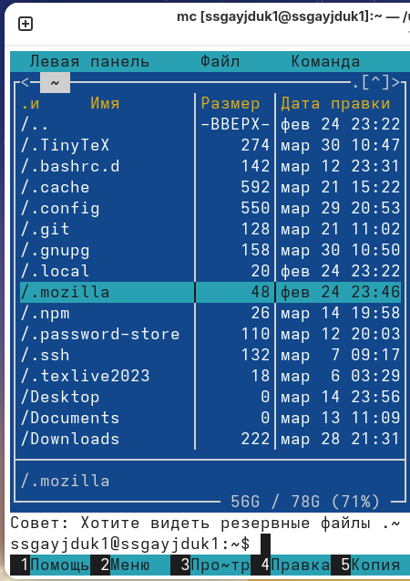{#fig-004 width=70%}

{#fig-005 width=70%}

{#fig-006 width=70%}

Выполним основные команды меню левой (или правой) панели. Оценим степень подробности вывода информации о файлах ([рис. @fig-007], [рис. @fig-008], [рис. @fig-009], [рис. @fig-010], [рис. @fig-011], [рис. @fig-012], [рис.  @fig-013]).

{#fig-007 width=70%}

{#fig-008 width=70%}

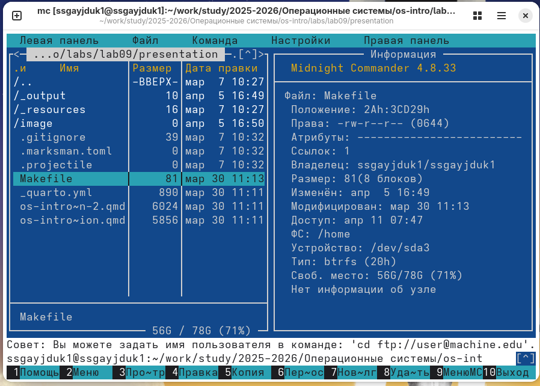{#fig-009 width=70%}

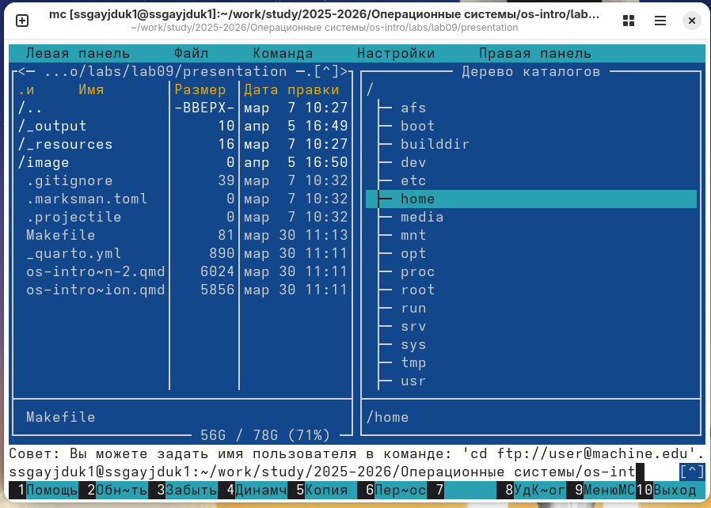{#fig-010 width=70%}

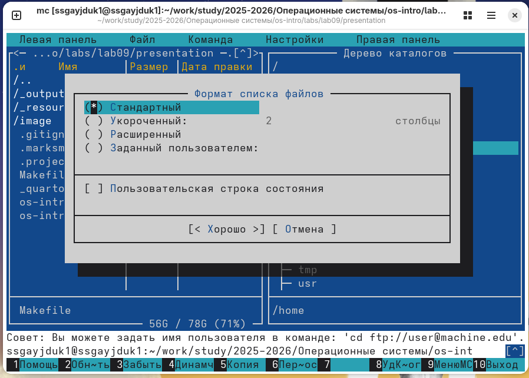{#fig-011 width=70%}

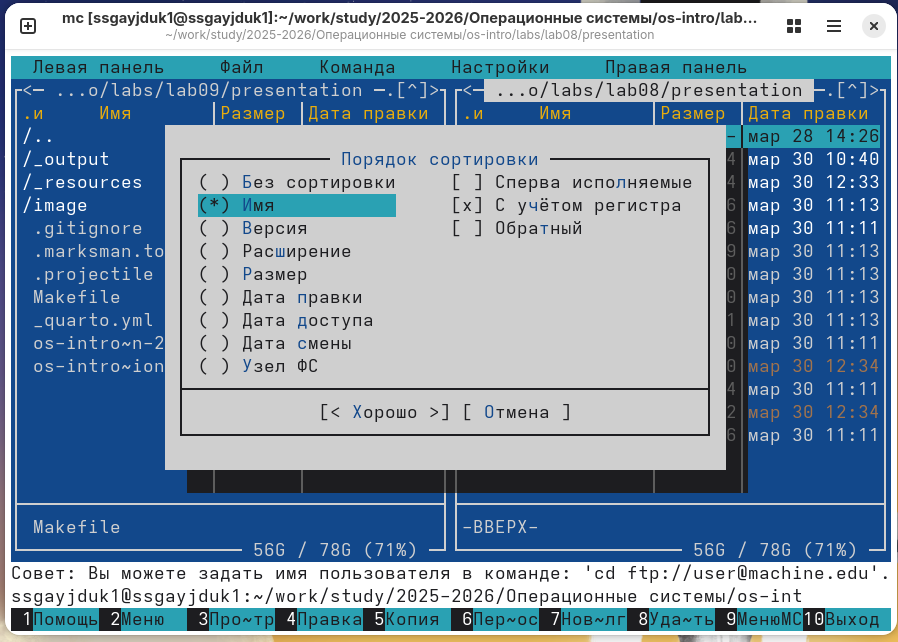{#fig-012 width=70%}

{#fig-013 width=70%}

Используя возможности подменю Файл , выполним: просмотр содержимого текстового файла, редактирование содержимого текстового файла (без сохранения результатов редактирования), создание каталога, копирование в файлов в созданный каталог ([рис. @fig-014], [рис.  @fig-015], [рис. @fig-016], [рис.  @fig-017], [рис.  @fig-018], [рис.  @fig-019]).

{#fig-014 width=70%}

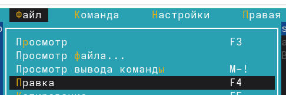{#fig-015 width=70%}

{#fig-016 width=70%}

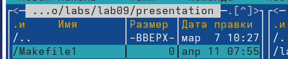{#fig-017 width=70%}

{#fig-018 width=70%}

{#fig-019 width=70%}

С помощью соответствующих средств подменю Команда осуществим: поиск в файловой системе файла с заданными условиями (например, файла с расширением .c или .cpp, содержащего строку main), выбор и повторение одной из предыдущих команд, переход в домашний каталог, анализ файла меню и файла расширений ([рис.  @fig-020], [рис.  @fig-021], [рис. @fig-022], [рис.  @fig-023], [рис.  @fig-024]).

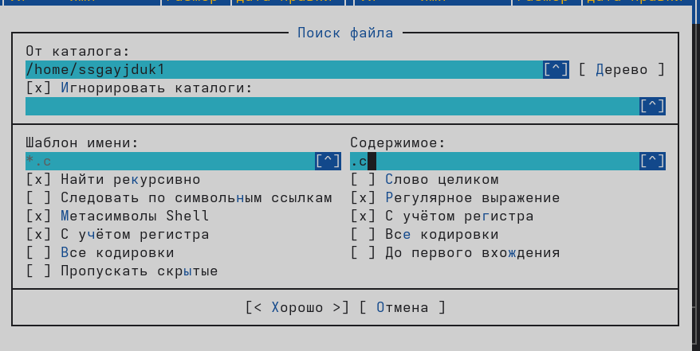{#fig-020 width=70%}

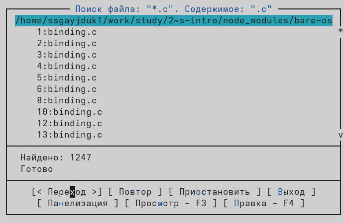{#fig-021 width=70%}

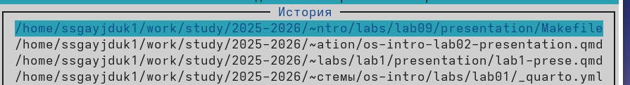{#fig-022 width=70%}

{#fig-023 width=70%}

{#fig-024 width=70%}

Вызовим подменю Настройки . Освоим операции, определяющие структуру экрана mc ([рис.  @fig-025], [рис.  @fig-026], [рис. @fig-027], [рис.  @fig-028], [рис.  @fig-029]).

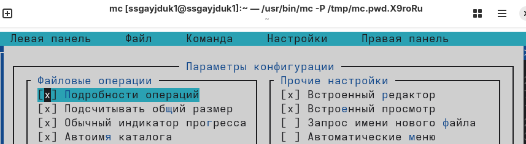{#fig-025 width=70%}

{#fig-026 width=70%}

{#fig-027 width=70%}

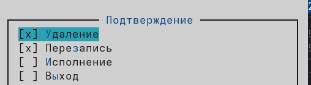{#fig-028 width=70%}

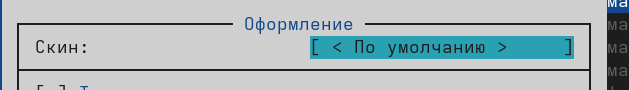{#fig-029 width=70%}

## Задание по встроенному редактору mc 

Создадим текстовой файл text.txt ([рис. @fig-030]).

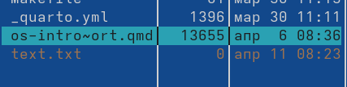{#fig-030 width=70%}

Откроем этот файл с помощью встроенного в mc редактора ([рис. @fig-031]).

{#fig-031 width=70%}

Вставим в открытый файл небольшой фрагмент текста, скопированный из Интернета ([рис. @fig-032]).

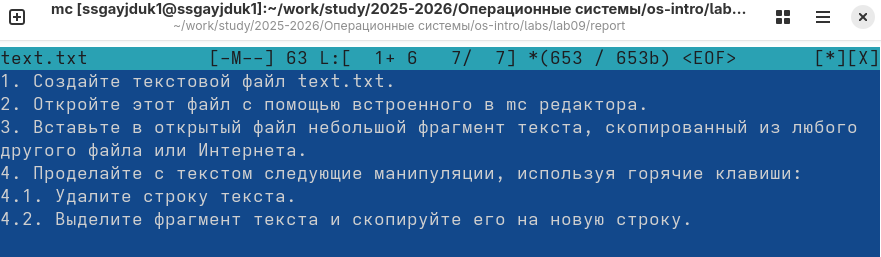{#fig-032 width=70%}

Проделаем с текстом следующие манипуляции, используя горячие клавиши: Удалим строку текста. Выделим фрагмент текста и скопируем его на новую строк. Выделим фрагмент текста и перенесем его на новую строку. Сохраним файл.
Отменим последнее действие. Перейдем в конец файла (нажав комбинацию клавиш) и напишем некоторый текст. Перейдем в начало файла (нажав комбинацию клавиш) и напишем некоторый текст. Сохраним и закроем файл. И получим итоговый результат ([рис. @fig-033]).

{#fig-033 width=70%}

Откроем файл с исходным текстом на некотором языке программирования (например C или Java) ([рис. @fig-034]).

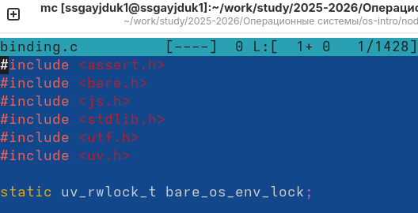{#fig-034 width=70%}

Используя меню редактора, включим подсветку синтаксиса, если она не включена, или выключим, если она включена ([рис. @fig-035]).

{#fig-035 width=70%}

# Контрольные вопросы 

1. Какие режимы работы есть в mc. Охарактеризуйте их.
- Стандартный (Standard): Показывает список файлов с их атрибутами (права, владелец, размер, время).
- Краткий (Brief): Показывает только имена файлов.
- Расширенный (Long Listing): Детальный список, аналогичный выводу команды ls -l.
- Информация (Info): Отображает информацию о текущем файле или свободном месте на диске.
- Дерево (Tree): Отображает древовидную структуру каталогов для навигации.

2. Какие операции с файлами можно выполнить как с помощью команд shell, так и с помощью меню (комбинаций клавиш) mc? Приведите несколько примеров.
- Копирование: cp в shell или F5 в mc.
- Перемещение/Переименование: mv или F6.
- Удаление: rm или F8.
- Создание каталога: mkdir или F7.
- Просмотр прав (chmod): chmod или Ctrl-x c .

3. Опишите структура меню левой (или правой) панели mc, дайте характеристику командам.
- Меню панели (Левая/Правая) вызывается клавишей F9 и позволяет настраивать отображение:
	- Список (Listing): Переключение режимов отображения файлов (Стандартный, Краткий, Расширенный).
	- Быстрый просмотр (Quick View): Показывает содержимое выделенного файла на другой панели (Ctrl-x q).
	- Информация (Info): Показывает подробную информацию о файловой системе или файле (Ctrl-x i).
	- Дерево (Tree): Переключает панель в режим дерева каталогов.
	- Фильтр (Filter): Позволяет задать маску для отображения только определенных файлов

4. Опишите структура меню Файл mc, дайте характеристику командам.
- Просмотр (View): Просмотр содержимого файла (F3).
- Редактирование (Edit): Открытие файла во встроенном редакторе (F4).
- Копирование (Copy): Копирование файлов/папок (F5).
- Перемещение (Move): Перемещение/переименование (F6).
- Удаление (Delete): Удаление в корзину (или полностью) (F8).
- Создать ссылку (Symlink): Создание символической ссылки (Ctrl-x s).
- Права доступа (Chmod): Изменение прав (Ctrl-x c).
- Владелец/Группа (Chown): Изменение владельца (Ctrl-x o)

5. Опишите структура меню Команда mc, дайте характеристику командам.
- Поиск файла (Find File): Поиск файлов по имени или содержимому (Alt-?).
- Смена каталога (Change Directory): Быстрый переход по пути (Alt-c).
- Список быстрого доступа (Hotlist): Избранные каталоги (Ctrl-\\).
- История команд (Command history): Просмотр истории введенных команд (Alt-h).
- Сравнить каталоги (Compare directories): Сравнение содержимого двух панелей (Ctrl-x d).
- Внешняя панелизация (External panelize): Заполнение панели результатом выполнения команды.

6. Опишите структура меню Настройки mc, дайте характеристику командам.
- Конфигурация (Configuration): Общие настройки (поддержка мыши, автоповтор клавиш, и т.д.).
- Оформление (Appearance): Выбор цветовой схемы (скина).
- Настройки панелей (Panel options): Настройка режимов отображения панелей.
- Распознавание клавиш (Learn keys): Переназначение клавиш, если стандартные не работают 

7. Назовите и дайте характеристику встроенным командам mc.
- Встроенные команды — это отдельные программы, входящие в состав mc:
	- mcedit: Встроенный текстовый редактор с подсветкой синтаксиса. Запускается по F4 .
	- mcview: Встроенный просмотрщик файлов (текст/hex). Запускается по F3.
	- mcdiff: Инструмент для сравнения и слияния файлов (визуальный diff). Запускается комбинацией

8. Назовите и дайте характеристику командам встроенного редактора mc.
- F2 / Ctrl-s: Сохранить файл.
- F3 / Ctrl-k: Начать/закончить выделение блока.
- F4 / Ctrl-Ins: Копировать блок.
- F5 / Shift-Ins: Вставить блок.
- F6: Переместить блок.
- F7: Поиск.
- F8: Замена.
- F10 / Esc: Выйти.
- Shift-F3: Вертикальное выделение текста.
- Ctrl-u: Отмена последнего действия (Undo) 

9. Дайте характеристику средствам mc, которые позволяют создавать меню, определяемые пользователем.
- Пользовательское меню вызывается клавишей F2. Это настраиваемое меню, где каждый пункт выполняет заданный пользователем набор команд оболочки (shell). Конфигурация хранится в файлах ~/.config/mc/menu (или ~/.mc/menu).

10. Дайте характеристику средствам mc, которые позволяют выполнять действия, определяемые пользователем, над текущим файлом.
- Эта функциональность реализована через файл расширений mc.ext. Позволяет задать, какая программа или действие (включая пользовательские скрипты) должно выполняться при нажатии Enter на файле с определенным расширением или типом. Пользователь может переопределить системные настройки в своем файле ~/.config/mc/mc.ext.

# Выводы

Мы освоили основные возможности командной оболочки Midnight Commander. А также приобрели навыки практической работы по просмотру каталогов и файлов; манипуляций с ними

# Список литературы{.unnumbered}

1.Kulyabov. Лабораторная работа № 9. Командная оболочка Midnight Commander. RUDN

::: {#refs}
:::
