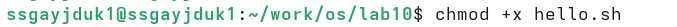
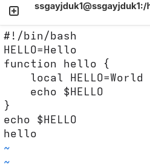

---
## Author
author:
  name: Гайдук Софья Сергеевна
  degrees: DSc
  orcid: 0000-0002-0877-7063
  email: 1032253645@rudn.ru
  affiliation:
    - name: Российский университет дружбы народов
      country: Российская Федерация
      postal-code: 117198
      city: Москва
      address: ул. Миклухо-Маклая, д. 6
---
## Title
---
title: "Лабораторная работа № 10"
subtitle: "Презентация"
author: "Гайдук Софья Сергеевна"
date: "2026-04-15"
format: 
  revealjs: 
    theme: solarized
    slide-number: true
---

# Информация

## Докладчик

:::::::::::::: {.columns align=center}
::: {.column width="70%"}

  * Гайдук Софья Сергеевна
  * студент
  * Российский университет дружбы народов им. П. Лумумбы
  * [1032253645@rudn.ru](mailto:1032253645@rudn.ru)
  * <https://github.com/SofiaGayduk/study_2025-2026_os-intro>

:::
::: {.column width="30%"}

:::
::::::::::::::

## Цель работы

Познакомиться с операционной системой Linux. Получить практические навыки работы с редактором vi, установленным по умолчанию практически во всех дистрибутивах.

## Выполнение лабораторной работы 

## Задание 1. Создание нового файла с использованием vi

Создадим каталог с именем ~/work/os/lab10. Перейдем во вновь созданный каталог ([рис. @fig-001]).

{#fig-001 width=70%}

Вызовим vi и создадим файл hello.sh ([рис. @fig-002]).
 
{#fig-002 width=70%}

## Задание 1. Создание нового файла с использованием vi

Нажмем клавишу i и вводем следующий текст. После нажмем клавишу Esc для перехода в командный режим после завершения ввода текста ([рис. @fig-003]).

{#fig-003 width=20%}

## Задание 1. Создание нового файла с использованием vi

Нажмем : для перехода в режим последней строки и w (записать), и q (выйти), а затем нажмем клавишу Enter для сохранения текста и завершения работы ([рис. @fig-004]).

{#fig-004 width=40%}

Сделаем файл исполняемым ([рис. @fig-005]).

{#fig-005 width=70%}

## Задание 2. Редактирование существующего файла

Вызовим vi на редактирование файла ([рис. @fig-006]).

{#fig-006 width=70%}

Установим курсор в конец слова HELL второй строки. Перейдем в режим вставки и заменим на HELLO. Нажмем Esc для возврата в командный режим ([рис. @fig-007]).

{#fig-007 width=20%}

## Задание 2. Редактирование существующего файла

Установим курсор на четвертую строку и сотрем слово LOCAL. Перейдем в режим вставки и наберем следующий текст: local, нажмем Esc для возврата в командный режим ([рис. @fig-008]).

{#fig-008 width=40%}

## Задание 2. Редактирование существующего файла

Установим курсор на последней строке файла. Вставим после неё строку, содержащую следующий текст: echo $HELLO ([рис. @fig-009]).

{#fig-009 width=70%}

## Задание 2. Редактирование существующего файла

Удалим последнюю строку ([рис. @fig-010]).

{#fig-010 width=70%}

## Задание 2. Редактирование существующего файла

Введем команду отмены изменений u для отмены последней команды ([рис. @fig-011]).

{#fig-011 width=70%}

## Задание 2. Редактирование существующего файла

Введем символ : для перехода в режим последней строки. Запишем произведённые изменения и выйдем из vi ([рис. @fig-012]).

{#fig-012 width=40%}

## Выводы

Мы познакомились с операционной системой Linux. Получили практические навыки работы с редактором vi, установленным по умолчанию практически во всех дистрибутивах.

## Список литературы{.unnumbered}

1.Kulyabov. Лабораторная работа № 10. Текстовой редактор vi. RUDN

::: {#refs}
:::
