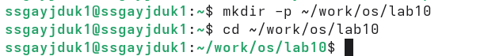
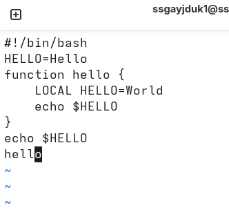
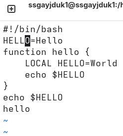
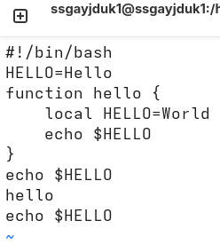

---
## Author
author:
  name: Гайдук Софья Сергеевна
  degrees: DSc
  orcid: 0000-0002-0877-7063
  email: 1032253645@rudn.ru
  affiliation:
    - name: Российский университет дружбы народов
      country: Российская Федерация
      postal-code: 117198
      city: Москва
      address: ул. Миклухо-Маклая, д. 6

## Title
title: "Лабораторная работа № 10"
subtitle: "Отчет"
license: "CC BY"
---

# Цель работы

Познакомиться с операционной системой Linux. Получить практические навыки работы с редактором vi, установленным по умолчанию практически во всех дистрибутивах.

# Выполнение лабораторной работы

## Задание по mc

 ([рис. @fig-001], [рис. @fig-002]).

{#fig-001 width=70%}

{#fig-002 width=70%}

 ([рис. @fig-003], [рис. @fig-004], [рис. @fig-005], [рис. @fig-006]).

{#fig-003 width=70%}

{#fig-004 width=70%}

{#fig-005 width=70%}

{#fig-006 width=70%}

([рис. @fig-007], [рис. @fig-008], [рис. @fig-009], [рис. @fig-010], [рис. @fig-011], [рис. @fig-012], [рис.  @fig-013]).

{#fig-007 width=70%}

{#fig-008 width=70%}

{#fig-009 width=70%}

{#fig-010 width=70%}

{#fig-011 width=70%}

{#fig-012 width=70%}

{#fig-013 width=70%}

Используя возможности подменю Файл , выполним: просмотр содержимого текстового файла, редактирование содержимого текстового файла (без сохранения результатов редактирования), создание каталога, копирование в файлов в созданный каталог ([рис. @fig-014], [рис.  @fig-015], [рис. @fig-016], [рис.  @fig-017], [рис.  @fig-018], [рис.  @fig-019]).

{#fig-014 width=70%}

{#fig-015 width=70%}

{#fig-016 width=70%}

{#fig-017 width=70%}

{#fig-018 width=70%}

{#fig-019 width=70%}

С помощью соответствующих средств подменю Команда осуществим: поиск в файловой системе файла с заданными условиями (например, файла с расширением .c или .cpp, содержащего строку main), выбор и повторение одной из предыдущих команд, переход в домашний каталог, анализ файла меню и файла расширений ([рис.  @fig-020], [рис.  @fig-021], [рис. @fig-022], [рис.  @fig-023], [рис.  @fig-024]).

{#fig-020 width=70%}

{#fig-021 width=70%}

{#fig-022 width=70%}

{#fig-023 width=70%}

{#fig-024 width=70%}

Вызовим подменю Настройки . Освоим операции, определяющие структуру экрана mc ([рис.  @fig-025], [рис.  @fig-026], [рис. @fig-027], [рис.  @fig-028], [рис.  @fig-029]).

{#fig-025 width=70%}

{#fig-026 width=70%}

{#fig-027 width=70%}

{#fig-028 width=70%}

{#fig-029 width=70%}

## Задание по встроенному редактору mc 

Создадим текстовой файл text.txt ([рис. @fig-030]).

{#fig-030 width=70%}

Откроем этот файл с помощью встроенного в mc редактора ([рис. @fig-031]).

{#fig-031 width=70%}

Вставим в открытый файл небольшой фрагмент текста, скопированный из Интернета ([рис. @fig-032]).

{#fig-032 width=70%}

Проделаем с текстом следующие манипуляции, используя горячие клавиши: Удалим строку текста. Выделим фрагмент текста и скопируем его на новую строк. Выделим фрагмент текста и перенесем его на новую строку. Сохраним файл.
Отменим последнее действие. Перейдем в конец файла (нажав комбинацию клавиш) и напишем некоторый текст. Перейдем в начало файла (нажав комбинацию клавиш) и напишем некоторый текст. Сохраним и закроем файл. И получим итоговый результат ([рис. @fig-033]).

{#fig-033 width=70%}

Откроем файл с исходным текстом на некотором языке программирования (например C или Java) ([рис. @fig-034]).

{#fig-034 width=70%}

Используя меню редактора, включим подсветку синтаксиса, если она не включена, или выключим, если она включена ([рис. @fig-035]).

{#fig-035 width=70%}

# Контрольные вопросы 

1. Дайте краткую характеристику режимам работы редактора vi.
- Командный (Normal): режим по умолчанию. Используется для ввода команд, навигации, удаления, копирования текста.
- Ввода (Insert): режим для непосредственного набора текста. Включается клавишами i, a, o и др.
- Режим последней строки (Last line / Command-line): запускается с клавиши : (двоеточие). Используется для команд с файлом (:w, :q), поиска, замены.
2. Как выйти из редактора, не сохраняя произведённые изменения?
- В командном режиме набрать :q! — принудительный выход без сохранения. Или, если изменения есть, но хочется выйти без сохранения: :q!
3. Назовите и дайте краткую характеристику командам позиционирования.
- h / j / k / l — влево, вниз, вверх, вправо.
- 0 (ноль) — в начало текущей строки.
- $ — в конец текущей строки.
- w — к началу следующего слова.
- b — к началу предыдущего слова.
- Ctrl + f / Ctrl + b — на страницу вперёд/назад.
4. Что для редактора vi является словом? 
- Слово — последовательность из букв, цифр и символа подчёркивания _, ограниченная пробелами, знаками препинания, символами перевода строки. Отличается от СЛОВА (WORD) — последовательности любых непробельных символов. 
5. Каким образом из любого места редактируемого файла перейти в начало (конец) файла?
- В начало файла: gg (в Vim) или 1G (классический vi). В конец файла: G.
6. Назовите и дайте краткую характеристику основным группам команд редактирования.
- Удаление: x (символ), dd (строку), dw (слово).
- Вставка/добавление: i (перед курсором), a (после), o (строка снизу).
- Замена: r (один символ), R (режим замены поверх текста).
- Копирование/вставка: yy (копировать строку), p (вставить после курсора).
- Отмена: u (отмена), Ctrl + r (повтор).
7. Необходимо заполнить строку символами $. Каковы ваши действия?
- cc — удалить всю строку и перейти в режим вставки. Нажать Esc, затем 70i$Esc (например, для строки длиной 70 символов). Или :s/.*/$/ (заменить всю строку на $), а затем повторить символ командой R и $ до конца.
8. Как отменить некорректное действие, связанное с процессом редактирования?
- u — отменить последнее изменение (в командном режиме). 
- U — отменить все изменения в текущей строке (восстановить её).
- Повторная u — отмена отмены (redo) — в классическом vi проблематично, в Vim: Ctrl + r
9. Назовите и дайте характеристику основным группам команд режима последней строки.
- Работа с файлами: :w (сохранить), :q (выйти), :wq (сохранить и выйти).
- Навигация: :123 — перейти на строку 123.
- Поиск/замена: :%s/old/new/g — глобальная замена.
- Настройки: :set nu (показать номера строк), :set nonu (убрать).
- Выполнение shell: :!команда
10. Как определить, не перемещая курсора, позицию, в которой заканчивается строка?
- В командном режиме: g Ctrl + g (в Vim) — покажет информацию о файле, включая текущую строку и столбец.
11. Выполните анализ опций редактора vi (сколько их, как узнать их назначение и т.д.).
- Количество опций — около 200–300 (в зависимости от версии, в Vim более 300).
	- :set all — вывести все опции и их текущие значения.
	- :set option? — узнать значение конкретной опции (например, :set number?).
	- :help option-name (в Vim).
Опции делятся на булевы (:set number), числовые (:set shiftwidth=4) и строковые (:set directory=/tmp).
12. Как определить режим работы редактора vi?
- Командный: нажатие клавиш не вводит текст, а вызывает команды. Внизу экрана нет индикатора -- INSERT --.
- Ввода: внизу экрана (в современных версиях) отображается -- INSERT -- или -- REPLACE --. Любые символы попадают в текст.
- Режим последней строки: внизу появляется двоеточие : и мигающий курсор.
13. Постройте граф взаимосвязи режимов работы редактора vi
- Из Командного в Ввода — клавиши i, a, o, I, A, O.
- Из Командного в Режим последней строки — клавиша :.
- Из обоих режимов (Ввода и Последней строки) в Командный — клавиша Esc.
- Из Режима последней строки после выполнения команды (например, :w) возврат в командный автоматический.

# Выводы

Мы познакомились с операционной системой Linux. Получили практические навыки работы с редактором vi, установленным по умолчанию практически во всех дистрибутивах.

# Список литературы{.unnumbered}

1.Kulyabov. Лабораторная работа № 10. Текстовой редактор vi. RUDN

::: {#refs}
:::
