---
## Author
author:
  name: Гайдук Софья Сергеевна
  degrees: DSc
  orcid: 0000-0002-0877-7063
  email: 1032253645@rudn.ru
  affiliation:
    - name: Российский университет дружбы народов
      country: Российская Федерация
      postal-code: 117198
      city: Москва
      address: ул. Миклухо-Маклая, д. 6
---
## Title
---
title: "Лабораторная работа № 11"
subtitle: "Презентация"
author: "Гайдук Софья Сергеевна"
date: "2026-04-24"
format: 
  revealjs: 
    theme: solarized
    slide-number: true
---

# Информация

## Докладчик

:::::::::::::: {.columns align=center}
::: {.column width="70%"}

  * Гайдук Софья Сергеевна
  * студент
  * Российский университет дружбы народов им. П. Лумумбы
  * [1032253645@rudn.ru](mailto:1032253645@rudn.ru)
  * <https://github.com/SofiaGayduk/study_2025-2026_os-intro>

:::
::: {.column width="30%"}

:::
::::::::::::::

# Цель работы

Познакомиться с операционной системой Linux. Получить практические навыки работы с редактором Emacs.

# Выполнение лабораторной работы 

## Основные команды emacs

Открыть emacs ([рис. 1]).

{#fig-001 width=70%}

## Основные команды emacs 

Создать файл lab07.sh с помощью комбинации Ctrl-x Ctrl-f ([рис. 2]).
 
{#fig-002 width=70%}

## Основные команды emacs

Наберить текст указанный в лабораторной работе 11 ([рис. 3]).

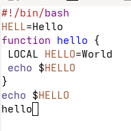{#fig-003 width=70%}

## Основные команды emacs

Сохранить файл с помощью комбинации Ctrl-x Ctrl-s ([рис. 4]).

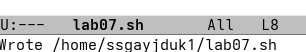{#fig-004 width=70%}

## Основные команды emacs

Вырезать одной командой целую строку (С-k) ([рис. 5]).

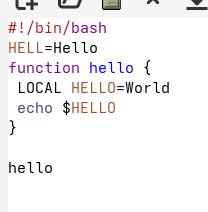{#fig-005 width=70%}

## Основные команды emacs

Вставить эту строку в конец файла (C-y) ([рис. 6]).

{#fig-006 width=70%}

## Основные команды emacs

Выделить область текста (C-space)([рис. 7]).

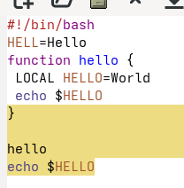{#fig-007 width=70%}

## Основные команды emacs

Скопировать область в буфер обмена (M-w). Вставить область в конец файла ([рис. 8]).

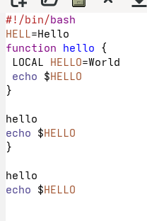{#fig-008 width=70%}

## Основные команды emacs

Вновь выделить эту область и на этот раз вырезать её (C-w) ([рис. 9]).

{#fig-009 width=70%}

## Основные команды emacs

Отмените последнее действие (C-/) ([рис. 10]).

{#fig-010 width=70%}

## Основные команды emacs

Переместите курсор в начало строки (C-a) ([рис. 11]).

{#fig-011 width=70%}

## Основные команды emacs

Переместите курсор в конец строки (C-e) ([рис. 12]).

{#fig-012 width=70%}

## Основные команды emacs

Вывести список активных буферов на экран (C-x C-b) ([рис. 13]).

{#fig-013 width=70%}

## Основные команды emacs

Переместитесь во вновь открытое окно (C-x) o со списком открытых буферов и переключитесь на другой буфер ([рис. 14], [рис.  15]).

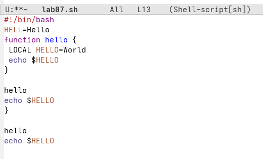{#fig-014 width=70%}

## Основные команды emacs

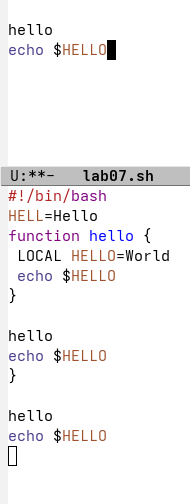{#fig-015 width=70%}

## Основные команды emacs

Закройте это окно (C-x 0) ([рис. 16]).

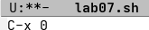{#fig-016 width=70%}

## Основные команды emacs

Теперь вновь переключайтесь между буферами, но уже без вывода их списка на экран (C-x b) ([рис.  17]).

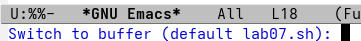{#fig-017 width=70%}

## Основные команды emacs

Поделите фрейм на 4 части: разделите фрейм на два окна по вертикали (C-x 3),
а затем каждое из этих окон на две части по горизонтали (C-x 2) ([рис.  18], [рис.  19]).

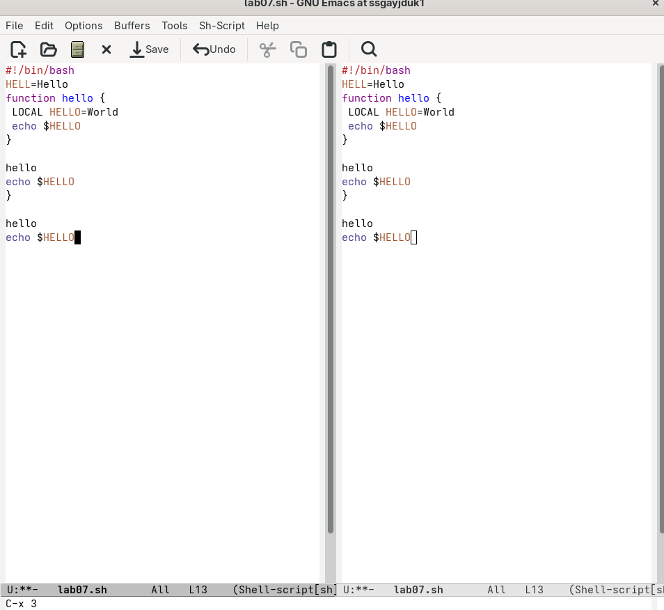{#fig-018 width=70%}

## Основные команды emacs

{#fig-019 width=70%}

## Основные команды emacs

В каждом из четырёх созданных окон откройте новый буфер (файл) и введите несколько строк текста ([рис.  20], [рис.  21], [рис. 22], [рис.  23], [рис.  24]).

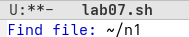{#fig-020 width=70%}

## Основные команды emacs

{#fig-021 width=70%}

## Основные команды emacs

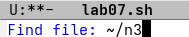{#fig-022 width=70%}

## Основные команды emacs

{#fig-023 width=70%}

## Основные команды emacs

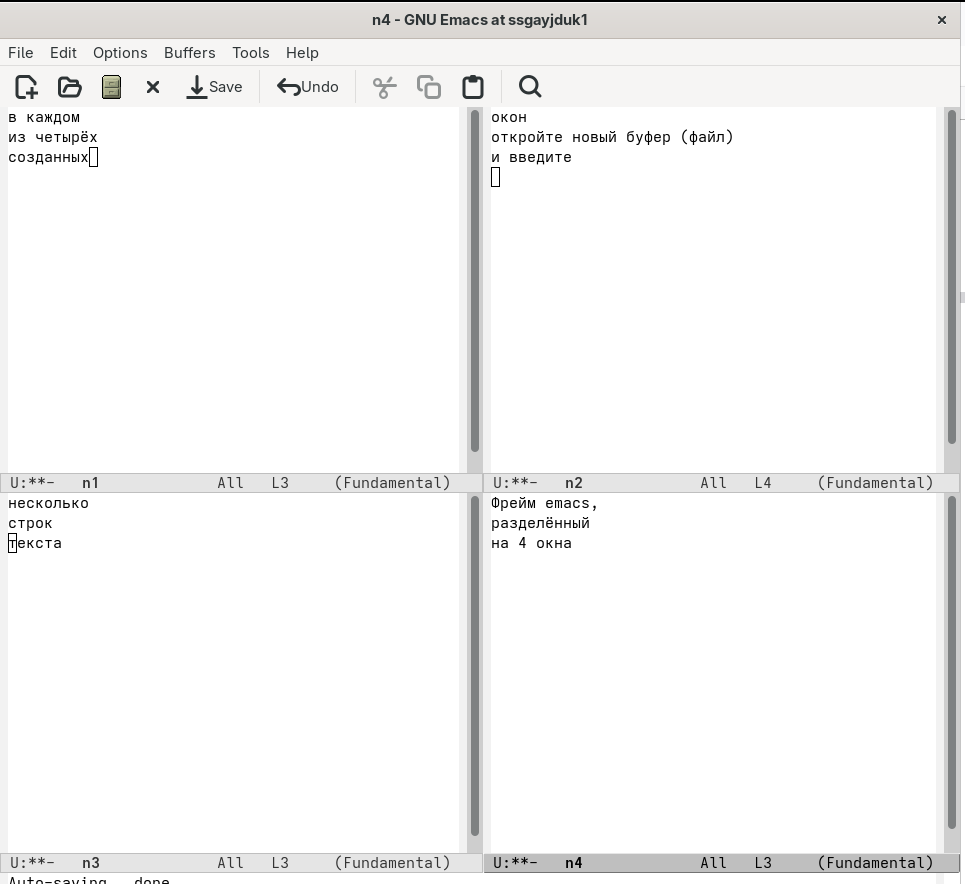{#fig-024 width=70%}

## Основные команды emacs

Переключитесь в режим поиска (C-s), и найдите несколько слов, присутствующих в тексте, и переключайтесь между результатами поиска, нажимая C-s. После выйдите из режима поиска, нажав C-g ([рис.  25]).

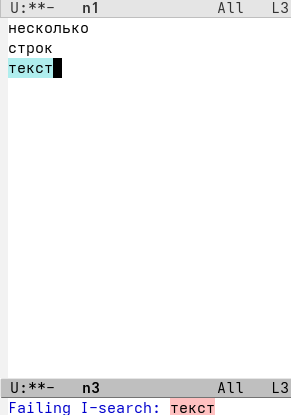{#fig-025 width=70%}

## Основные команды emacs

Перейдите в режим поиска и замены (M-%), введите текст, который следует найти и заменить, нажмите Enter , затем введите текст для замены. После того как будут подсвечены результаты поиска, нажмите ! для подтверждения замены ([рис.  26], [рис. 27], [рис.  28], [рис.  29]).

{#fig-026 width=70%}

## Основные команды emacs

{#fig-027 width=70%}

## Основные команды emacs

{#fig-028 width=70%}

## Основные команды emacs

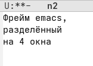{#fig-029 width=70%}

## Основные команды emacs

Испробуйте другой режим поиска, нажав M-s o. Объясните, чем он отличается от
обычного режима. В новом окне появляется строки и и выделенный текст, который подсвечивается ([рис. 30]).

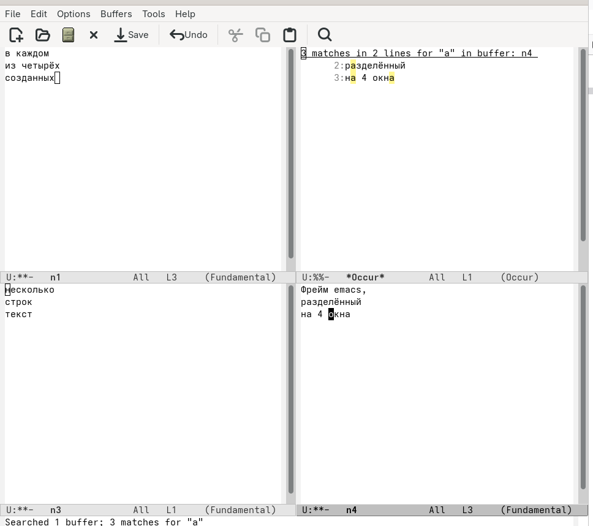{#fig-030 width=70%}

# Выводы

Мы познакомились с операционной системой Linux. Получили практические навыки работы с редактором Emacs.

# Список литературы{.unnumbered}

1.Kulyabov. Лабораторная работа № 11. Текстовой редактор emacs. RUDN

# Список литературы{.unnumbered}

1.Kulyabov. Лабораторная работа № 11. Текстовой редактор emacs. RUDN

::: {#refs}
:::
