---
## Author
author:
  name: Гайдук Софья Сергеевна
  degrees: DSc
  orcid: 0000-0002-0877-7063
  email: 1032253645@rudn.ru
  affiliation:
    - name: Российский университет дружбы народов
      country: Российская Федерация
      postal-code: 117198
      city: Москва
      address: ул. Миклухо-Маклая, д. 6

## Title
title: "Лабораторная работа № 11"
subtitle: "Отчет"
license: "CC BY"
---

# Цель работы

Познакомиться с операционной системой Linux. Получить практические навыки работы с редактором Emacs.

# Выполнение лабораторной работы 

Открыть emacs ([рис. @fig-001]).

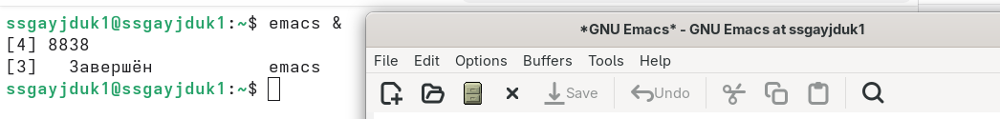{#fig-001 width=70%}

Создать файл lab07.sh с помощью комбинации Ctrl-x Ctrl-f ([рис. @fig-002]).
 
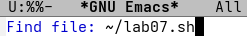{#fig-002 width=70%}

Наберить текст указанный в лабораторной работе 11 ([рис. @fig-003]).

{#fig-003 width=70%}

Сохранить файл с помощью комбинации Ctrl-x Ctrl-s ([рис. @fig-004]).

{#fig-004 width=70%}

Вырезать одной командой целую строку (С-k) ([рис. @fig-005]).

{#fig-005 width=70%}

Вставить эту строку в конец файла (C-y) ([рис. @fig-006]).

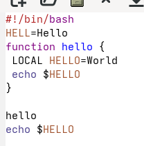{#fig-006 width=70%}

Выделить область текста (C-space)([рис. @fig-007]).

{#fig-007 width=70%}

Скопировать область в буфер обмена (M-w). Вставить область в конец файла ([рис. @fig-008]).

{#fig-008 width=70%}

Вновь выделить эту область и на этот раз вырезать её (C-w) ([рис. @fig-009]).

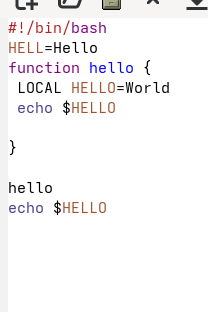{#fig-009 width=70%}

Отмените последнее действие (C-/) ([рис. @fig-010]).

{#fig-010 width=70%}

Переместите курсор в начало строки (C-a) ([рис. @fig-011]).

{#fig-011 width=70%}

Переместите курсор в конец строки (C-e) ([рис. @fig-012]).

{#fig-012 width=70%}

Вывести список активных буферов на экран (C-x C-b) ([рис. @fig-013]).

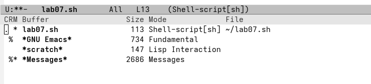{#fig-013 width=70%}

Переместитесь во вновь открытое окно (C-x) o со списком открытых буферов и переключитесь на другой буфер ([рис. @fig-014], [рис.  @fig-015]).

{#fig-014 width=70%}

{#fig-015 width=70%}

Закройте это окно (C-x 0) ([рис. @fig-016]).

{#fig-016 width=70%}

Теперь вновь переключайтесь между буферами, но уже без вывода их списка на экран (C-x b) ([рис.  @fig-017]).

{#fig-017 width=70%}

Поделите фрейм на 4 части: разделите фрейм на два окна по вертикали (C-x 3),
а затем каждое из этих окон на две части по горизонтали (C-x 2) ([рис.  @fig-018], [рис.  @fig-019]).

{#fig-018 width=70%}

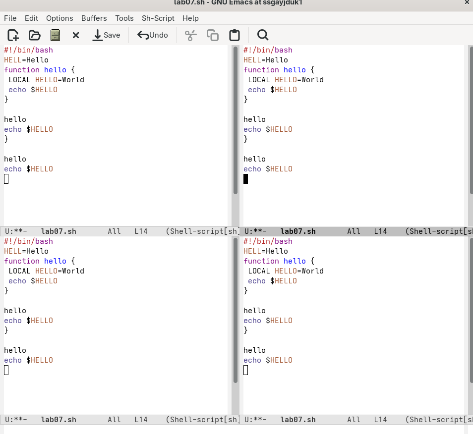{#fig-019 width=70%}

В каждом из четырёх созданных окон откройте новый буфер (файл) и введите несколько строк текста ([рис.  @fig-020], [рис.  @fig-021], [рис. @fig-022], [рис.  @fig-023], [рис.  @fig-024]).

{#fig-020 width=70%}

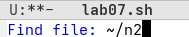{#fig-021 width=70%}

{#fig-022 width=70%}

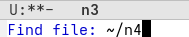{#fig-023 width=70%}

{#fig-024 width=70%}

Переключитесь в режим поиска (C-s), и найдите несколько слов, присутствующих в тексте, и переключайтесь между результатами поиска, нажимая C-s. После выйдите из режима поиска, нажав C-g ([рис.  @fig-025]).

{#fig-025 width=70%}

Перейдите в режим поиска и замены (M-%), введите текст, который следует найти и заменить, нажмите Enter , затем введите текст для замены. После того как будут подсвечены результаты поиска, нажмите ! для подтверждения замены ([рис.  @fig-026], [рис. @fig-027], [рис.  @fig-028], [рис.  @fig-029]).

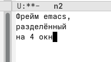{#fig-026 width=70%}

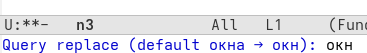{#fig-027 width=70%}

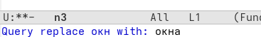{#fig-028 width=70%}

{#fig-029 width=70%}

Испробуйте другой режим поиска, нажав M-s o. Объясните, чем он отличается от
обычного режима. В новом окне появляется строки и и выделенный текст, который подсвечивается ([рис. @fig-030]).

{#fig-030 width=70%}

# Контрольные вопросы 

1. Кратко охарактеризуйте редактор emacs.
- Emacs — расширяемый настраиваемый текстовый редактор, который фактически является средой для работы с текстом, кодом, почтой и файлами.
2. Какие особенности данного редактора могут сделать его сложным для освоения новичком?
- Сложность для новичка — нестандартные комбинации клавиш (Ctrl/Alt), необычная терминология (буфер/окно) и обилие встроенных функций.
3. Своими словами опишите, что такое буфер и окно в терминологии emacs’а.
- Буфер — содержимое в памяти (текст файла или служебная информация)
- Окно — область экрана, через которую вы видите буфер 
4. Можно ли открыть больше 10 буферов в одном окне?
- Нет, в одном окне отображается только один буфер, но можно разделить окно на несколько частей.
5. Какие буферы создаются по умолчанию при запуске emacs?
- По умолчанию: GNU Emacs (приветствие), scratch (черновик), Messages (журнал).
6. Какие клавиши вы нажмёте, чтобы ввести следующую комбинацию C-c | и C-c C-|?
- C-c | — Ctrl+C, затем клавиша | (Shift+\). 
- C-c C-| — удерживая Ctrl, нажать C, затем (не отпуская Ctrl) нажать |.
7. Как поделить текущее окно на две части?
- Горизонтально: C-x 2, вертикально: C-x 3.
8. В каком файле хранятся настройки редактора emacs?
- ~/.emacs или ~/.emacs.d/init.el
9. Какую функцию выполняет клавиша и можно ли её переназначить?
- Клавиша Meta (Alt) служит префиксом для команд; её функцию можно переназначить через настройки.
10. Какой редактор вам показался удобнее в работе vi или emacs? Поясните почему. 
- Мне показились оба редактора удобными, так как vim - ориентирован на клавиатуру, что позволяет быстро перемещаться и манипулировать текстом без необходимости использования мыши. А emacs - возможность настройки за пределами редактирования текста, интегрированные инструменты, такие как файловый менеджер, отладчик, система контроля версий (Git).

# Выводы

Мы познакомились с операционной системой Linux. Получыили практические навыки работы с редактором Emacs.

# Список литературы{.unnumbered}

1.Kulyabov. Лабораторная работа № 11. Текстовой редактор emacs. RUDN

::: {#refs}
:::
