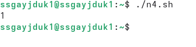

---
## Author
author:
  name: Гайдук Софья Сергеевна
  degrees: DSc
  orcid: 0000-0002-0877-7063
  email: 1032253645@rudn.ru
  affiliation:
    - name: Российский университет дружбы народов
      country: Российская Федерация
      postal-code: 117198
      city: Москва
      address: ул. Миклухо-Маклая, д. 6
---
## Title
---
title: "Лабораторная работа № 12"
subtitle: "Презентация"
author: "Гайдук Софья Сергеевна"
date: "2026-04-29"
format: 
  revealjs: 
    theme: solarized
    slide-number: true
---

# Информация

## Докладчик

:::::::::::::: {.columns align=center}
::: {.column width="70%"}

  * Гайдук Софья Сергеевна
  * студент
  * Российский университет дружбы народов им. П. Лумумбы
  * [1032253645@rudn.ru](mailto:1032253645@rudn.ru)
  * <https://github.com/SofiaGayduk/study_2025-2026_os-intro>

:::
::: {.column width="30%"}

:::
::::::::::::::

## Цель работы

Изучить основы программирования в оболочке ОС UNIX/Linux. Научиться писать небольшие командные файлы

# Выполнение лабораторной работы 

## Задание 1 

Написать скрипт, который при запуске будет делать резервную копию самого себя в другую директорию backup
в нашем домашнем каталоге ([рис. 1], [рис. 2], [рис. 3], [рис. 4]).

{#fig-001 width=70%}

##  Задание 1 
 
{#fig-002 width=70%}

## Задание 1 

{#fig-003 width=70%}

## Задание 1 

{#fig-004 width=70%}

## Задание 2

Написать пример командного файла, обрабатывающего любое произвольное число  аргументов командной строки, в том числе превышающее десять ([рис. 5], [рис. 6]).

{#fig-005 width=70%}

## Задание 2

{#fig-006 width=70%}

## Задание 3

Написать командный файл — аналог команды ls. Требуется, чтобы он выдавал информацию о нужном каталоге
и выводил информацию о возможностях доступа к файлам этого каталога ([рис. 7], [рис. 8]).

{#fig-007 width=70%}

## Задание 3

{#fig-008 width=70%}

## Задание 4

Написать командный файл, который получает в качестве аргумента командной строки формат файла (.txt, .doc, .jpg, .pdf и т.д.) и вычисляет количество таких файлов в указанной директории ([рис. 9], [рис. 10]).

{#fig-009 width=70%}

## Задание 4

{#fig-010 width=70%}

# Выводы

Мы познакомились с операционной системой Linux. Получили практические навыки работы с редактором Emacs.

# Список литературы{.unnumbered}

1.Kulyabov. Лабораторная работа № 12. Программирование в командном процессоре ОС UNIX. Командные файлы. RUDN

::: {#refs}
:::
