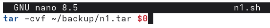
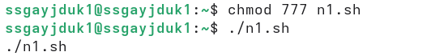
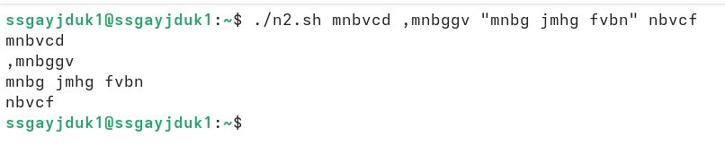
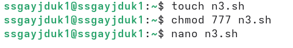
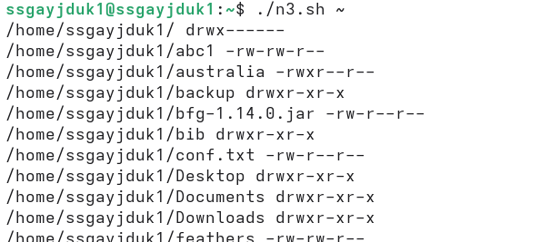
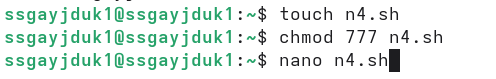

---
## Author
author:
  name: Гайдук Софья Сергеевна
  degrees: DSc
  orcid: 0000-0002-0877-7063
  email: 1032253645@rudn.ru
  affiliation:
    - name: Российский университет дружбы народов
      country: Российская Федерация
      postal-code: 117198
      city: Москва
      address: ул. Миклухо-Маклая, д. 6

## Title
title: "Лабораторная работа № 12"
subtitle: "Отчет"
license: "CC BY"
---

# Цель работы

Изучить основы программирования в оболочке ОС UNIX/Linux. Научиться писать небольшие командные файлы

# Выполнение лабораторной работы 

Написать скрипт, который при запуске будет делать резервную копию самого себя (то есть файла, в котором содержится его исходный код) в другую директорию backup в нашем домашнем каталоге. При этом файл должен архивироваться одним из архиваторов на выбор zip, bzip2 или tar ([рис. @fig-001], [рис. @fig-002], [рис. @fig-003], [рис. @fig-004]). 

{#fig-001 width=70%}

 
{#fig-002 width=70%}

{#fig-003 width=70%}

{#fig-004 width=70%}

Написать пример командного файла, обрабатывающего любое произвольное число аргументов командной строки, в том числе превышающее десять. Например, скрипт может последовательно распечатывать значения всех переданных аргументов ([рис. @fig-005], [рис. @fig-006]).

{#fig-005 width=70%}

{#fig-006 width=70%}

Написать командный файл — аналог команды ls (без использования самой этой команды и команды dir). Требуется, чтобы он выдавал информацию о нужном каталоге и выводил информацию о возможностях доступа к файлам этого каталога ([рис. @fig-007], [рис. @fig-008]).

{#fig-007 width=70%}

{#fig-008 width=70%}

Написать командный файл, который получает в качестве аргумента командной строки формат файла (.txt, .doc, .jpg, .pdf и т.д.) и вычисляет количество таких файлов в указанной директории. Путь к директории также передаётся в виде аргумента командной строки.([рис. @fig-009], [рис. @fig-010]).

{#fig-009 width=70%}

{#fig-010 width=70%}

# Контрольные вопросы 

1. Объясните понятие командной оболочки. Приведите примеры командных оболочек.
Чем они отличаются?
- Командная оболочка — программа, обеспечивающая интерфейс между пользователем и ОС, интерпретирующая команды. Примеры: bash, sh, zsh, fish. Отличаются синтаксисом, возможностями (автодополнение, история, скрипты) и расширениями.
2. Что такое POSIX?
- POSIX — стандарт, описывающий интерфейсы и поведение UNIX-подобных ОС, включая командные оболочки, для обеспечения совместимости программ.
3. Как определяются переменные и массивы в языке программирования bash?
- Переменные: `var=value` (без пробелов). Массивы: arr=(элемент1 элемент2); обращение ${arr[0]}.
4. Каково назначение операторов let и read?
- let — для арифметических вычислений. read — для чтения ввода пользователя в переменные.
5. Какие арифметические операции можно применять в языке программирования bash?
- Арифметические операции: +, -, *, /, % (остаток), ** (возведение в степень), а также побитовые и сравнения.
6. Что означает операция (( ))?
- (( )) — конструкция для выполнения арифметических операций и проверок (возвращает 0, если выражение истинно).
7. Какие стандартные имена переменных Вам известны?
- Стандартные переменные: PATH, HOME, USER, SHELL, PWD, OLDPWD, RANDOM, UID, IFS.
8. Что такое метасимволы?
- Метасимволы — символы с особым значением для оболочки (например, *, ?, |, >, <, &, ;, $, \).
9. Как экранировать метасимволы?
- Экранирование: обратным слешем (\*) или одинарными кавычками ('*'). Двойные кавычки не экранируют $, \, ".
10. Как создавать и запускать командные файлы?
- Создание: текстовый файл с шебангом (#!/bin/bash). Запуск: bash файл, ./файл (после chmod +x).
11. Как определяются функции в языке программирования bash?
- Функции: имя() { команды; } или function имя { команды; }.
12. Каким образом можно выяснить, является файл каталогом или обычным файлом?
- С помощью команды test или [ ]: [ -d файл ] (каталог) или [ -f файл ] (обычный файл).
13. Каково назначение команд set, typeset и unset?
- set — установка параметров оболочки/переменных; typeset (аналог declare) — задание атрибутов переменных; unset — удаление переменных/функций.
14. Как передаются параметры в командные файлы?
- Параметры передаются после имени скрипта, разделённые пробелами: ./скрипт арг1 арг2. Внутри доступны через $1, $2, ...
15. Назовите специальные переменные языка bash и их назначение.
- Специальные переменные: $0 (имя скрипта), $1-$9 (аргументы), $# (количество аргументов), $* (все аргументы как одна строка), $@ (все аргументы раздельно), $? (код возврата последней команды), $$ (PID процесса), $! (PID последнего фонового процесса).

# Выводы

Изучили основы программирования в оболочке ОС UNIX/Linux. Научились писать небольшие командные файлы

# Список литературы{.unnumbered}

1.Kulyabov. Лабораторная работа № 12. Программирование в командном процессоре ОС UNIX. Командные файлы. RUDN

::: {#refs}
:::
