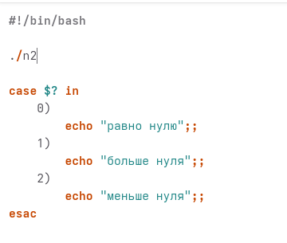
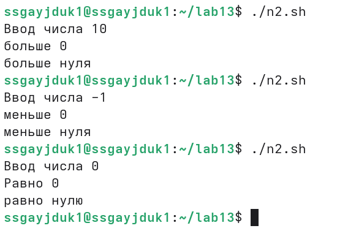

---
## Author
author:
  name: Гайдук Софья Сергеевна
  degrees: DSc
  orcid: 0000-0002-0877-7063
  email: 1032253645@rudn.ru
  affiliation:
    - name: Российский университет дружбы народов
      country: Российская Федерация
      postal-code: 117198
      city: Москва
      address: ул. Миклухо-Маклая, д. 6
---
## Title
---
title: "Лабораторная работа № 13"
subtitle: "Презентация"
author: "Гайдук Софья Сергеевна"
date: "2026-05-01"
format:
  beamer:
    theme: "Madrid"
    colortheme: "dove"
    slide-number: true
---
# Информация

## Докладчик

:::::::::::::: {.columns align=center}
::: {.column width="70%"}

  * Гайдук Софья Сергеевна
  * студент
  * Российский университет дружбы народов им. П. Лумумбы
  * [1032253645@rudn.ru](mailto:1032253645@rudn.ru)
  * <https://github.com/SofiaGayduk/study_2025-2026_os-intro>

:::
::: {.column width="30%"}

:::
::::::::::::::

## Цель работы

Изучить основы программирования в оболочке ОС UNIX. Научится писать более сложные командные файлы с использованием логических управляющих конструкций и циклов.

# Выполнение лабораторной работы 

## Задание 1 

Используя команды getopts grep, написать командный файл, который анализирует командную строку с ключами ([рис. 1], [рис. 2], [рис. 3], [рис. 4], [рис. 5]).

{#fig-001 width=70%}

##  Задание 1 
 
{#fig-002 width=70%}

## Задание 1 

{#fig-003 width=20%}

## Задание 1 

{#fig-004 width=20%}

## Задание 1 

{#fig-005 width=70%}

## Задание 2

Написать на языке Си программу, которая вводит число и определяет, является ли оно больше нуля, меньше нуля или равно нулю ([рис. 6], [рис. 7], [рис. 8], [рис. 9], [рис. 10]). 

{#fig-006 width=70%}

## Задание 2

{#fig-007 width=20%}

## Задание 2

{#fig-008 width=70%}

## Задание 2

{#fig-009 width=70%}

## Задание 2

{#fig-010 width=20%}

## Задание 2

{#fig-011 width=70%}

## Задание 3

Написать командный файл, создающий указанное число файлов, пронумерованных последовательно от 1 до N 
[рис. 12], [рис. 13])

{#fig-012 width=20%}

## Задание 3

{#fig-013 width=20%}

## Задание 4

Написать командный файл, который с помощью команды tar запаковывает в архив все файлы в указанной директории ([рис. 14], [рис. 15], [рис. 16], [рис. 17]). 

{#fig-014 width=70%}

## Задание 4

{#fig-015 width=70%}

## Задание 4

{#fig-016 width=70%}

## Задание 4

{#fig-017 width=70%}

# Выводы

Мы изучили основы программирования в оболочке ОС UNIX. Научились писать более сложные командные файлы с использованием логических управляющих конструкций и циклов. 

# Список литературы{.unnumbered}

1.Kulyabov. Лабораторная работа № 13. Программирование в командном процессоре ОС UNIX. Ветвления и циклы. RUDN

# Список литературы{.unnumbered}

1.Kulyabov. Лабораторная работа № 13. Программирование в командном процессоре ОС UNIX. Ветвления и циклы. RUDN

::: {#refs}
:::
