---
## Author
author:
  name: Гайдук Софья Сергеевна
  degrees: DSc
  orcid: 0000-0002-0877-7063
  email: 1032253645@rudn.ru
  affiliation:
    - name: Российский университет дружбы народов
      country: Российская Федерация
      postal-code: 117198
      city: Москва
      address: ул. Миклухо-Маклая, д. 6

## Title
title: "Лабораторная работа № 13"
subtitle: "Отчет"
license: "CC BY"
---

# Цель работы

Изучить основы программирования в оболочке ОС UNIX. Научится писать более сложные командные файлы с использованием логических управляющих конструкций и циклов 

# Выполнение лабораторной работы 

Используя команды getopts grep, написать командный файл, который анализирует командную строку с ключами:
– -iinputfile — прочитать данные из указанного файла;
– -ooutputfile — вывести данные в указанный файл;
– -pшаблон — указать шаблон для поиска;
– -C — различать большие и малые буквы;
– -n — выдавать номера строк.
а затем ищет в указанном файле нужные строки, определяемые ключом -p ([рис. @fig-001], [рис. @fig-002], [рис. @fig-003], [рис. @fig-004], [рис. @fig-005]). 

{#fig-001 width=70%}

 
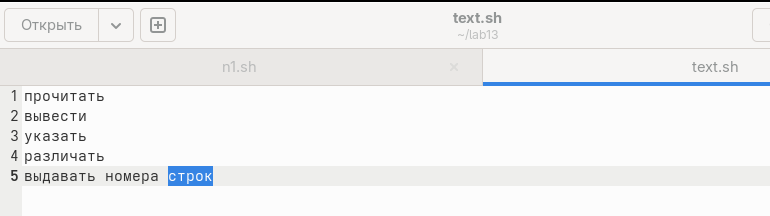{#fig-002 width=70%}

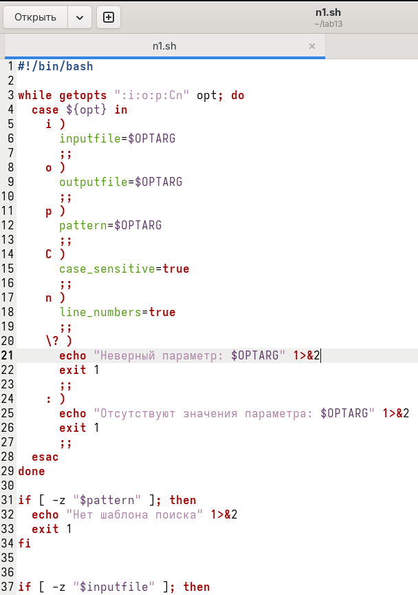{#fig-003 width=70%}

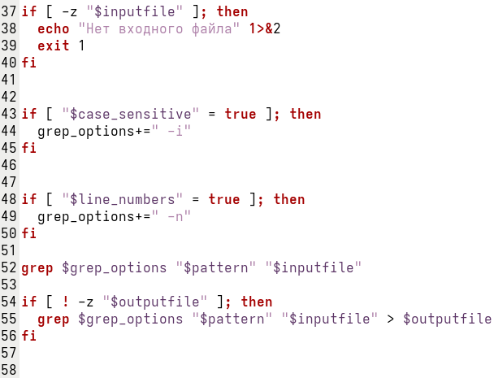{#fig-004 width=70%}

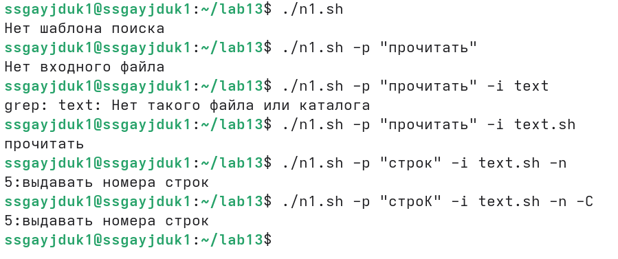{#fig-005 width=70%}

Написать на языке Си программу, которая вводит число и определяет, является ли оно больше нуля, меньше нуля или равно нулю. Затем программа завершается с помощью функции exit(n), передавая информацию в о коде завершения в оболочку. Командный файл должен вызывать эту программу и, проанализировав с помощью команды
$?, выдать сообщение о том, какое число было введено ([рис. @fig-006], [рис. @fig-007], [рис. @fig-008], [рис. @fig-009], [рис. @fig-010], [рис. @fig-011]). 

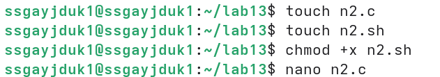{#fig-006 width=70%}

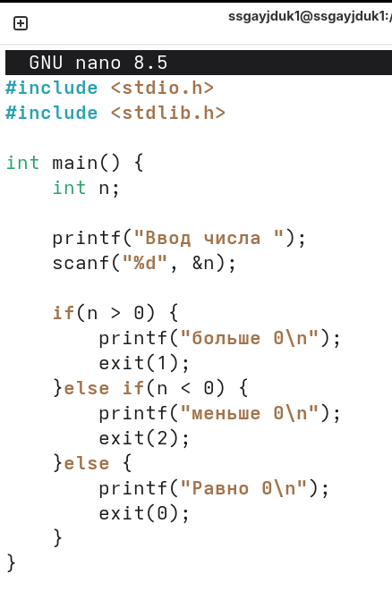{#fig-007 width=70%}

{#fig-008 width=70%}

 
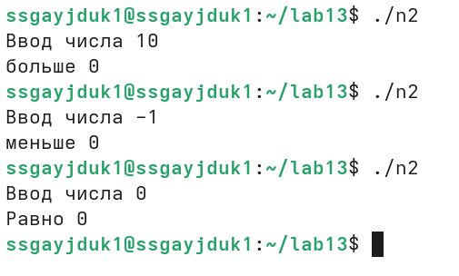{#fig-009 width=70%}

{#fig-010 width=70%}

{#fig-011 width=70%}

Написать командный файл, создающий указанное число файлов, пронумерованных последовательно от 1 до N (например 1.tmp, 2.tmp, 3.tmp,4.tmp и т.д.). Число файлов, которые необходимо создать, передаётся в аргументы командной строки. Этот же командный файл должен уметь удалять все созданные им файлы (если они существуют) ([рис. @fig-012], [рис. @fig-013]). 

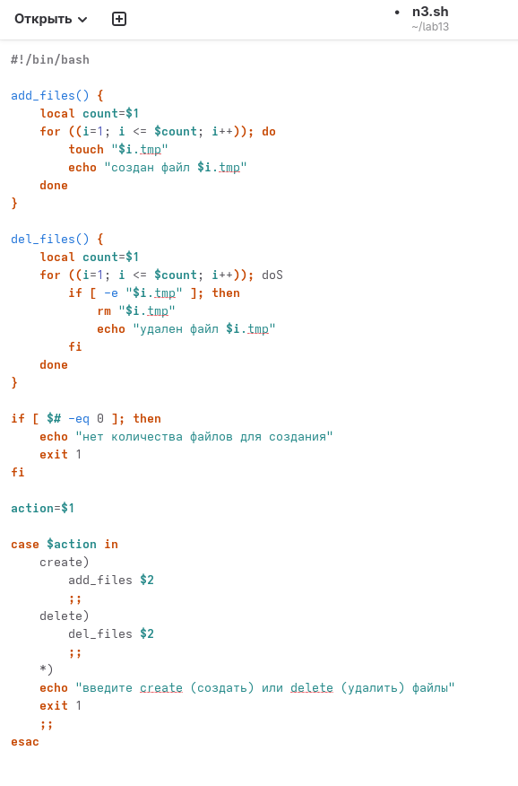{#fig-012 width=70%}

 
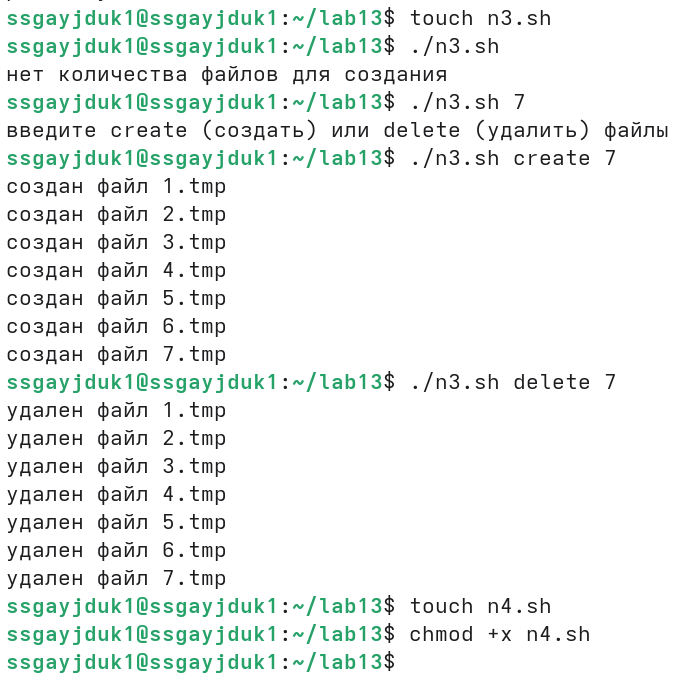{#fig-013 width=70%}

Написать командный файл, который с помощью команды tar запаковывает в архив все файлы в указанной директории. Модифицировать его так, чтобы запаковывались только те файлы, которые были изменены менее недели тому назад (использовать команду find) ([рис. @fig-014], [рис. @fig-015], [рис. @fig-016], [рис. @fig-017]). 

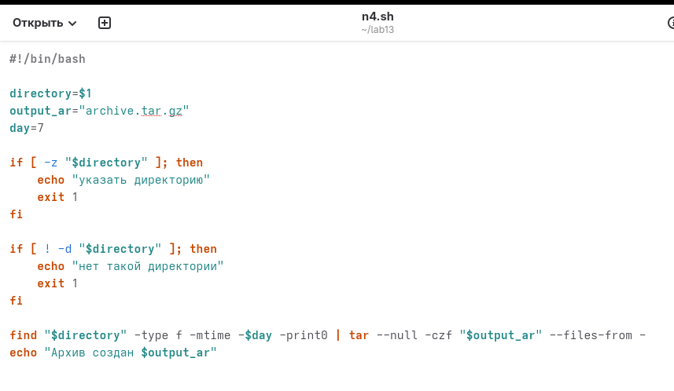{#fig-014 width=70%}

{#fig-015 width=70%}

{#fig-016 width=70%}

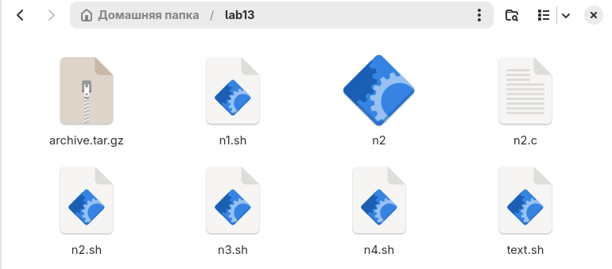{#fig-017 width=70%}

# Контрольные вопросы 

1. Каково предназначение команды getopts?
- getopts — разбирает параметры командной строки (например, -i file -o out) в скриптах bash.
2. Какое отношение метасимволы имеют к генерации имён файлов?
- Метасимволы (*, ?, []) используются для подстановки имён файлов (glob pattern), заменяясь списком подходящих файлов.
3. Какие операторы управления действиями вы знаете?
- Операторы управления действиями — && (И), || (ИЛИ), ; (последовательное выполнение), & (фон), | (конвейер).
4. Какие операторы используются для прерывания цикла?
- Операторы прерывания цикла — break (полный выход), continue (переход к следующей итерации).
5. Для чего нужны команды false и true?
- true — всегда возвращает код 0 (успех). false — всегда возвращает код 1 (ошибка). Используются для бесконечных циклов или проверок.
6. Что означает строка if test -f man$s/$i.$s, встреченная в командном файле?
- if test -f man$s/$i.$s — проверяет, существует ли файл с именем, составленным из переменных и расширений (например, man1/prog.c).
7. Объясните различия между конструкциями while и until.
- while — выполняет цикл, пока условие истинно. until — выполняет цикл, пока условие ложно (до тех пор, пока не станет истинным).

# Выводы

Изучили основы программирования в оболочке ОС UNIX. Научились писать более сложные командные файлы с использованием логических управляющих конструкций и циклов 

# Список литературы{.unnumbered}

1.Kulyabov. Лабораторная работа № 13. Программирование в командном процессоре ОС UNIX. Ветвления и циклы. RUDN

::: {#refs}
:::
