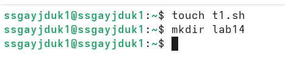
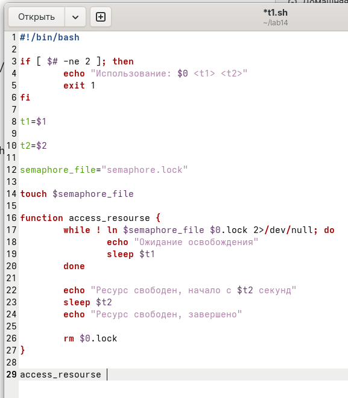
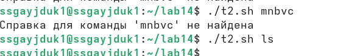
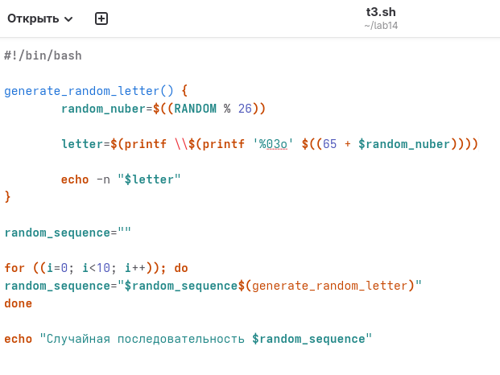

---
## Author
author:
  name: Гайдук Софья Сергеевна
  degrees: DSc
  orcid: 0000-0002-0877-7063
  email: 1032253645@rudn.ru
  affiliation:
    - name: Российский университет дружбы народов
      country: Российская Федерация
      postal-code: 117198
      city: Москва
      address: ул. Миклухо-Маклая, д. 6
---
## Title
---
title: "Лабораторная работа № 14"
subtitle: "Презентация"
author: "Гайдук Софья Сергеевна"
date: "2026-05-02"
format:
  beamer:
    theme: "Madrid"
    colortheme: "dove"
    slide-number: true
---
# Информация

## Докладчик

:::::::::::::: {.columns align=center}
::: {.column width="70%"}

  * Гайдук Софья Сергеевна
  * студент
  * Российский университет дружбы народов им. П. Лумумбы
  * [1032253645@rudn.ru](mailto:1032253645@rudn.ru)
  * <https://github.com/SofiaGayduk/study_2025-2026_os-intro>

:::
::: {.column width="30%"}

:::
::::::::::::::

# Цель работы

Изучить основы программирования в оболочке ОС UNIX. Научиться писать более сложные командные файлы с использованием логических управляющих конструкций и циклов

# Выполнение лабораторной работы 

## Задание 1

Написать командный файл, реализующий упрощённый механизм семафоров. Командный файл должен в течение некоторого времени t1 дожидаться освобождения ресурса, выдавая об этом сообщение, а дождавшись его освобождения, использовать его в течение некоторого времени t2<>t1, также выдавая информацию о том, что
ресурс используется соответствующим командным файлом (процессом) ([рис. @fig-001], [рис. @fig-002], [рис. @fig-003]).

{#fig-001 width=70%}

## Задание 1

{#fig-002 width=20%}

## Задание 1

{#fig-003 width=70%}

## Задание 2

Реализовать команду man с помощью командного файла ([рис. @fig-004], [рис. @fig-005]). 

{#fig-004 width=20%}

## Задание 2

{#fig-005 width=70%}

## Задание 3

Используя встроенную переменную $RANDOM, напишите командный файл, генерирующий случайную последовательность букв латинского алфавита ([рис. @fig-006], [рис. @fig-007]).

{#fig-006 width=20%}

## Задание 3

{#fig-007 width=70%}

# Выводы

Мы изучили основы программирования в оболочке ОС UNIX. Научились писать более сложные командные файлы с использованием логических управляющих конструкций и циклов

# Список литературы{.unnumbered}

1.Kulyabov. Лабораторная работа № 14. Программирование в командном процессоре ОС UNIX. Расширенное программирование. RUDN

# Список литературы{.unnumbered}

1.Kulyabov. Лабораторная работа № 14. Программирование в командном процессоре ОС UNIX. Расширенное программирование. RUDN

::: {#refs}
:::
