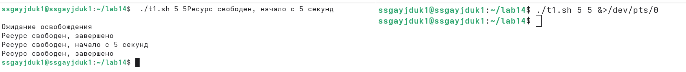
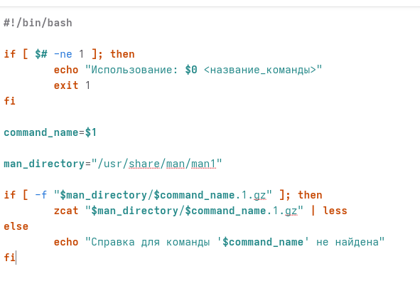
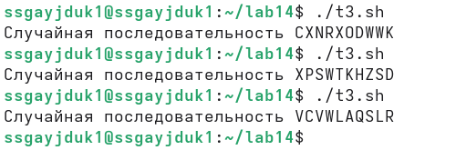

---
## Author
author:
  name: Гайдук Софья Сергеевна
  degrees: DSc
  orcid: 0000-0002-0877-7063
  email: 1032253645@rudn.ru
  affiliation:
    - name: Российский университет дружбы народов
      country: Российская Федерация
      postal-code: 117198
      city: Москва
      address: ул. Миклухо-Маклая, д. 6

## Title
title: "Лабораторная работа № 14"
subtitle: "Отчет"
license: "CC BY"
---

# Цель работы

Изучить основы программирования в оболочке ОС UNIX. Научиться писать более сложные командные файлы с использованием логических управляющих конструкций и циклов

# Выполнение лабораторной работы 

Написать командный файл, реализующий упрощённый механизм семафоров. Командный файл должен в течение некоторого времени t1 дожидаться освобождения ресурса, выдавая об этом сообщение, а дождавшись его освобождения, использовать его в течение некоторого времени t2<>t1, также выдавая информацию о том, что
ресурс используется соответствующим командным файлом (процессом) ([рис. @fig-001], [рис. @fig-002], [рис. @fig-003]).

{#fig-001 width=70%}

 
{#fig-002 width=70%}

{#fig-003 width=70%}

Реализовать команду man с помощью командного файла ([рис. @fig-004], [рис. @fig-005]). 

{#fig-004 width=70%}

{#fig-005 width=70%}

Используя встроенную переменную $RANDOM, напишите командный файл, генерирующий случайную последовательность букв латинского алфавита ([рис. @fig-006], [рис. @fig-007]).

{#fig-006 width=70%}

{#fig-007 width=70%}

# Контрольные вопросы 

1. Найдите синтаксическую ошибку в следующей строке: while [$1 != "exit"]
- Синтаксическая ошибка — отсутствуют пробелы после [ и перед ]. Правильно: while [ "$1" != "exit" ] 
2. Как объединить (конкатенация) несколько строк в одну?
- Объединение (конкатенация) строк в bash — простой записью переменных подряд: result="$str1$str2" или с разделителем: result="$str1 $str2". Также можно использовать += 
3. Найдите информацию об утилите seq. Какими иными способами можно реализовать её функционал при программировании на bash?
- Утилита seq и её альтернативы — seq генерирует последовательности чисел. Альтернативы в bash:
   - {1..10} — для фиксированных пределов 
   - for ((i=1; i<=N; i++)) — C-подобный цикл для переменных пределов 
4. Какой результат даст вычисление выражения $((10/3))?
- Результат $((10/3)) — будет 3, так как в bash арифметика целочисленная 
5. Укажите кратко основные отличия командной оболочки zsh от bash.
- Основные отличия zsh от bash:
   - zsh: лучшая автодополнение, подсветка синтаксиса, проверка орфографии 
   - bash: простота, POSIX-совместимость, максимальная распространённость 
6. Проверьте, верен ли синтаксис данной конструкции for ((a=1; a <= LIMIT; a++))
- Синтаксис for ((a=1; a <= LIMIT; a++)) — верен, это стандартный C-подобный цикл в bash. Пробелы вокруг <= допустимы
7. Сравните язык bash с какими-либо языками программирования. Какие преимущества у bash по сравнению с ними? Какие недостатки?
- Преимущества bash: вездесущность (есть в любом Linux), простое объединение команд, не требует установки 
- Недостатки bash: множество cложных мест (IFS, CDPATH и др.), сложность написания надёжных скриптов более 100 строк, неудобная обработка путей 

# Выводы

Мы изучили основы программирования в оболочке ОС UNIX. Научились писать более сложные командные файлы с использованием логических управляющих конструкций и циклов

# Список литературы{.unnumbered}

1.Kulyabov. Лабораторная работа № 14. Программирование в командном процессоре ОС UNIX. Расширенное программирование. RUDN

::: {#refs}
:::
