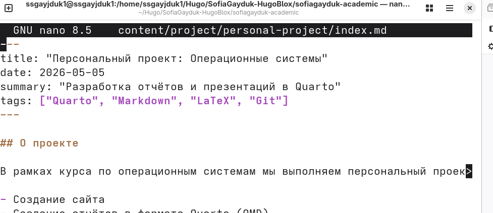
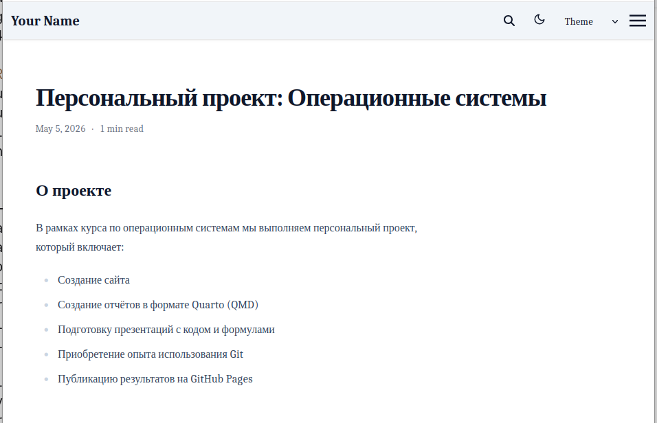
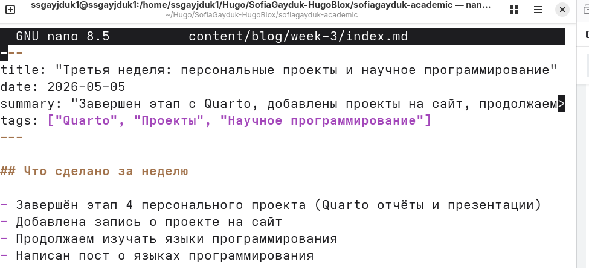
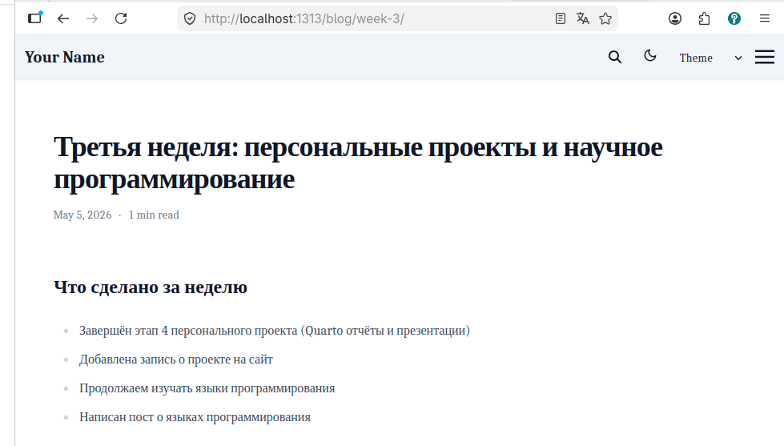
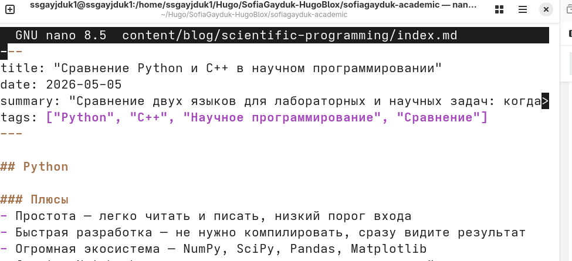
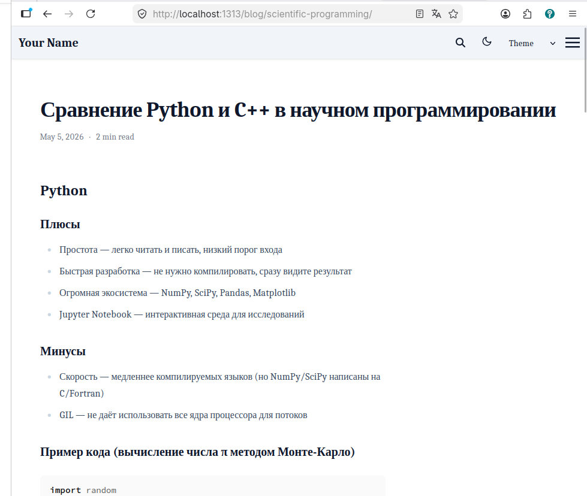

---
## Author
author:
  name: Гайдук Софья Сергеевна
  degrees: DSc
  orcid: 0000-0002-0877-7063
  email: 1032253645@rudn.ru
  affiliation:
    - name: Российский университет дружбы народов
      country: Российская Федерация
      postal-code: 117198
      city: Москва
      address: ул. Миклухо-Маклая, д. 6
---
## Title
---
title: "Индивидуальный проект. Часть 5"
subtitle: "Презентация"
author: "Гайдук Софья Сергеевна"
date: "2026-04-05"
format: 
  revealjs: 
    theme: solarized
    slide-number: true
---

# Информация

## Докладчик

:::::::::::::: {.columns align=center}
::: {.column width="70%"}

  * Гайдук Софья Сергеевна
  * студент
  * Российский университет дружбы народов им. П. Лумумбы
  * [1032253645@rudn.ru](mailto:1032253645@rudn.ru)
  * <https://github.com/SofiaGayduk/study_2025-2026_os-intro>

:::
::: {.column width="30%"}

:::
::::::::::::::

# Цель работы

Добавить к сайту все остальные элементы.  

# Выполнение индивидуального проекта 

## Сделать записи для персональных проектов  

([рис. @fig-001])

{#fig-001 width=70%}

## ([рис. @fig-002]).
 
{#fig-002 width=70%}

## Сделать пост по прошедшей неделе 

([рис. @fig-003])

{#fig-003 width=70%}

## ([рис. @fig-004])

{#fig-004 width=70%}

## Добавить пост на тему: "Языки научного программирования" 

([рис. @fig-005])

{#fig-005 width=70%}

## ([рис. @fig-006])

{#fig-006 width=70%}

# Выводы

Мы добавили к сайту все остальные элементы.

# Список литературы{.unnumbered}

1.Kulyabov. Индивидуальный проект. Часть 5. RUDN

::: {#refs}
:::
