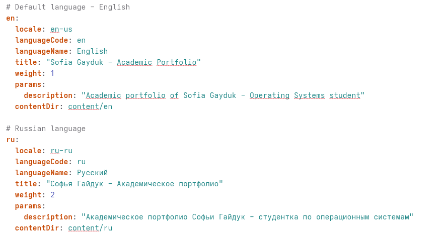
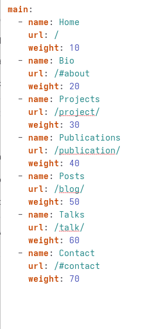
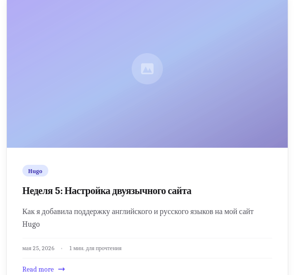
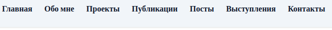
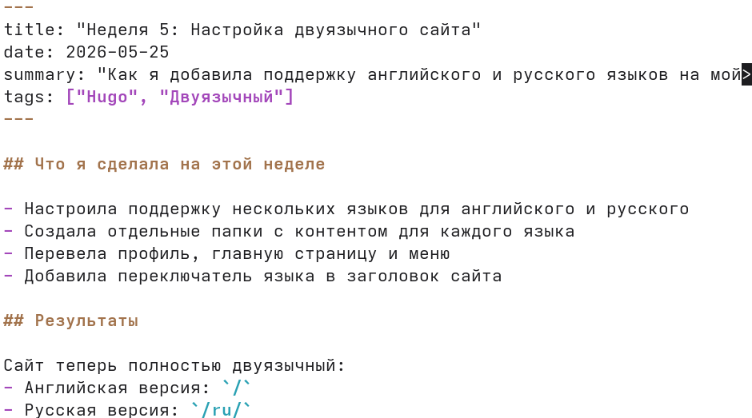
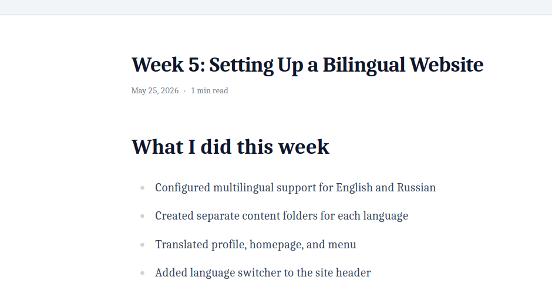
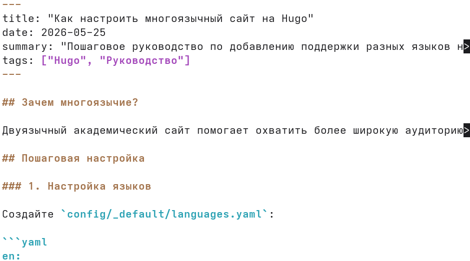

---
## Author
author:
  name: Гайдук Софья Сергеевна
  degrees: DSc
  orcid: 0000-0002-0877-7063
  email: 1032253645@rudn.ru
  affiliation:
    - name: Российский университет дружбы народов
      country: Российская Федерация
      postal-code: 117198
      city: Москва
      address: ул. Миклухо-Маклая, д. 6

## Title
title: "Индивидуальный проект. Часть 6"
subtitle: "Отчет"
license: "CC BY"
---

# Цель работы

Размещение двуязычного сайта на Github 

# Выполнение лабораторной работы 

Сделать поддержку английского и русского языков ([рис. @fig-001], [рис. @fig-002]).

{#fig-001 width=70%}

 
{#fig-002 width=70%}

Разместить элементы сайта на обоих языках ([рис. @fig-003], [рис. @fig-004]).

{#fig-003 width=70%}

{#fig-004 width=70%}

Разместить контент на обоих языках ([рис. @fig-005], [рис. @fig-006]).

{#fig-005 width=70%}

{#fig-006 width=70%}

Сделать пост по прошедшей неделе ([рис. @fig-007], [рис. @fig-008]).

{#fig-007 width=70%}

{#fig-008 width=70%}

Добавить пост на тему по выбору (на двух языках) ([рис. @fig-009], [рис. @fig-010]).

{#fig-009 width=70%}

{#fig-010 width=70%}

# Выводы

Мы разместили двуязычный сайт на Github 

# Список литературы{.unnumbered}

1.Kulyabov. Индивидуальный проект. Часть 6. RUDN

::: {#refs}
:::
