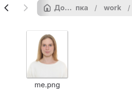
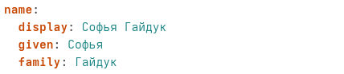
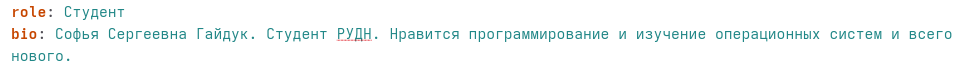
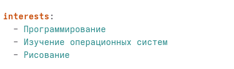
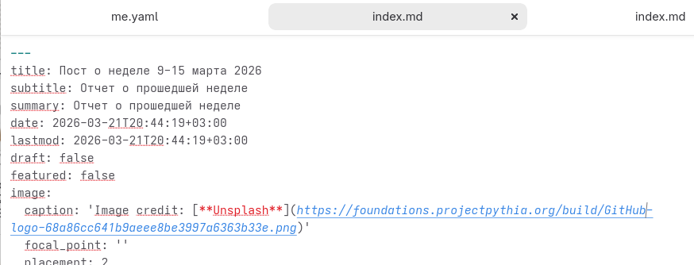
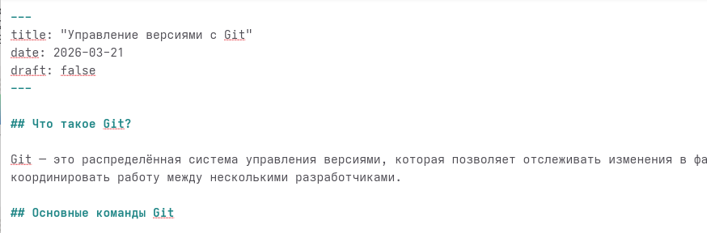

---
## Author
author:
  name: Гайдук Софья Сергеевна
  degrees: DSc
  orcid: 0000-0002-0877-7063
  email: 1032253645@rudn.ru
  affiliation:
    - name: Российский университет дружбы народов
      country: Российская Федерация
      postal-code: 117198
      city: Москва
      address: ул. Миклухо-Маклая, д. 6
---
## Title
---
title: "Индивидуальный проект. Этап 2"
subtitle: "Презентация"
author: "Гайдук Софья Сергеевна"
date: "2026-03-21"
format: 
  revealjs: 
    theme: solarized
    slide-number: true
---

# Информация

## Докладчик

:::::::::::::: {.columns align=center}
::: {.column width="70%"}

  * Гайдук Софья Сергеевна
  * студент
  * Российский университет дружбы народов им. П. Лумумбы
  * [1032253645@rudn.ru](mailto:1032253645@rudn.ru)
  * <https://github.com/SofiaGayduk/study_2025-2026_os-intro>

:::
::: {.column width="30%"}

:::
::::::::::::::

## Цель работы

Добавить к сайту данные о себе

## Выполнение 

## Фото

Разместим фотографию владельца сайта ([рис. @fig-001]).

{#fig-001 width=70%}

## Biography

Разместим краткое описание владельца сайта ([рис. @fig-002],  [рис. @fig-003]).

{#fig-002 width=70%}

{#fig-003 width=70%}

## Интересы

Добавим информацию об интересах (Interests) ([рис. @fig-004]).

{#fig-004 width=70%}

## Образование

Добавить информацию от образовании (Education) ([рис. @fig-005]).

{#fig-005 width=70%}

## Пост по прошедшей неделе

Сделаем пост по прошедшей неделе ([рис. @fig-006]).

{#fig-006 width=70%}

## Пост на тему: Git

Добавить пост на тему: Управление версиями. Git ([рис. @fig-007]).

{#fig-007 width=70%}

## Выводы

Мы освоили второй этап создания сайта и добавили к сайту данные о себе

## Список литературы{.unnumbered}

1.Kulyabov. Индивидуальный проект. Этап 2. RUDN

::: {#refs}
:::
